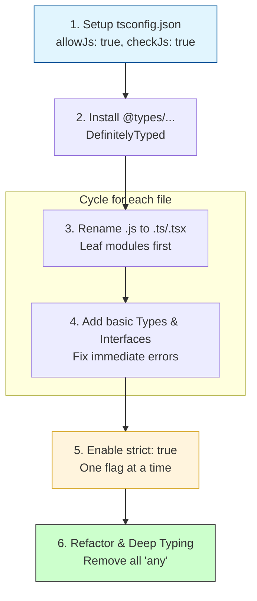

## TypeScript: Миграция JS → TS

Привет, коллеги-разработчики! Добро пожаловать в новый урок Yasha Learn Code. Сегодня мы отправимся в увлекательное путешествие — миграцию существующего JavaScript-проекта на TypeScript. Это как переезд из старой, но уютной квартиры, где все лежало "где-то там", в новую, современную, где для каждой вещи есть свое место, и вы точно знаете, что и где найдете.

Зачем это нужно? TypeScript дает нам статическую типизацию, что означает:
*   **Безопасность**: Ловите ошибки до запуска кода.
*   **Масштабируемость**: Большие проекты легче поддерживать.
*   **Улучшенный DevEx**: Автодополнение, рефакторинг, навигация в IDE.
*   **Ясность**: Код становится документацией сам по себе.

Вы уже освоили дженерики, утилити-типы и интерфейсы, так что готовы к более серьезным вызовам. Поехали!

### 🏗️ Подготовка к Переезду: Настройка Проекта

Первым делом, нам нужно подготовить "фундамент" для нашего нового дома. Это означает установку TypeScript и настройку файла `tsconfig.json`.

1.  **Установка TypeScript**:
    ```bash
    npm install typescript --save-dev
    # или
    yarn add typescript --dev
    ```

2.  **Инициализация `tsconfig.json`**:
    Создайте файл `tsconfig.json` в корне проекта. Это сердце конфигурации TypeScript.

    ```json
    // tsconfig.json
    {
      "compilerOptions": {
        "target": "es2020",             // Целевая версия ECMAScript для компиляции
        "module": "commonjs",           // Система модулей (например, CommonJS для Node.js)
        "outDir": "./dist",             // Каталог для скомпилированных JS-файлов
        "rootDir": "./src",             // Корневой каталог для исходных TS-файлов
        "strict": true,                 // Включает все строгие проверки типов (наша цель!)
        "esModuleInterop": true,        // Позволяет импортировать CommonJS модули как ES-модули
        "skipLibCheck": true,           // Пропускает проверку деклараций библиотек
        "forceConsistentCasingInFileNames": true, // Требует согласованности регистра имен файлов
        "allowJs": true,                // Разрешает включать JS-файлы в компиляцию (для миграции)
        "checkJs": true,                // Включает проверку типов для JS-файлов (очень полезно!)
        "noEmit": true                  // Не генерирует JS-файлы, только проверяет типы
      },
      "include": [                      // Какие файлы включать в компиляцию
        "src/**/*.ts",
        "src/**/*.js"
      ],
      "exclude": [                      // Какие файлы исключать
        "node_modules",
        "**/*.test.ts"
      ]
    }
    ```
    Особое внимание уделите `allowJs` и `checkJs` — это ваши лучшие друзья на начальных этапах миграции, позволяющие TypeScript работать с существующим JS-кодом, постепенно проверяя его. `noEmit: true` позволит вам сначала просто проверять типы, не изменяя сборку.

### Шаг за Шагом: Постепенная Миграция

Самый эффективный подход к миграции — постепенный. Не пытайтесь переписать все сразу. Это как ремонт: лучше делать по комнате, а не сносить все стены одновременно.

### Migration Strategy Flowchart


*Пошаговый процесс миграции: от настройки окружения до полного покрытия типами.*

1.  **Начните с "самой безопасной" комнаты**: Обычно это утилитарные функции, небольшие, независимые модули без большого количества внешних зависимостей.

2.  **Переименуйте `.js` в `.ts` (или `.tsx` для React-проектов)**: Это самый первый и простой шаг. TypeScript сразу начнет указывать на места, где ему не хватает информации.

    Предположим, у нас есть такой JS-файл:
    ```javascript
    // src/utils.js
    /**
     * @param {number[]} numbers
     * @returns {number}
     */
    function sumArray(numbers) {
      return numbers.reduce((acc, current) => acc + current, 0);
    }

    /**
     * @param {object} user
     * @param {string} user.firstName
     * @param {string} user.lastName
     * @returns {string}
     */
    function formatUser(user) {
      return `${user.firstName} ${user.lastName}`;
    }

    module.exports = {
      sumArray,
      formatUser
    };
    ```
    Вы видите комментарии JSDoc, которые уже дают какую-то информацию о типах. TypeScript умеет их понимать!

    Теперь переименуем `src/utils.js` в `src/utils.ts`.
    Благодаря `allowJs: true` и `checkJs: true` в `tsconfig.json`, TypeScript уже мог бы проверять этот файл. Но переименование в `.ts` дает полный контроль.

    ```typescript
    // src/utils.ts
    // TypeScript теперь полностью проверяет этот файл
    function sumArray(numbers: number[]): number {
      return numbers.reduce((acc, current) => acc + current, 0);
    }

    interface User {
      firstName: string;
      lastName: string;
    }

    function formatUser(user: User): string {
      return `${user.firstName} ${user.lastName}`;
    }

    export {
      sumArray,
      formatUser
    };
    ```
    Мы заменили JSDoc на нативные TypeScript-типы и интерфейсы. Это делает код чище и предоставляет полную мощь TS.

### Работа с Зависимостями: D.TS Файлы

Ваш JS-проект, скорее всего, использует кучу сторонних библиотек. Как TypeScript узнает об их типах? Здесь на помощь приходят файлы объявлений типов (`.d.ts`).

1.  **Библиотеки с встроенными типами**: Многие современные библиотеки (например, `react`, `vue`, `lodash-es`) уже поставляются с файлами `.d.ts`. Просто установите их, и TypeScript автоматически их подхватит.

2.  **Библиотеки без встроенных типов**: Для старых или менее популярных библиотек сообщество создало репозиторий DefinitelyTyped. Типы из него устанавливаются как `@types/название-библиотеки`.

    Например, для `lodash`:
    ```bash
    npm install lodash --save
    npm install @types/lodash --save-dev
    ```

3.  **Создание своих `.d.ts` для внутренних JS-модулей**: Если у вас есть часть проекта, которая останется на JS, но вы хотите, чтобы TS-модули могли с ней корректно взаимодействовать, вы можете написать для нее декларационный файл.

    Допустим, у нас есть старый JS-файл `legacyAuth.js`:
    ```javascript
    // src/legacyAuth.js
    function login(username, password) {
      // ... сложная логика входа
      return { token: 'abc', userId: 123 };
    }

    function logout(token) {
      console.log('User logged out with token:', token);
    }

    module.exports = { login, logout };
    ```
    Чтобы использовать его в TS, создадим `src/legacyAuth.d.ts`:
    ```typescript
    // src/legacyAuth.d.ts
    declare module './legacyAuth' { // Объявляем модуль с конкретным путем
      interface AuthResult {
        token: string;
        userId: number;
      }

      function login(username: string, password: string): AuthResult;
      function logout(token: string): void;

      // Если используется export default, то:
      // export default function login(username: string, password: string): AuthResult;
      // export function logout(token: string): void;
    }
    ```
    Теперь в любом TS-файле вы можете импортировать `login` и `logout` с полной типизацией:
    ```typescript
    // src/app.ts
    import { login, logout } from './legacyAuth'; // TS теперь знает типы из .d.ts

    const authData = login('user', 'pass');
    console.log(authData.token); // Автодополнение и проверка типов работают!

    // logout(123); // Ошибка: Argument of type 'number' is not assignable to parameter of type 'string'.
    logout(authData.token);
    ```

### Углубляемся: Строгие Проверки и Рефакторинг

После того как вы переименовали большинство файлов и добавили базовые типы, приходит время для "генеральной уборки" – включения строгого режима (`"strict": true` в `tsconfig.json`). Это как установить систему безопасности, которая будет ловить даже мелкие нарушения.

**`strict: true`** эквивалентен включению всех этих опций:
*   `noImplicitAny`: Запрещает неявному `any`. Это самый частый "затык" при миграции.
*   `strictNullChecks`: Требует явной обработки `null` и `undefined`.
*   `strictFunctionTypes`: Более строгая проверка совместимости функций.
*   `strictPropertyInitialization`: Проверяет инициализацию свойств классов.
*   `noImplicitThis`: Запрещает неявному `this`.
*   `alwaysStrict`: Компилирует файлы в строгом режиме JavaScript.

Давайте рассмотрим пример `noImplicitAny` и `strictNullChecks`:

```javascript
// src/dataProcessor.js (наш исходный JS)
function processData(config) {
  const data = config.data;
  if (config.transform) {
    return config.transform(data);
  }
  return data;
}

function getUserFullName(user) {
  return `${user.firstName || ''} ${user.lastName || ''}`;
}

module.exports = { processData, getUserFullName };
```

Мигрируем в `src/dataProcessor.ts` и включаем `strict: true`.
```typescript
// src/dataProcessor.ts
interface ProcessingConfig<T, R = T> {
  data: T;
  transform?: (input: T) => R; // transform может отсутствовать
}

function processData<T, R>(config: ProcessingConfig<T, R>): T | R {
  const data = config.data;
  if (config.transform) {
    return config.transform(data); // TypeScript знает, что transform определен
  }
  return data;
}

interface UserProfile {
  firstName: string;
  lastName: string;
  middleName?: string; // middleName теперь опционален
  email: string | null; // email может быть строкой или null
}

function getUserFullName(user: UserProfile): string {
  // Благодаря strictNullChecks, user.email?.toLowerCase() безопасен
  // А вот user.email.toLowerCase() выдал бы ошибку без проверки или Optional Chaining
  const emailSuffix = user.email ? ` (${user.email.toLowerCase()})` : '';

  // Optional chaining (?.) и Nullish coalescing (??) для безопасного доступа
  return `${user.firstName} ${user.middleName ?? ''} ${user.lastName}${emailSuffix}`;
}

export { processData, getUserFullName };
```
Здесь мы:
*   Явно типизировали `config` с помощью дженерик-интерфейса `ProcessingConfig`.
*   Использовали опциональные свойства (`?`) для `transform` и `middleName`.
*   Применили union-тип (`string | null`) для `email`.
*   Использовали операторы `?` (optional chaining) и `??` (nullish coalescing) для безопасной работы с потенциально отсутствующими значениями, которые требуют `strictNullChecks: true`.

### Типичные "Затыки" и Как с Ними Бороться

В процессе миграции вы неизбежно столкнетесь с некоторыми распространенными проблемами.

1.  **"Property 'x' does not exist on type 'Y'."**
    Это означает, что вы пытаетесь получить доступ к свойству, которое TypeScript не видит в данном типе.
    *   **Решение**: Добавьте свойство в интерфейс/тип, используйте Type Guard (например, `if ('x' in obj)`) или Type Assertion (`(obj as MyType).x`).

    ```typescript
    // Пример: свойство, которого нет
    interface Dog {
      name: string;
      breed: string;
    }

    const myPet: Dog = { name: 'Buddy', breed: 'Golden Retriever' };

    // console.log(myPet.age); // Ошибка: Property 'age' does not exist on type 'Dog'.

    // Если вы уверены, что свойство есть (но TS не знает):
    const unknownData: any = { name: 'Whiskers', type: 'cat' };
    // console.log(unknownData.type.toUpperCase()); // Может быть ошибка в runtime, но TS не ругается, если unknownData: any

    // Правильное решение: Type Guard
    interface Cat { name: string; type: 'cat'; }
    interface Fish { name: string; type: 'fish'; }
    type Pet = Dog | Cat | Fish;

    function getPetType(pet: Pet): string {
      if ('type' in pet) { // Type Guard
        return pet.type; // TS знает, что pet теперь имеет свойство 'type'
      }
      return pet.breed; // TS знает, что pet теперь Dog
    }

    console.log(getPetType({ name: 'Nemo', type: 'fish' })); // 'fish'
    console.log(getPetType(myPet)); // 'Golden Retriever'
    ```

2.  **"Object is possibly 'null' or 'undefined'."**
    Это ошибка от `strictNullChecks`, которая требует явной обработки `null` или `undefined`.
    *   **Решение**: Проверки (`if (value)`, `value != null`), опциональная цепочка (`?.`), оператор нулевого слияния (`??`), Non-null assertion operator (`!`, использовать с осторожностью!).

    ```typescript
    // Пример: Object is possibly 'null' or 'undefined'.
    function greetUser(user: { name: string; email?: string | null } | null): string {
      // return `Hello, ${user.name}!`; // Ошибка: Object is possibly 'null'.

      if (user === null) { // Явная проверка на null
        return 'Hello, Guest!';
      }

      // Если email может быть undefined или null
      // const userEmail = user.email.toLowerCase(); // Ошибка: Object is possibly 'null' or 'undefined'.
      const userEmail = user.email?.toLowerCase() ?? 'no email provided'; // Безопасное использование
      return `Hello, ${user.name}! Your email: ${userEmail}`;
    }

    console.log(greetUser(null));
    console.log(greetUser({ name: 'Alice' }));
    console.log(greetUser({ name: 'Bob', email: 'bob@example.com' }));
    console.log(greetUser({ name: 'Charlie', email: null }));

    // Non-null assertion operator (использовать очень осторожно, только если вы на 100% уверены!)
    const maybeString: string | undefined = "Hello";
    const definitelyString: string = maybeString!; // Говорим TS: "Я знаю, что это не undefined!"
    ```

3.  **Использование `any` как временная мера**:
    Иногда, особенно в начале миграции, вы можете столкнуться с очень сложными структурами данных или функциями, которые трудно сразу типизировать. В таких случаях, использование `any` может быть временным "костылем".

    ```typescript
    // src/complexLegacyComponent.js (много пропсов, которые трудно сразу типизировать)
    // ...
    // Временно в TS
    function renderComplexComponent(props: any) {
      // ... много логики
      console.log(props.data.items[0].value); // TS не ругается, но и не проверяет
      // ...
    }
    ```
    **💡 Важно**: `any` должен быть временным решением, маячком для последующего рефакторинга. Его чрезмерное использование сводит на нет все преимущества TypeScript. Стремитесь минимизировать его и заменять на более точные типы (`unknown`, дженерики, конкретные интерфейсы) по мере продвижения.

### 💡 Совет

*   **Используйте Git**: Миграция — это серия изменений. Коммитьте часто. Используйте ветки. Если что-то пошло не так, вы всегда сможете откатиться.
*   **Начните с листовых модулей**: Сначала мигрируйте модули, которые не зависят ни от кого другого, или зависят только от типизированных библиотек. Затем переходите к модулям, которые зависят от уже мигрированных.
*   **Воспользуйтесь мощью вашей IDE**: VS Code, WebStorm и другие IDE имеют потрясающую поддержку TypeScript. Используйте автодополнение, подсказки, автоматический рефакторинг.
*   **Используйте `"noEmit": true` на начальном этапе**: Это позволит вам проверять типы, не заморачиваясь с изменением сборки проекта. Когда большая часть файлов будет типизирована, вы сможете настроить компиляцию в `dist`.
*   **Не бойтесь `unknown`**: Если вы не уверены в типе, но не хотите терять безопасность, используйте `unknown` вместо `any`. `unknown` заставляет вас явно проверять тип перед использованием.

### 🎯 Практика

Время применить полученные знания на практике!

#### Задание 1: Миграция Утилитарного Модуля

У вас есть JS-модуль для работы со строками. Мигрируйте его в TypeScript, добавив явные типы и интерфейсы.

```javascript
// src/stringUtils.js
/**
 * Преобразует строку в заголовочный регистр (каждое слово с большой буквы).
 * @param {string} str - Входная строка.
 * @returns {string} - Преобразованная строка.
 */
function toTitleCase(str) {
  return str.replace(/\w\S*/g, function(txt) {
    return txt.charAt(0).toUpperCase() + txt.substr(1).toLowerCase();
  });
}

/**
 * Генерирует уникальный ID.
 * @param {string} prefix - Префикс для ID (опционально).
 * @returns {string} - Уникальный ID.
 */
function generateUniqueId(prefix) {
  return (prefix ? `${prefix}-` : '') + Math.random().toString(36).substr(2, 9);
}

/**
 * Проверяет, является ли строка палиндромом.
 * @param {string} str - Входная строка.
 * @returns {boolean}
 */
function isPalindrome(str) {
  const cleanedStr = str.toLowerCase().replace(/[^a-z0-9]/g, '');
  return cleanedStr === cleanedStr.split('').reverse().join('');
}

module.exports = { toTitleCase, generateUniqueId, isPalindrome };
```
**Ваша задача**:
1.  Переименовать `stringUtils.js` в `stringUtils.ts`.
2.  Добавить явные типы для параметров и возвращаемых значений функций.
3.  Создать интерфейс `StringUtils` для модуля, если вы будете экспортировать его как объект.

#### Задание 2: Работа с Нетипизированным Внешним API

Представьте, что у вас есть JavaScript-функция, которая делает запрос к внешнему API. Этот API не предоставляет типов.

```javascript
// src/apiClient.js
const fetch = require('node-fetch'); // Предположим, установлен node-fetch (npm install node-fetch)

async function fetchData(endpoint) {
  try {
    const response = await fetch(`https://api.example.com/${endpoint}`);
    if (!response.ok) {
      throw new Error(`HTTP error! status: ${response.status}`);
    }
    const data = await response.json();
    return data;
  } catch (error) {
    console.error('Failed to fetch data:', error.message);
    throw error;
  }
}

// Пример использования (если бы это был JS)
// fetchData('users/1').then(user => console.log(user.name));
// fetchData('products/abc').then(product => console.log(product.price));

module.exports = { fetchData };
```
**Ваша задача**:
1.  Мигрируйте `apiClient.js` в `apiClient.ts`.
2.  Создайте `.d.ts` файл (например, `apiClient.d.ts` или прямо в `apiClient.ts` как `declare module`) с объявлением типов для функции `fetchData`. Используйте дженерики, чтобы функция могла возвращать разные типы данных в зависимости от эндпоинта.
3.  Определите два интерфейса: `User` (с `id: number`, `name: string`, `email: string`) и `Product` (с `id: string`, `name: string`, `price: number`).
4.  Создайте тестовый TS-файл (`main.ts`), где вы вызовете `fetchData` для получения `User` и `Product`, демонстрируя, что типы теперь работают.

#### Задание 3: Очистка От `any` и `null`/`undefined`

В вашем проекте есть функция, которая была быстро написана и содержит много неявных `any` и потенциальных ошибок с `null`/`undefined`. Мигрируйте ее, сделав типобезопасной в строгом режиме.

```javascript
// src/profileManager.js
function getDisplayName(userConfig) {
  if (!userConfig) {
    return 'Anonymous';
  }

  let name = userConfig.preferredName;
  if (!name && userConfig.details) {
    name = userConfig.details.firstName + ' ' + userConfig.details.lastName;
  }

  if (name && name.length > 20) {
    return name.substring(0, 17) + '...';
  }
  return name || 'Unknown User';
}

module.exports = { getDisplayName };
```
**Ваша задача**:
1.  Переименовать `profileManager.js` в `profileManager.ts`.
2.  Создать интерфейсы для `UserConfig` и `UserDetails`, учитывая, что свойства могут быть опциональными или `null`/`undefined`.
3.  Рефакторить функцию `getDisplayName`, чтобы она полностью соответствовала `strict: true` (т.е. никаких ошибок "Object is possibly 'null' or 'undefined'." и "Implicit any"). Используйте опциональные цепочки, операторы нулевого слияния и другие Type Guard-ы по необходимости.


## Интерактивный пример

<Playground
  template="vanilla-ts"
  files={{
    "/index.html": `
<!DOCTYPE html>
<html lang="en">
<head>
    <meta charset="UTF-8">
    <meta name="viewport" content="width=device-width, initial-scale=1.0">
    <title>TS Migration Demo</title>
    <style>
        body {
            background-color: #282c34;
            color: white;
            font-family: sans-serif;
            display: flex;
            justify-content: center;
            align-items: center;
            height: 100vh;
            margin: 0;
        }
        #output {
            font-size: 2em;
        }
    </style>
</head>
<body>
    <div id="output"></div>

    <script>
        function greet(name) {
            return "Hello, " + name + "!";
        }

        const outputElement = document.getElementById('output');
        if (outputElement) {
            outputElement.textContent = greet("World");
        }
    <\/script>
</body>
</html>
`
  }}
/>
