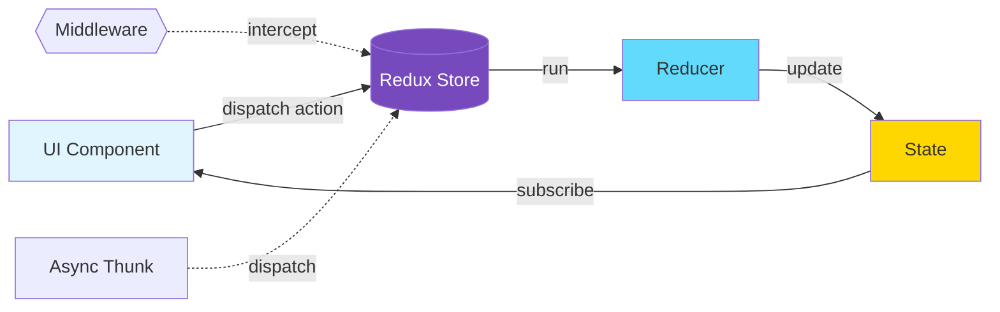

## TypeScript: Redux Toolkit (RTK) + TypeScript

Здарова, кодеры! Яша снова на связи. Сегодня мы погрузимся в мир, где управление состоянием приложения становится не просто логичным, но и удивительно приятным благодаря TypeScript. Если вы уже работали с Redux, то наверняка знаете, сколько boilerplate-кода он может породить. Redux Toolkit (RTK) — это ваш швейцарский нож, который не только решает эту проблему, но и делает работу с Redux в TypeScript невероятно интуитивной и безопасной.

### Схема Redux Flow



Представьте, что у вас есть огромная фабрика по производству данных (ваш Redux store). Раньше, чтобы создать новый продукт (часть состояния) или изменить старый, вам приходилось писать кучу инструкций: отдельные цеха для каждого этапа (action types), куча рабочих, которые просто перекладывают бумаги (action creators), и целые отделы, которые определяют, что делать с этими бумагами (reducers). Это работало, но было медленно и утомительно.

Redux Toolkit — это модернизация этой фабрики. Теперь у вас есть автоматизированные линии сборки (слайсы), которые сами генерируют инструкции и управляют рабочими. А TypeScript? TypeScript — это ваш отдел контроля качества, который следит, чтобы каждая деталь была нужного типа, каждый процесс был описан, и на выходе вы всегда получали предсказуемый и безошибочный продукт. Вместе RTK и TypeScript превращают рутину в элегантный танец кода.

### 🛠️ Основы Redux Toolkit: Слайсы и Стор

В основе RTK лежит концепция **"слайсов" (slices)**. Слайс — это единый объект, который объединяет в себе начальное состояние, редьюсеры и экшены для конкретной части вашего состояния. Это как мини-модуль для управления одной сущностью (например, пользователем, списком постов, счетчиком).

#### Создание Слайса

Давайте создадим слайс для управления счетчиком, используя `createSlice`.

```typescript
// src/features/counter/counterSlice.ts
import { createSlice, PayloadAction } from '@reduxjs/toolkit';

// 1. Определяем тип нашего состояния
interface CounterState {
  value: number;
  status: 'idle' | 'loading' | 'failed';
}

// 2. Определяем начальное состояние
const initialState: CounterState = {
  value: 0,
  status: 'idle',
};

// 3. Создаем слайс с помощью createSlice
export const counterSlice = createSlice({
  name: 'counter', // Имя слайса, используется как префикс для action types
  initialState,   // Начальное состояние
  reducers: {
    // Reducer для инкремента. RTK автоматически генерирует action creator 'counter/increment'.
    increment: (state) => {
      // Здесь мы можем "мутировать" состояние напрямую,
      // Immer.js под капотом гарантирует иммутабельность.
      state.value += 1;
    },
    // Reducer для декремента.
    decrement: (state) => {
      state.value -= 1;
    },
    // Reducer с payload. PayloadAction<T> типизирует полезную нагрузку экшена.
    incrementByAmount: (state, action: PayloadAction<number>) => {
      state.value += action.payload;
    },
    // Асинхронный "заглушка" для демонстрации изменения статуса
    setLoading: (state, action: PayloadAction<boolean>) => {
        state.status = action.payload ? 'loading' : 'idle';
    }
  },
});

// 4. Экспортируем action creators, сгенерированные createSlice
export const { increment, decrement, incrementByAmount, setLoading } = counterSlice.actions;

// 5. Экспортируем редьюсер для использования в store
export default counterSlice.reducer;
```

#### Настройка Сторон (Store)

Теперь, когда у нас есть слайс, его нужно добавить в наш Redux Store. Для этого используем `configureStore`. Он автоматически настроит DevTools, `thunk` middleware и другие полезные вещи.

```typescript
// src/app/store.ts
import { configureStore } from '@reduxjs/toolkit';
import counterReducer from '../features/counter/counterSlice'; // Импортируем редьюсер нашего слайса

export const store = configureStore({
  reducer: {
    counter: counterReducer, // Добавляем наш слайс в стор
    // Здесь могут быть и другие редьюсеры от других слайсов
  },
});

// 1. Выводим типы RootState и AppDispatch из нашего store.
// Это критически важно для типизации хуков useSelector и useDispatch.
export type RootState = ReturnType<typeof store.getState>;
export type AppDispatch = typeof store.dispatch;
```

`RootState` — это тип всего нашего состояния, а `AppDispatch` — тип функции `dispatch`, которая знает о всех возможных экшенах и thunk'ах.

### ☁️ Асинхронные Операции с createAsyncThunk

Что если нам нужно выполнить асинхронную операцию, например, получить данные с сервера? Redux Toolkit предоставляет `createAsyncThunk` для элегантной работы с асинхронностью, полностью типизированной.

Представьте, что мы хотим получить список пользователей.

```typescript
// src/features/users/usersSlice.ts
import { createSlice, createAsyncThunk, PayloadAction } from '@reduxjs/toolkit';

// 1. Определяем тип для пользователя
interface User {
  id: number;
  name: string;
  email: string;
}

// 2. Определяем тип состояния для пользователей
interface UsersState {
  users: User[];
  status: 'idle' | 'loading' | 'failed' | 'succeeded';
  error: string | null;
}

const initialState: UsersState = {
  users: [],
  status: 'idle',
  error: null,
};

// 3. Создаем асинхронный thunk для получения пользователей
// Типы: <Возвращаемый тип, Тип аргумента для thunk, Конфигурация для thunk API>
export const fetchUsers = createAsyncThunk<
  User[], // Возвращаемый тип: массив User
  void,   // Тип аргумента: void, т.к. не принимаем аргументов
  { rejectValue: string } // Тип для rejectValue в случае ошибки
>(
  'users/fetchUsers', // Уникальный префикс для экшенов thunk'а
  async (_, { rejectWithValue }) => {
    try {
      const response = await fetch('https://jsonplaceholder.typicode.com/users');
      if (!response.ok) {
        throw new Error('Failed to fetch users');
      }
      const data = await response.json();
      return data as User[]; // Приводим к нашему типу
    } catch (error: any) {
      return rejectWithValue(error.message); // Возвращаем ошибку через rejectWithValue
    }
  }
);

export const usersSlice = createSlice({
  name: 'users',
  initialState,
  reducers: {
    // Здесь могут быть синхронные редьюсеры
  },
  // extraReducers обрабатывает экшены, сгенерированные НЕ этим слайсом.
  // В нашем случае, это экшены от createAsyncThunk.
  extraReducers: (builder) => {
    builder
      .addCase(fetchUsers.pending, (state) => {
        state.status = 'loading';
        state.error = null;
      })
      .addCase(fetchUsers.fulfilled, (state, action: PayloadAction<User[]>) => {
        state.status = 'succeeded';
        state.users = action.payload;
      })
      .addCase(fetchUsers.rejected, (state, action) => {
        state.status = 'failed';
        state.error = action.payload as string || 'An unknown error occurred';
      });
  },
});

export default usersSlice.reducer;
```

Не забудьте добавить `usersSlice.reducer` в `store.ts`!

### 📡 RTK Query: Упрощаем Запросы к API

Для более сложных сценариев работы с API, кэшированием, инвалидацией и автоматическим формированием хуков, RTK предлагает **RTK Query**. Это мощный инструмент, который избавляет от написания множества thunk'ов и редьюсеров для управления состоянием запросов.

```typescript
// src/services/jsonplaceholderApi.ts
import { createApi, fetchBaseQuery } from '@reduxjs/toolkit/query/react';

// Определяем базовый интерфейс для поста
interface Post {
  userId: number;
  id: number;
  title: string;
  body: string;
}

// Определяем наш API сервис
export const jsonplaceholderApi = createApi({
  reducerPath: 'jsonplaceholderApi', // Уникальное имя для редьюсера API
  baseQuery: fetchBaseQuery({ baseUrl: 'https://jsonplaceholder.typicode.com/' }), // Базовый URL для всех запросов
  endpoints: (builder) => ({
    // Endpoint для получения всех постов
    getPosts: builder.query<Post[], void>({ // <Тип возвращаемых данных, Тип аргумента>
      query: () => 'posts', // Путь относительно baseUrl
    }),
    // Endpoint для получения одного поста по ID
    getPostById: builder.query<Post, number>({
        query: (id) => `posts/${id}`,
    }),
    // Endpoint для создания нового поста (мутация)
    createPost: builder.mutation<Post, Omit<Post, 'id' | 'userId'>>({ // Omit - для игнорирования полей
      query: (newPost) => ({
        url: 'posts',
        method: 'POST',
        body: newPost,
      }),
    }),
  }),
});

// RTK Query автоматически генерирует React-хуки для каждого эндпоинта
export const { useGetPostsQuery, useGetPostByIdQuery, useCreatePostMutation } = jsonplaceholderApi;
```

Добавьте редьюсер `jsonplaceholderApi.reducer` в `store.ts` и `jsonplaceholderApi.middleware` в `middleware` вашего стора:

```typescript
// src/app/store.ts (обновленный)
import { configureStore } from '@reduxjs/toolkit';
import counterReducer from '../features/counter/counterSlice';
import usersReducer from '../features/users/usersSlice';
import { jsonplaceholderApi } from '../services/jsonplaceholderApi'; // Импорт API сервиса

export const store = configureStore({
  reducer: {
    counter: counterReducer,
    users: usersReducer,
    [jsonplaceholderApi.reducerPath]: jsonplaceholderApi.reducer, // Добавляем редьюсер RTK Query
  },
  // Добавляем middleware RTK Query для кэширования, инвалидации и т.д.
  middleware: (getDefaultMiddleware) =>
    getDefaultMiddleware().concat(jsonplaceholderApi.middleware),
});

export type RootState = ReturnType<typeof store.getState>;
export type AppDispatch = typeof store.dispatch;
```

### 🔗 Типизируем Хуки: useSelector и useDispatch

Чтобы избежать постоянного приведения типов при использовании `useSelector` и `useDispatch` в ваших компонентах, создайте типизированные версии этих хуков.

**См. также:** [React Hooks](/react/hooks) | [useCallback](/react/use-callback) | [useMemo](/react/use-memo)

```typescript
// src/app/hooks.ts
import { TypedUseSelectorHook, useDispatch, useSelector } from 'react-redux';
import type { RootState, AppDispatch } from './store';

// Используйте эти типизированные хуки по всему приложению вместо обычных useDispatch и useSelector
export const useAppDispatch: () => AppDispatch = useDispatch;
export const useAppSelector: TypedUseSelectorHook<RootState> = useSelector;
```

Теперь в ваших React-компонентах вы можете использовать `useAppDispatch` и `useAppSelector` без проблем с типизацией:

```typescript
// Пример использования в React компоненте
import React from 'react';
import { useAppSelector, useAppDispatch } from '../../app/hooks';
import { increment, decrement, incrementByAmount } from './counterSlice';
import { fetchUsers } from '../users/usersSlice'; // Предполагаем, что юзеры тоже тут

function CounterComponent() {
  const count = useAppSelector((state) => state.counter.value);
  const counterStatus = useAppSelector((state) => state.counter.status);
  const users = useAppSelector((state) => state.users.users);
  const usersStatus = useAppSelector((state) => state.users.status);
  const dispatch = useAppDispatch();

  // Использование RTK Query
  // const { data: posts, error, isLoading } = useGetPostsQuery();

  return (
    <div>
      <p>Счетчик: {count} (Статус: {counterStatus})</p>
      <button onClick={() => dispatch(increment())}>Инкремент</button>
      <button onClick={() => dispatch(decrement())}>Декремент</button>
      <button onClick={() => dispatch(incrementByAmount(5))}>Добавить 5</button>

      <p>Пользователи: {usersStatus}</p>
      <button onClick={() => dispatch(fetchUsers())}>Загрузить пользователей</button>
      {usersStatus === 'loading' && <p>Загрузка...</p>}
      {usersStatus === 'succeeded' && (
        <ul>
          {users.map((user) => (
            <li key={user.id}>{user.name} ({user.email})</li>
          ))}
        </ul>
      )}
      {/* ... отображение постов из RTK Query ... */}
    </div>
  );
}

export default CounterComponent;
```

### 🐛 Типичные Ошибки и Как Их Избежать

1.  **Забыли экспортировать `RootState` и `AppDispatch`**: Без них `useSelector` и `useDispatch` не будут знать типы вашего стора, и вам придется вручную приводить типы везде. Всегда экспортируйте их из `store.ts` и используйте для создания типизированных хуков.
2.  **Неправильная типизация `PayloadAction`**: Если вы передаете полезную нагрузку в редьюсер, всегда явно указывайте тип `PayloadAction<YourType>`. Это поможет TypeScript проверить, что вы отправляете правильные данные.
3.  **Неверная типизация `createAsyncThunk`**: Самая частая ошибка. Помните о порядке генерик-параметров: `<ВозвращаемыйТип, ТипАргумента, ТипКонфигурацииТанка>`. Особенно важен `ТипКонфигурацииТанка` для `rejectValue`.
4.  **Мутации вне Redux Toolkit**: Помните, что "мутировать" состояние напрямую (например, `state.value += 1`) безопасно только внутри `createSlice` благодаря Immer.js. В других местах (например, в компонентах) всегда создавайте новые объекты или массивы.
5.  **Игнорирование ошибок в `extraReducers`**: Всегда обрабатывайте `rejected` состояние thunk'ов. Это поможет вам отлавливать и отображать ошибки пользователю.

---

### 🎯 Практика

Время закрепить материал! Создайте следующие компоненты и Redux логику:

1.  **Расширение `counterSlice`**: Добавьте в `counterSlice` новый `reducer`:
    *   `reset`: сбрасывает `value` до 0.
    *   `setCustomValue`: принимает `PayloadAction<number | string>` и устанавливает `value`. Если приходит строка, попытайтесь преобразовать ее в число; если это невозможно, установите `value` в 0 и выведите предупреждение в консоль (или в поле `error` состояния). Убедитесь, что `CounterState` может хранить `error` (тип `string | null`).
2.  **`todosSlice` с CRUD-операциями и асинхронностью**:
    *   Создайте новый слайс `todosSlice` для управления списком задач.
    *   Определите интерфейс `Todo`: `{ id: string; text: string; completed: boolean; }`.
    *   Добавьте синхронные редьюсеры:
        *   `addTodo`: принимает `PayloadAction<string>` (текст задачи) и добавляет новую задачу с уникальным `id`, `completed: false`.
        *   `toggleTodo`: принимает `PayloadAction<string>` (id задачи) и переключает `completed` у соответствующей задачи.
        *   `removeTodo`: принимает `PayloadAction<string>` (id задачи) и удаляет задачу.
    *   Добавьте асинхронный thunk `fetchTodos` с помощью `createAsyncThunk`, который будет загружать начальный список задач из фиктивного API (например, `fetch('https://jsonplaceholder.typicode.com/todos?_limit=5')`). Убедитесь, что статус загрузки (pending, fulfilled, rejected) правильно отображается в состоянии `todosSlice`.
3.  **Использование RTK Query для постов**:
    *   Используйте `jsonplaceholderApi` (или создайте свой для `json-server`) для отображения списка постов.
    *   В React-компоненте используйте `useGetPostsQuery` для получения всех постов и `useGetPostByIdQuery` для отображения деталей одного поста при клике на него.
    *   Добавьте кнопку "Создать пост", которая будет использовать `useCreatePostMutation` для отправки нового поста на сервер.

---

### 💡 Совет

Используйте возможности TypeScript по максимуму! Чем точнее вы опишете свои интерфейсы, `PayloadAction` и параметры `createAsyncThunk`, тем меньше ошибок вы совершите и тем легче будет поддерживать ваш код. Redux Toolkit + TypeScript — это мощнейшая комбинация, которая не только упрощает разработку, но и делает её гораздо более надёжной и предсказуемой. Не бойтесь экспериментировать с RTK Query — он значительно сокращает количество boilerplate-кода для работы с API!


## Интерактивный пример

<Sandpack
  template="vanilla-ts"
  files={{
    "/index.ts": `
import './style.css';
import { configureStore, createSlice, PayloadAction } from '@reduxjs/toolkit';

// 1. Определяем тип нашего состояния
interface CounterState {
  value: number;
  status: 'idle' | 'loading' | 'failed';
}

// 2. Определяем начальное состояние
const initialState: CounterState = {
  value: 0,
  status: 'idle',
};

// 3. Создаем слайс с помощью createSlice
export const counterSlice = createSlice({
  name: 'counter', // Имя слайса, используется как префикс для action types
  initialState,   // Начальное состояние
  reducers: {
    // Reducer для инкремента. RTK автоматически генерирует action creator 'counter/increment'.
    increment: (state) => {
      // Здесь мы можем "мутировать" состояние напрямую, благодаря Immer.js
      state.value += 1;
    },
    // Reducer для декремента
    decrement: (state) => {
      state.value -= 1;
    },
    // Reducer для увеличения на определенную величину (payload)
    incrementByAmount: (state, action: PayloadAction<number>) => {
      state.value += action.payload;
    },
  },
});

// Экспортируем action creators, сгенерированные автоматически
export const { increment, decrement, incrementByAmount } = counterSlice.actions;

// Создаем Redux store
const store = configureStore({
  reducer: {
    counter: counterSlice.reducer, // Подключаем reducer из слайса
  },
});

// Функция для получения текущего значения счетчика из store
const getCounterValue = () => store.getState().counter.value;

// Подписываемся на изменения в store и обновляем UI
store.subscribe(() => {
  const counterValue = getCounterValue();
  document.getElementById('counter-value')!.innerText = counterValue.toString();
});

// Функция для обновления UI
const updateUI = () => {
  const counterValue = getCounterValue();
  document.getElementById('counter-value')!.innerText = counterValue.toString();
};

// Обработчики событий для кнопок
document.getElementById('increment-button')!.addEventListener('click', () => {
  store.dispatch(increment());
});

document.getElementById('decrement-button')!.addEventListener('click', () => {
  store.dispatch(decrement());
});

document.getElementById('increment-by-amount-button')!.addEventListener('click', () => {
  const amount = parseInt((document.getElementById('amount-input') as HTMLInputElement).value) || 0;
  store.dispatch(incrementByAmount(amount));
});

// Инициализация UI
updateUI();
`
    ,
    "/style.css": `
body {
  font-family: sans-serif;
  background-color: #222;
  color: #eee;
  padding: 20px;
  display: flex;
  flex-direction: column;
  align-items: center;
}

button {
  background-color: #4CAF50; /* Green */
  border: none;
  color: white;
  padding: 10px 20px;
  text-align: center;
  text-decoration: none;
  display: inline-block;
  font-size: 16px;
  margin: 4px 2px;
  cursor: pointer;
  border-radius: 5px;
}

button:hover {
  opacity: 0.8;
}

input[type=number] {
  padding: 10px;
  margin: 5px;
  border: 1px solid #ccc;
  border-radius: 4px;
  box-sizing: border-box;
}

#counter-value {
  font-size: 2em;
  margin: 20px;
}
`
    ,
    "/index.html": `
<!DOCTYPE html>
<html>
<head>
  <title>Redux Toolkit + TypeScript</title>
  <meta charset="UTF-8" />
