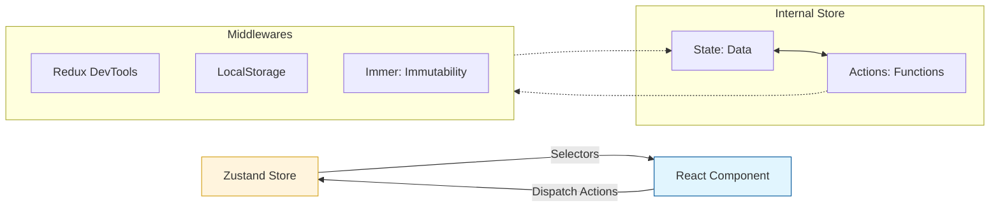

## TypeScript: Zustand + TypeScript: Основы

Привет, кодеры! Яша снова на связи, и сегодня мы погрузимся в мир управления состоянием с одним из самых легких и приятных инструментов — Zustand. Если твой проект ощущается как тяжелый рюкзак, полный ненужных вещей, и ты ищешь легкое, но мощное решение для состояния, то Zustand — это то, что доктор прописал. Он минималистичен, быстр и, что самое главное для нас с тобой, отлично дружит с TypeScript!

Мы уже мастера в базовых типах, интерфейсах и дженериках, так что пора применить эти знания для создания по-настоящему типобезопасного и производительного управления состоянием.

### 🚀 Создаем Первое Хранилище: Базовый Zustand

Zustand – это как маленький, но очень вместительный рюкзак для твоего состояния. Он позволяет тебе создать хранилище, и компоненты могут "заглядывать" в него, чтобы взять нужные данные, не перетаскивая весь рюкзак целиком.

### Zustand State Flow


*Поток данных в Zustand: компоненты подписываются на часть состояния и вызывают действия для его обновления.*

Начнем с классики – счетчика. Это простой пример, но он демонстрирует ключевые концепции.

```typescript
import { create } from 'zustand';

// 1. Определяем интерфейс для нашего состояния.
// Это важно для типобезопасности!
interface CounterState {
  count: number;
  increment: (by?: number) => void;
  decrement: (by?: number) => void;
  reset: () => void;
}

// 2. Создаем хранилище, явно указывая его тип.
// 'set' - функция для изменения состояния.
// 'get' - функция для получения текущего состояния (полезна для сложных вычислений).
const useCounterStore = create<CounterState>((set, get) => ({
  count: 0, // Инициализируем начальное значение
  
  // Функция для увеличения счетчика.
  // Используем колбэк в 'set' для безопасного обновления на основе предыдущего состояния.
  increment: (by = 1) => set((state) => ({ count: state.count + by })),
  
  // Функция для уменьшения счетчика.
  decrement: (by = 1) => set((state) => ({ count: state.count - by })),

  // Сброс счетчика. Можно передать объект с новым состоянием напрямую.
  reset: () => set({ count: 0 }),
}));

// --- Как использовать это хранилище в React-компоненте (для демонстрации) ---
// function CounterComponent() {
//   // Получаем значение 'count' и функцию 'increment' из хранилища.
//   // Zustand оптимизирован: компонент будет ререндериться только при изменении 'count'.
//   const count = useCounterStore((state) => state.count);
//   const increment = useCounterStore((state) => state.increment);
//   const decrement = useCounterStore((state) => state.decrement);

//   return (
//     <div>
//       <p>Счетчик: {count}</p>
//       <button onClick={() => increment()}>Увеличить</button>
//       <button onClick={() => decrement(5)}>Уменьшить на 5</button>
//     </div>
//   );
// }

// console.log("Начальное состояние:", useCounterStore.getState().count); // Доступ к состоянию вне React
// useCounterStore.getState().increment(10);
// console.log("После увеличения:", useCounterStore.getState().count);
```

Обрати внимание, как `create<CounterState>` гарантирует, что ты не забудешь ни одно поле из интерфейса `CounterState` и что все твои функции будут иметь правильные аргументы и возвращаемые значения. Это магия TypeScript!

### 🛠️ Моделируем Сложное Состояние с TypeScript

В реальных приложениях состояние редко бывает таким простым, как счетчик. Давай представим, что нам нужно управлять профилем пользователя с вложенными настройками и списком друзей.

```typescript
// Определяем типы для сложных объектов
interface UserSettings {
  theme: 'dark' | 'light';
  notificationsEnabled: boolean;
  language: string;
}

interface UserProfile {
  id: string;
  name: string;
  email: string;
  settings: UserSettings; // Вложенный объект
  friends: string[]; // Массив строк (ID друзей)
  lastLogin: Date; // Работаем с объектами Date
}

// Определяем интерфейс для всего хранилища пользователя
interface UserStoreState {
  user: UserProfile | null;
  isLoading: boolean;
  error: string | null;
  
  // Действия для работы с профилем пользователя
  fetchUser: (userId: string) => Promise<void>;
  updateUserName: (newName: string) => void;
  toggleNotifications: () => void;
  addFriend: (friendId: string) => void;
  setLanguage: (lang: string) => void;
}

const useUserStore = create<UserStoreState>((set, get) => ({
  user: null, // Изначально пользователя нет
  isLoading: false,
  error: null,

  fetchUser: async (userId: string) => {
    set({ isLoading: true, error: null });
    try {
      // Имитация асинхронного запроса к API
      await new Promise((resolve) => setTimeout(resolve, 800)); 
      
      const fetchedUser: UserProfile = {
        id: userId,
        name: 'Яша TypeScript',
        email: 'yasha@learncode.com',
        settings: { theme: 'dark', notificationsEnabled: true, language: 'ru' },
        friends: ['Алиса', 'Боб'],
        lastLogin: new Date(),
      };
      set({ user: fetchedUser, isLoading: false });
    } catch (err: any) {
      set({ error: err.message, isLoading: false });
    }
  },

  updateUserName: (newName: string) => {
    set((state) => ({
      user: state.user ? { ...state.user, name: newName } : null,
    }));
  },

  toggleNotifications: () => {
    set((state) => ({
      user: state.user
        ? {
            ...state.user,
            settings: {
              ...state.user.settings,
              notificationsEnabled: !state.user.settings.notificationsEnabled,
            },
          }
        : null,
    }));
  },

  addFriend: (friendId: string) => {
      set((state) => ({
          user: state.user
              ? {
                  ...state.user,
                  friends: [...state.user.friends, friendId] // Обновляем массив иммутабельно
              }
              : null
      }));
  },

  setLanguage: (lang: string) => {
    set((state) => ({
      user: state.user
        ? {
            ...state.user,
            settings: {
              ...state.user.settings,
              language: lang,
            },
          }
        : null,
    }));
  },
}));

// --- Примеры использования селекторов ---
// const userName = useUserStore((state) => state.user?.name); // Тип: string | undefined
// const userLanguage = useUserStore((state) => state.user?.settings.language); // Тип: string | undefined
// const friendsCount = useUserStore((state) => state.user?.friends.length || 0); // Тип: number

// console.log("Начальное состояние пользователя:", useUserStore.getState().user);
// useUserStore.getState().fetchUser('yasha123'); // Загружаем пользователя
// setTimeout(() => {
//   console.log("Пользователь после загрузки:", useUserStore.getState().user?.name);
//   useUserStore.getState().updateUserName('Yasha The Great');
//   useUserStore.getState().toggleNotifications();
//   useUserStore.getState().addFriend('Иван');
//   useUserStore.getState().setLanguage('en');
//   console.log("Пользователь после обновлений:", useUserStore.getState().user);
// }, 1000);
```

Здесь мы видим, как TypeScript помогает нам при работе с вложенными объектами. Если ты забудешь поле `settings` или попытаешься обратиться к нему без проверки на `null`, TypeScript тебя поправит. Обрати внимание на паттерн `...state.user` и `...state.user.settings` — это стандартный способ иммутабельного обновления вложенных объектов в JavaScript, если не используешь Immer (о нем ниже).

### 🧪 Продвинутые Техники: Мидлвары и Иммутабельность с Immer

Zustand очень гибок благодаря мидлварам (middleware). Они позволяют добавлять дополнительную логику к вашему хранилищу, не изменяя его основной структуры. Два самых популярных мидлвара: `devtools` (для интеграции с Redux DevTools) и `persist` (для сохранения состояния в локальном хранилище).

А для упрощения работы с иммутабельностью глубоко вложенных объектов мы используем Immer.

```typescript
import { create } from 'zustand';
import { devtools, persist } from 'zustand/middleware';
import { produce } from 'immer'; // Импортируем 'produce' из Immer

// Тип для элемента корзины
interface CartItem {
  id: string;
  name: string;
  price: number;
  quantity: number;
}

// Тип для состояния корзины
interface CartState {
  items: CartItem[];
  total: number;
  addItem: (item: Omit<CartItem, 'quantity'>, quantity?: number) => void;
  removeItem: (id: string) => void;
  updateQuantity: (id: string, quantity: number) => void;
  clearCart: () => void;
  // Добавим действие для получения общего количества товаров
  getTotalItemsCount: () => number; 
}

// Вспомогательная функция для интеграции Immer с Zustand
// Это хак, который позволяет использовать produce внутри set-функций Zustand.
// Он принимает функцию конфига Zustand и оборачивает set так, чтобы он работал с Immer.
const immer =
  <T extends object>(
    config: (set: (fn: (state: T) => void) => void, get: () => T, api: any) => T
  ): typeof config =>
  (set, get, api) =>
    config(
      (fn) => set(produce(fn) as (state: T) => T), // Здесь magic: 'set' теперь понимает Immer
      get,
      api
    );

const useCartStore = create<CartState>()(
  // Оборачиваем наше хранилище в мидлвары
  devtools( // 1. devtools: Для отладки в Redux DevTools
    persist( // 2. persist: Для сохранения состояния в localStorage
      immer((set, get) => ({ // 3. immer: Используем нашу обертку для Immer
        items: [],
        total: 0,
        
        addItem: (newItem, quantity = 1) => {
          // С Immer мы можем мутировать 'draft' объект напрямую!
          // Immer позаботится о создании новой, иммутабельной версии состояния.
          set((state) => {
            const existingItem = state.items.find((item) => item.id === newItem.id);
            if (existingItem) {
              existingItem.quantity += quantity;
            } else {
              state.items.push({ ...newItem, quantity });
            }
            // Пересчитываем total. В Immer это делается очень наглядно.
            state.total = state.items.reduce((sum, item) => sum + item.price * item.quantity, 0);
          });
        },
        
        removeItem: (id: string) => {
          set((state) => {
            state.items = state.items.filter((item) => item.id !== id);
            state.total = state.items.reduce((sum, item) => sum + item.price * item.quantity, 0);
          });
        },

        updateQuantity: (id: string, quantity: number) => {
          set((state) => {
            const item = state.items.find((item) => item.id === id);
            if (item) {
              item.quantity = quantity;
            }
            state.total = state.items.reduce((sum, item) => sum + item.price * item.quantity, 0);
          });
        },
        
        clearCart: () => {
          set((state) => {
            state.items = [];
            state.total = 0;
          });
        },

        // Селектор как функция, которая находится внутри хранилища
        // Это не классический селектор Zustand, а просто функция, которая использует 'get()'
        getTotalItemsCount: () => {
          return get().items.reduce((sum, item) => sum + item.quantity, 0);
        }
      })),
      {
        name: 'cart-storage', // Имя, под которым состояние будет храниться в localStorage
        getStorage: () => localStorage, // Указываем, какое хранилище использовать
        // Можно добавить 'partialize' для сохранения только части состояния
        // или 'version' для управления миграциями схем данных
      }
    )
  )
);

// --- Примеры использования ---
// useCartStore.getState().addItem({ id: 'ts-book', name: 'TypeScript Book', price: 25 }, 1);
// useCartStore.getState().addItem({ id: 'react-hat', name: 'React Hat', price: 15 }, 2);
// console.log("Корзина после добавления:", useCartStore.getState().items, "Total:", useCartStore.getState().total);

// useCartStore.getState().updateQuantity('ts-book', 3);
// console.log("Корзина после обновления количества:", useCartStore.getState().items, "Total:", useCartStore.getState().total);

// useCartStore.getState().removeItem('react-hat');
// console.log("Корзина после удаления:", useCartStore.getState().items, "Total:", useCartStore.getState().total);
// console.log("Общее количество товаров в корзине:", useCartStore.getState().getTotalItemsCount());
```

С Immer работа с вложенными объектами становится намного приятнее и безопаснее. Ты пишешь код, как будто мутируешь объект напрямую, а Immer гарантирует иммутабельность "под капотом". А `devtools` и `persist` — это маст-хэв для большинства реальных приложений.

### 🚫 Типичные Ошибки и Как Их Избежать

1.  **Некорректная типизация селекторов**: TypeScript обычно хорошо выводит типы, но иногда при сложных селекторах ты можешь получить `any` или неверный тип.
    *   **Ошибка**: `const data = useMyStore(state => state.some.nested.property);` где `some` или `nested` могут быть `undefined`. TypeScript может показать `any`.
    *   **Решение**: Всегда проверяй на `undefined` или используй опциональные цепочки `?.` и операторы объединения с null `??`.
        ```typescript
        interface AppState {
          user?: {
            profile?: {
              name: string;
            };
          };
        }
        // ... создание useAppStore
        
        const userName = useAppStore((state) => state.user?.profile?.name ?? 'Гость');
        // Тип userName будет string, а не string | undefined, как в первом случае.
        ```

2.  **Мутация состояния без Immer**: Если ты не используешь Immer, то прямое изменение объектов или массивов в колбэке `set` не вызовет ререндера.
    *   **Ошибка (без Immer)**:
        ```typescript
        // ... в create<MyState>((set) => ({ ... }))
        updateItem: (id: string, newName: string) => {
          set((state) => {
            const item = state.items.find(i => i.id === id);
            if (item) {
              item.name = newName; // Прямая мутация! Zustand не увидит изменения.
            }
            return state; // Возвращаем тот же объект, что получили.
          });
        }
        ```
    *   **Решение (без Immer)**: Всегда возвращай новый объект или массив.
        ```typescript
        updateItem: (id: string, newName: string) => {
          set((state) => ({
            items: state.items.map(item => 
              item.id === id ? { ...item, name: newName } : item
            ),
          }));
        }
        ```
    *   **Лучшее Решение**: Используй Immer, как показано выше.

3.  **Забыли обновить производные данные**: Если у тебя есть поле `total`, которое зависит от `items`, ты должен вручную пересчитывать `total` при каждом изменении `items`.
    *   **Ошибка**: Обновил `items`, но `total` остался старым.
    *   **Решение**: Убедись, что все зависимые поля обновляются в том же `set` колбэке, где изменяются их источники. Immer здесь также очень помогает, делая код более читаемым.

### 🎯 Практика

Время применить полученные знания! Создай новые хранилища и функции, используя все, что мы прошли.

1.  **Создайте хранилище `TaskStore`**:
    *   Определите тип `Task` с полями: `id: string`, `title: string`, `description: string`, `isCompleted: boolean`, `createdAt: Date`.
    *   Создайте хранилище `TaskStore` с состоянием `tasks: Task[]`.
    *   Добавьте следующие действия:
        *   `addTask(title: string, description: string)`: Добавляет новую задачу. `id` генерируется автоматически (например, `Math.random().toString()`).
        *   `deleteTask(id: string)`: Удаляет задачу по `id`.
        *   `toggleTaskStatus(id: string)`: Переключает статус `isCompleted` для задачи.
        *   `editTask(id: string, updates: Partial<Omit<Task, 'id' | 'createdAt'>>)`: Редактирует поля задачи (кроме `id` и `createdAt`).

2.  **Модифицируйте `TaskStore` с мидлварами**:
    *   Интегрируйте `devtools` для отладки в браузере.
    *   Добавьте `persist` для сохранения задач в `localStorage` под именем `'task-manager-storage'`.

3.  **Реализуйте селектор**:
    *   В `TaskStore` создайте селектор (или функцию, которая использует `get()`) `getCompletedTasksCount(): number`, которая возвращает количество завершенных задач.
    *   Создайте также селектор `getTasksByStatus(status: boolean): Task[]`, который фильтрует задачи по статусу завершения.

4.  **Используйте Immer**:
    *   Примените `immer` мидлвар к вашему `TaskStore` и перепишите действия `editTask` и `toggleTaskStatus` таким образом, чтобы они использовали синтаксис мутации `draft` объекта.

### 💡 Совет

*   **Явная типизация — твой друг**: Всегда используй `create<MyState>(...)`. Это дает тебе полный контроль и помощь TypeScript внутри колбэка `set` и `get`.
*   **Immer для сложности**: Если у тебя вложенные объекты или массивы, и ты часто их обновляешь, `immer` радикально упростит твой код и повысит его безопасность.
*   **Селекторы для производительности**: Используй `useStore((state) => state.partOfState)` вместо `useStore((state) => state)` и последующей деструктуризации. Это гарантирует, что твой компонент будет ререндериться только тогда, когда изменится *именно та часть состояния*, которую он использует.
*   **Разделение ответственности**: Для очень больших приложений рассмотри возможность создания нескольких небольших, специализированных хранилищ вместо одного гигантского. Это улучшает модульность и читаемость.
*   **Тестирование**: Не забывай, что Zustand хранилища легко тестировать, так как они не привязаны напрямую к React-компонентам. Ты можешь вызвать их методы напрямую и проверять состояние.

Удачи в практике! До следующего урока, Яша.
