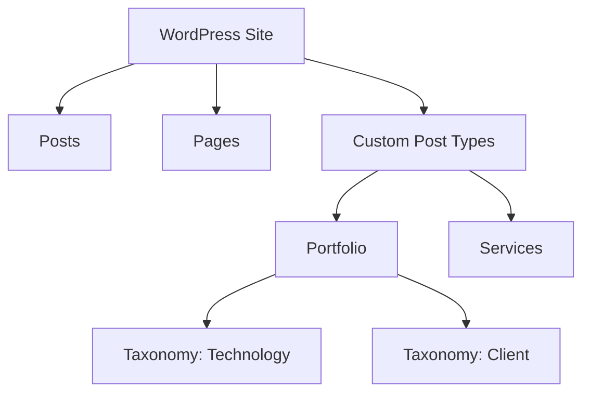

# Custom Post Types & Taxonomies

WordPress по умолчанию предоставляет два основных типа контента: Записи (Posts) и Страницы (Pages). Для создания сложных сайтов, таких как портфолио, каталоги недвижимости или базы знаний, необходимо создавать свои типы записей и способы их группировки.

## Регистрация Custom Post Type (CPT)

Для регистрации используется функция `register_post_type()`. Рекомендуется вызывать её на хуке `init`.

```php
function yasha_register_portfolio_cpt() {
    $args = [
        'labels' => [
            'name' => 'Проекты',
            'singular_name' => 'Проект',
        ],
        'public'      => true,
        'has_archive' => true,
        'menu_icon'   => 'dashicons-portfolio',
        'supports'    => ['title', 'editor', 'thumbnail', 'excerpt'],
        'show_in_rest' => true, // Обязательно для поддержки Gutenberg
    ];

    register_post_type('portfolio', $args);
}
add_action('init', 'yasha_register_portfolio_cpt');
```

### Основные параметры:
- `public`: определяет, будет ли тип записи доступен в админке и на фронтенде.
- `has_archive`: создает страницу архива (например, `/portfolio/`).
- `show_in_rest`: включает поддержку блочного редактора Gutenberg.
- `supports`: определяет доступные поля (заголовок, редактор, миниатюра и т.д.).

## Таксономии (Taxonomies)

Таксономии позволяют группировать контент. Стандартные примеры — Категории и Теги. Мы можем создать свои, например «Технологии» для проектов.

```php
function yasha_register_tech_taxonomy() {
    $args = [
        'labels' => [
            'name' => 'Технологии',
            'singular_name' => 'Технология',
        ],
        'hierarchical' => true, // Поведение как у категорий (false — как у тегов)
        'show_in_rest' => true,
    ];

    register_taxonomy('technology', ['portfolio'], $args);
}
add_action('init', 'yasha_register_tech_taxonomy');
```

## Визуализация структуры контента



## Работа с CPT в коде

Для вывода кастомных записей используется стандартный `WP_Query` с указанием `post_type`.

```php
$query = new WP_Query([
    'post_type' => 'portfolio',
    'posts_per_page' => 10,
    'tax_query' => [
        [
            'taxonomy' => 'technology',
            'field'    => 'slug',
            'terms'    => 'react',
        ],
    ],
]);

if ($query->have_posts()) {
    while ($query->have_posts()) {
        $query->the_post();
        the_title('<h2>', '</h2>');
    }
    wp_reset_postdata();
}
```

## Резюме
Использование CPT и таксономий превращает WordPress из блог-платформы в полноценную CMS для любых типов данных. Всегда включайте `show_in_rest`, если планируете использовать Gutenberg.
