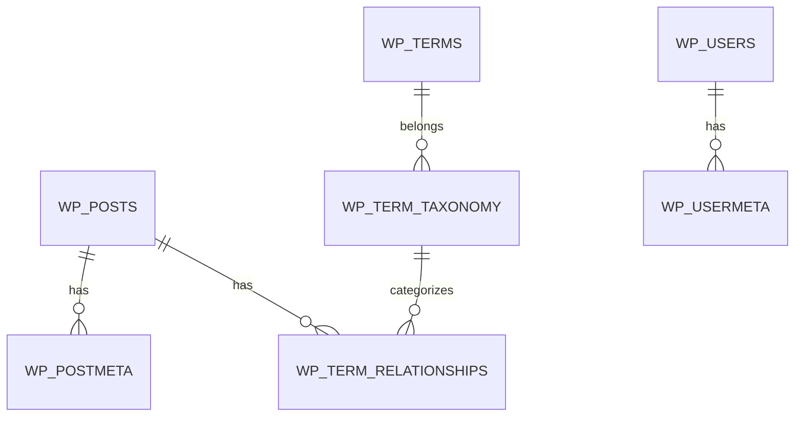

# Работа с Базой Данных

Хотя WordPress предоставляет высокоуровневые API (`WP_Query`, `get_post`), иногда требуется прямой доступ к базе данных для сложных отчетов или работы с кастомными таблицами.

## Объект $wpdb

`$wpdb` — это глобальный объект класса `wpdb`, который инкапсулирует работу с MySQL.

```php
global $wpdb;

// Получение одной переменной
$user_count = $wpdb->get_var( "SELECT COUNT(*) FROM $wpdb->users" );

// Получение одной строки
$user = $wpdb->get_row( "SELECT * FROM $wpdb->users WHERE ID = 1" );

// Получение списка результатов
$results = $wpdb->get_results( "SELECT post_title FROM $wpdb->posts WHERE post_status = 'publish'" );
```

## Структура таблиц WordPress



### Основные таблицы:
- `wp_posts`: Записи, страницы, вложения и CPT.
- `wp_postmeta`: Дополнительные данные (метаполя) для записей.
- `wp_options`: Настройки сайта и плагинов.
- `wp_terms`: Названия категорий/тегов.

## Создание кастомных таблиц

При разработке сложных систем (например, системы логов) лучше создать свою таблицу.

```php
function yasha_create_custom_table() {
    global $wpdb;
    $table_name = $wpdb->prefix . 'yasha_logs';
    $charset_collate = $wpdb->get_charset_collate();

    $sql = "CREATE TABLE $table_name (
        id mediumint(9) NOT NULL AUTO_INCREMENT,
        time datetime DEFAULT '0000-00-00 00:00:00' NOT NULL,
        message text NOT NULL,
        PRIMARY KEY  (id)
    ) $charset_collate;";

    require_once( ABSPATH . 'wp-admin/includes/upgrade.php' );
    dbDelta( $sql );
}
```

## Операции CRUD

```php
// Insert
$wpdb->insert( 
    $wpdb->prefix . 'yasha_logs', 
    [ 'time' => current_time( 'mysql' ), 'message' => 'Test log' ],
    [ '%s', '%s' ] 
);

// Update
$wpdb->update( 
    $wpdb->prefix . 'yasha_logs', 
    [ 'message' => 'Updated message' ], 
    [ 'id' => 1 ], 
    [ '%s' ], 
    [ '%d' ] 
);
```

## Резюме
- Используйте `$wpdb->prefix` для поддержки кастомных префиксов таблиц.
- Всегда экранируйте данные через `$wpdb->prepare()`.
- Используйте `dbDelta` для безопасного создания и обновления структуры таблиц.
