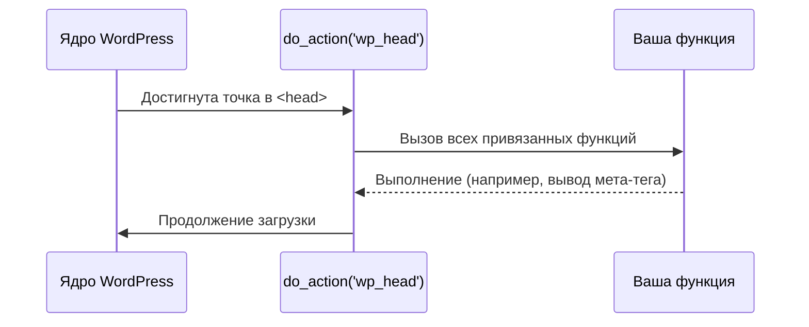

# Хуки (Hooks)

Хуки — это основа расширяемости WordPress. Они позволяют разработчикам изменять поведение системы или выводить контент в определенных местах, не затрагивая файлы ядра или других плагинов.

Существует два типа хуков: **Actions** (События) и **Filters** (Фильтры).

## Actions (Экшены)

Экшены позволяют выполнять код в определенный момент загрузки страницы или выполнения процесса (например, при сохранении поста).

**Принцип работы:** "Когда происходит событие X, выполни функцию Y".



### Пример использования:

Добавим скрипт в подвал сайта.

```php
function my_custom_footer_text() {
    echo '<p>Сделано на курсе Яши</p>';
}

add_action('wp_footer', 'my_custom_footer_text');
```

## Filters (Фильтры)

Фильтры используются для модификации данных перед тем, как они будут сохранены в базу или выведены на экран.

**Принцип работы:** "Возьми переменную, измени её и верни обратно".

### Пример использования:

Изменим длину текста в анонсе поста (excerpt).

```php
function my_custom_excerpt_length($length) {
    return 20; // Ограничить до 20 слов
}

add_filter('excerpt_length', 'my_custom_excerpt_length');
```

## Как найти нужный хук?

1. **Документация:** Официальный WordPress Code Reference.
2. **Поиск по коду:** Если вы используете IDE, ищите вызовы `do_action()` и `apply_filters()` в файлах ядра или плагинов.
3. **Плагины для отладки:** Query Monitor показывает все хуки, запущенные на текущей странице.

## Приоритет выполнения

Вы можете указать, в какой очереди выполнится ваша функция, добавив числовой приоритет (по умолчанию 10).

```php
add_action('init', 'my_first_function', 5);  // Выполнится раньше
add_action('init', 'my_second_function', 15); // Выполнится позже
```

Использование хуков делает ваш код чистым, модульным и совместимым с обновлениями системы.
