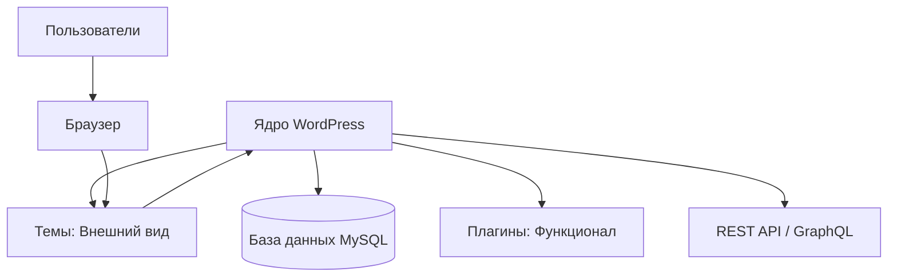

# Введение в WordPress

WordPress — это самая популярная система управления контентом (CMS) в мире. В 2026 году она продолжает удерживать лидерство, эволюционировав из простой платформы для блогов в мощный фреймворк для создания сложных веб-приложений, интернет-магазинов и Headless-решений.

## Почему WordPress?

Несмотря на появление множества новых инструментов, WordPress остается актуальным по нескольким причинам:

1. **Доступность:** Огромное сообщество и база знаний.
2. **Гибкость:** Возможность создать что угодно — от лендинга до социальной сети.
3. **Экосистема:** Тысячи плагинов (WooCommerce, ACF, Yoast) и тем.
4. **Gutenberg:** Современный блочный редактор на базе React, который изменил подход к редактированию контента.

## Архитектура системы

Архитектура WordPress строится на принципе обратной совместимости и событийной модели.

### Основные компоненты:

- **Core (Ядро):** Файлы системы, которые обеспечивают базовую логику. Их никогда нельзя редактировать напрямую.
- **Темы:** Отвечают за отображение данных.
- **Плагины:** Расширяют возможности системы без изменения ядра.
- **База данных:** Хранит посты, настройки, данные пользователей и мета-информацию.

## Возможности в 2026 году

Современный WordPress — это не только PHP. Сегодня активно используются:

- **Full Site Editing (FSE):** Управление всем сайтом через блоки.
- **Interactivity API:** Создание быстрых фронтенд-интерфейсов без перезагрузки страниц.
- **Headless Mode:** Использование WP как бэкенда для Next.js или Vue приложений.

В следующих уроках мы разберем, как настроить среду разработки и начать создавать профессиональные решения на этой платформе.
