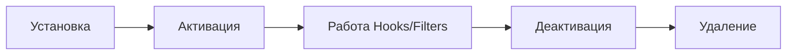

# Разработка плагинов

Плагины позволяют расширять функциональность WordPress без изменения файлов ядра или темы.

## Структура плагина

Минимальный плагин — это PHP-файл в директории `wp-content/plugins/` с заголовком в комментариях. Однако профессиональные плагины имеют четкую структуру.

```text
my-awesome-plugin/
├── assets/             # JS, CSS, Images
├── includes/           # PHP логика, классы
├── templates/          # Файлы шаблонов
├── languages/          # i18n файлы
└── my-awesome-plugin.php # Главный файл
```

## Главный файл плагина

```php
<?php
/**
 * Plugin Name: Yasha Custom Functionality
 * Description: Обучающий плагин для демонстрации разработки.
 * Version: 1.0.0
 * Author: Yasha Learn Code
 * License: GPL2
 */

// Защита от прямого доступа
if ( ! defined( 'ABSPATH' ) ) {
    exit;
}

// Константы
define( 'YASHA_PLUGIN_DIR', plugin_dir_path( __FILE__ ) );
define( 'YASHA_PLUGIN_URL', plugin_dir_url( __FILE__ ) );

// Подключение файлов
require_once YASHA_PLUGIN_DIR . 'includes/class-yasha-init.php';
```

## Жизненный цикл плагина



### Активация и Деактивация

Используются для создания таблиц в БД или настройки дефолтных опций.

```php
function yasha_plugin_activate() {
    // Логика при активации (например, flush_rewrite_rules)
}
register_activation_hook( __FILE__, 'yasha_plugin_activate' );

function yasha_plugin_deactivate() {
    // Очистка при отключении
}
register_deactivation_hook( __FILE__, 'yasha_plugin_deactivate' );
```

## Использование хуков в плагине

Лучшая практика — использовать объектно-ориентированный подход для организации хуков.

```php
class Yasha_Core {
    public function __construct() {
        add_action( 'wp_enqueue_scripts', [ $this, 'enqueue_assets' ] );
    }

    public function enqueue_assets() {
        wp_enqueue_style( 'yasha-styles', YASHA_PLUGIN_URL . 'assets/css/main.css' );
    }
}
new Yasha_Core();
```

## Интерактивный пример (Assets)

Здесь мы можем имитировать подключение стилей через плагин.

<Playground template="vanilla" />

## Резюме
- Всегда используйте префиксы в именах функций и классов, чтобы избежать конфликтов.
- Не забывайте про `register_uninstall_hook` для полной очистки данных после удаления плагина.
- Организуйте код по логическим папкам.
