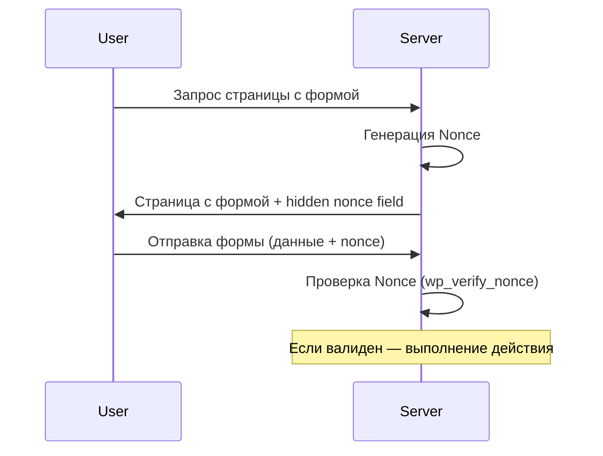

# Безопасность и очистка данных

Безопасность в WordPress строится на принципе: никогда не доверять входящим данным и всегда экранировать исходящие.

## Validation, Sanitization, Escaping

Существует три уровня обработки данных:
1. **Validation (Валидация):** Проверка, соответствуют ли данные формату (например, является ли строка email-адресом).
2. **Sanitization (Очистка):** Удаление потенциально опасных символов из входящих данных перед сохранением в БД.
3. **Escaping (Экранирование):** Подготовка данных перед выводом в браузер для предотвращения XSS-атак.

### Примеры кода

```php
// 1. Validation
if ( ! is_email( $_POST['user_email'] ) ) {
    wp_die('Неверный формат email');
}

// 2. Sanitization (перед сохранением)
$user_name = sanitize_text_field( $_POST['user_name'] );
$user_bio  = wp_kses_post( $_POST['user_bio'] ); // Разрешает только безопасный HTML

// 3. Escaping (при выводе)
echo esc_html( $title );
echo esc_url( $link );
?>
<input type="text" value="<?php echo esc_attr( $value ); ?>">
```

## Nonces (Numbers used once)

Nonces защищают от CSRF-атак (Cross-Site Request Forgery). Они проверяют, что запрос был отправлен намеренно и из доверенного места.

### Жизненный цикл Nonce



### Использование Nonce

**В форме:**
```php
<form method="post">
    <?php wp_nonce_field( 'yasha_save_settings', 'yasha_settings_nonce' ); ?>
    <input type="text" name="setting_field">
    <input type="submit" value="Сохранить">
</form>
```

**В обработчике:**
```php
if ( isset( $_POST['yasha_settings_nonce'] ) && wp_verify_nonce( $_POST['yasha_settings_nonce'], 'yasha_save_settings' ) ) {
    // Безопасно сохраняем данные
} else {
    wp_die('Ошибка безопасности');
}
```

## SQL Инъекции и $wpdb

При выполнении прямых запросов к БД всегда используйте метод `prepare()`.

```php
global $wpdb;
$user_id = 5;
$results = $wpdb->get_results( $wpdb->prepare(
    "SELECT * FROM {$wpdb->prefix}posts WHERE post_author = %d AND post_status = %s",
    $user_id,
    'publish'
) );
```

## Резюме
- Используйте `sanitize_*` функции для входящих данных.
- Используйте `esc_*` функции для вывода данных.
- Всегда добавляйте `nonce` в формы и AJAX-запросы.
- Никогда не конкатенируйте переменные в SQL-запросах.
