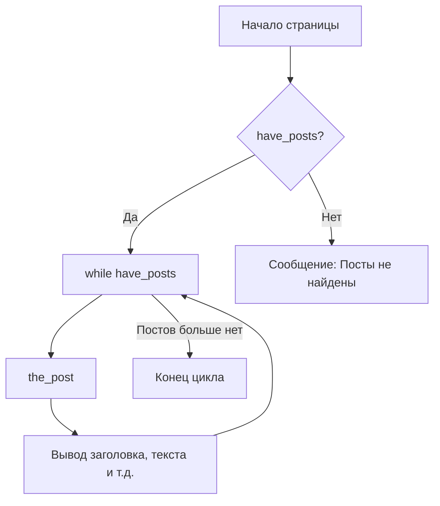

# Цикл (The Loop)

Цикл (The Loop) — это основной механизм WordPress для вывода постов. Он проходит по каждому посту, доступному для текущей страницы, и отображает его согласно вашему шаблону.

## Как это работает

Когда WordPress загружает страницу, он делает запрос к базе данных и собирает массив постов. Цикл проверяет, есть ли посты, и если да — начинает их перебор.



## Стандартный код цикла

Этот код обычно находится в файлах `index.php`, `single.php` или `archive.php`.

```php
<?php
if ( have_posts() ) : 
    while ( have_posts() ) : the_post(); ?>
        
        <article id="post-<?php the_ID(); ?>">
            <h2><a href="<?php the_permalink(); ?>"><?php the_title(); ?></a></h2>
            <div><?php the_excerpt(); ?></div>
        </article>

    <?php endwhile; 
else :
    echo '<p>Контент не найден.</p>';
endif;
?>
```

## Важные функции внутри цикла

- `the_title()` — выводит заголовок поста.
- `the_content()` — выводит основной текст.
- `the_permalink()` — ссылка на полную версию поста.
- `the_post_thumbnail()` — выводит миниатюру (featured image).
- `the_category()` — список категорий.

## Пользовательские запросы: WP_Query

Иногда стандартного цикла недостаточно (например, нужно вывести 3 последних новости в подвале). Для этого используется класс `WP_Query`.

```php
$args = array(
    'post_type' => 'post',
    'posts_per_page' => 3
);

$query = new WP_Query( $args );

if ( $query->have_posts() ) {
    while ( $query->have_posts() ) {
        $query->the_post();
        the_title('<li>', '</li>');
    }
    wp_reset_postdata(); // Обязательно сбросить глобальные данные после кастомного цикла
}
```

Всегда помните о вызовe `wp_reset_postdata()`, чтобы не нарушить работу основного цикла на странице.
