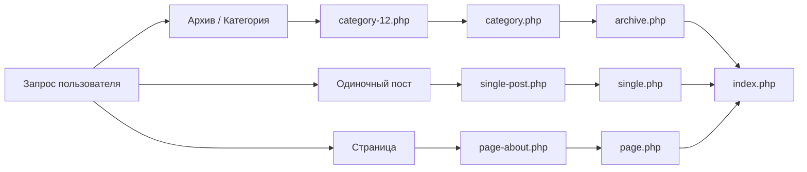

# Структура темы

Тема WordPress определяет, как контент будет отображаться пользователю. Понимание иерархии шаблонов — ключ к созданию гибких и производительных сайтов.

## Минимальный набор файлов

Для того чтобы WordPress распознал папку как тему, в ней должны быть как минимум два файла:

1. `style.css` — мета-информация о теме и стили.
2. `index.php` — основной шаблон вывода.

### style.css

В начале этого файла обязательно должен быть заголовок в комментариях:

```css
/*
Theme Name: My Custom Theme
Author: Yasha
Version: 1.0
Description: Обучающая тема для курса WordPress.
*/
```

## Иерархия шаблонов (Template Hierarchy)

WordPress ищет нужный файл шаблона в зависимости от того, какую страницу запросил пользователь. Если специфичный файл не найден, система переходит к более общему.



## Основные файлы темы

- `functions.php` — "мозг" темы. Здесь подключаются скрипты, стили и регистрируются возможности темы.
- `header.php` — верхняя часть сайта (теги `head`, навигация).
- `footer.php` — нижняя часть сайта (подвал, скрипты).
- `sidebar.php` — боковая панель.

## Подключение стилей и скриптов

Правильный способ подключения ресурсов в WordPress — использование хука `wp_enqueue_scripts` в файле `functions.php`.

```php
<?php
// functions.php

function my_theme_scripts() {
    // Подключение стилей
    wp_enqueue_style('main-styles', get_stylesheet_uri());
    
    // Подключение кастомного JS
    wp_enqueue_script('custom-js', get_template_directory_uri() . '/js/main.js', array(), '1.0', true);
}

add_action('wp_enqueue_scripts', 'my_theme_scripts');
```

Использование функций `get_header()` и `get_footer()` позволяет собирать страницу из этих фрагментов.
