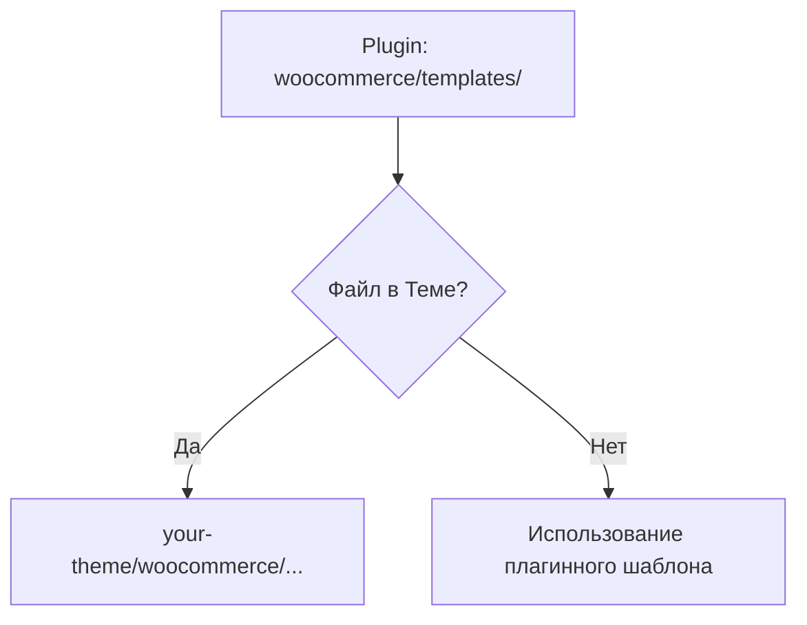

# WooCommerce

WooCommerce — самый популярный плагин для создания интернет-магазинов на WordPress. Он превращает WP в мощную e-commerce платформу.

## Поддержка темы (Theme Support)

Чтобы тема корректно работала с WooCommerce, её нужно объявить.

```php
function yasha_add_woocommerce_support() {
    add_theme_support( 'woocommerce' );
    add_theme_support( 'wc-product-gallery-zoom' );
    add_theme_support( 'wc-product-gallery-lightbox' );
    add_theme_support( 'wc-product-gallery-slider' );
}
add_action( 'after_setup_theme', 'yasha_add_woocommerce_support' );
```

## Иерархия шаблонов WooCommerce

WooCommerce использует свою систему шаблонов. Чтобы переопределить их, создайте папку `woocommerce` в корне вашей темы.



Например, для изменения страницы товара: скопируйте `single-product.php` из плагина в `your-theme/woocommerce/single-product.php`.

## Хуки WooCommerce

WooCommerce практически полностью построен на хуках. Это позволяет менять контент, не затрагивая файлы шаблонов.

### Пример: Добавление текста под кнопкой "Купить"

```php
add_action( 'woocommerce_after_add_to_cart_button', 'yasha_after_cart_button_text' );

function yasha_after_cart_button_text() {
    echo '<p class="shipping-info">Бесплатная доставка от 5000 руб.</p>';
}
```

### Удаление стандартных элементов

```php
// Удаление вывода цены на странице списка товаров
remove_action( 'woocommerce_after_shop_loop_item_title', 'woocommerce_template_loop_price', 10 );
```

## Работа с данными заказа

```php
$order = wc_get_order( $order_id );

foreach ( $order->get_items() as $item_id => $item ) {
    $product_name = $item->get_name();
    $quantity = $item->get_quantity();
}

$total = $order->get_total();
```

## Интерактивность в корзине

<Playground template="vanilla" />

## Резюме
- Используйте `add_theme_support( 'woocommerce' )`.
- Переопределяйте шаблоны только в крайнем случае, отдавайте приоритет хукам (`add_action`, `remove_action`).
- Используйте `wc_get_product` и `wc_get_order` для получения объектов данных.
