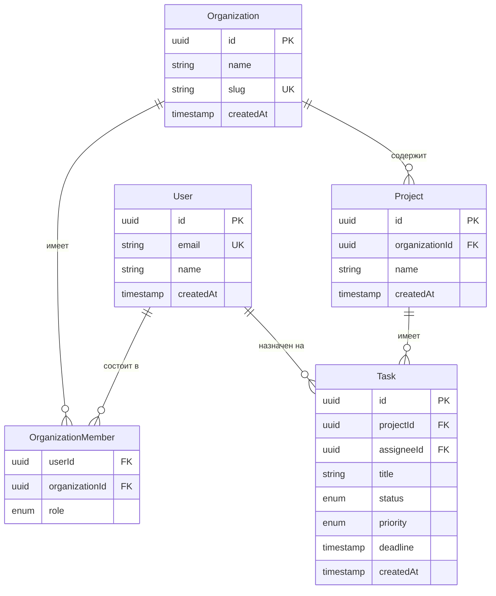

import { Tabs, TabItem, Aside, Steps, Card, CardGrid } from '@astrojs/starlight/components';


## Зачем вообще AI в базах данных?

Базы данных — одно из самых болезненных мест в разработке. Нормализация, индексы, миграции, N+1 запросы, explain plan... Всё это можно делать руками и тратить часы, или делегировать AI и тратить минуты.

В 2026 году AI умеет:
- Проектировать схемы из словесного описания
- Генерировать Prisma schema, Drizzle schema, чистый SQL
- Писать и оптимизировать запросы
- Читать `EXPLAIN ANALYZE` и предлагать индексы
- Генерировать миграции и seed data
- Рисовать ERD из описания (буквально)

Это не замена понимания БД — это суперзарядка для тех, кто понимает.

## Описываем схему словами, получаем готовый код

Самое мощное применение AI в базах — это трансформация бизнес-требований в готовую схему. Не нужно держать в голове синтаксис — просто описываешь что нужно.

### Промпт для Prisma schema

```
Спроектируй Prisma schema для SaaS-платформы управления задачами.

Требования:
- Пользователи могут состоять в нескольких организациях (разные роли)
- Организации имеют проекты, проекты — задачи
- Задачи: название, описание, статус, приоритет, дедлайн, исполнитель
- Комментарии к задачам с поддержкой вложенности (replies)
- Вложения к задачам (URL + метаданные)
- Теги и лейблы
- Аудит-лог всех изменений
- Подписки/тарифы для организаций

Стек: PostgreSQL, Prisma ORM, TypeScript.
Используй best practices: createdAt/updatedAt везде, soft delete через deletedAt, UUID как primary keys.
```

Claude или ChatGPT выдадут полную Prisma schema с отношениями, индексами и перечислениями. Дальше уточняешь итеративно:

```
Добавь поддержку подзадач (subtasks). Задача может быть дочерней для другой задачи — неограниченная вложенность.
```

```
Добавь таблицу для webhook-подписок организации на события (task.created, comment.added и т.д.)
```

### Drizzle schema

Drizzle — альтернатива Prisma с другим подходом. AI отлично справляется с обоими:

```
Перепиши эту Prisma schema на Drizzle ORM с PostgreSQL.
Используй Drizzle Kit для миграций.
Типы должны быть полностью TypeScript-safe.

[вставить Prisma schema]
```

### Чистый SQL

```
Сгенерируй CREATE TABLE statements для PostgreSQL.
Нужны таблицы: users, organizations, projects, tasks.
Включи: foreign keys, индексы на часто фильтруемые поля, CHECK constraints для статусов/приоритетов.
Добавь комментарии к каждой таблице и колонке.
```

<Aside type="tip" title="Контекст — всё">
Чем больше контекста ты даёшь AI о своём бизнесе и стеке, тем точнее схема. Укажи: тип приложения, ожидаемые объёмы, какие запросы будут самыми частыми. AI учтёт это при выборе индексов и типов данных.
</Aside>

## ERD из описания

ERD (Entity-Relationship Diagram) — схема базы данных в виде диаграммы. Раньше нужно было вручную рисовать в Lucidchart или draw.io. Сейчас:

### Вариант 1: Mermaid через Claude/ChatGPT

```
Нарисуй ERD для схемы выше в формате Mermaid erDiagram.
Покажи все связи: один-ко-многим, многие-ко-многим.
```

Результат — Mermaid-код, который рендерится прямо в GitHub, Notion, Obsidian:



### Вариант 2: dbdiagram.io

Сервис [dbdiagram.io](https://dbdiagram.io) использует свой DBML синтаксис. AI генерирует его:

```
Напиши DBML код для dbdiagram.io для следующей схемы: [описание]
```

Вставляешь в dbdiagram.io — получаешь красивую интерактивную диаграмму, которую можно экспортировать в PDF, PNG или SQL.

## Генерация миграций

### С Prisma

После изменения schema.prisma скажи AI:

```
У меня изменилась Prisma schema — добавил таблицу Webhook и поле metadata к Task.
Какую команду запустить для создания миграции?
Напиши имя миграции в snake_case.
```

Ответ: `npx prisma migrate dev --name add_webhooks_and_task_metadata`

Но AI может сделать больше — проверить, нет ли проблем с миграцией:

```
Вот SQL который сгенерировал Prisma для миграции: [вставить SQL]

Проверь:
1. Нет ли потенциальной потери данных
2. Правильно ли настроены CASCADE на foreign keys
3. Есть ли необходимые индексы
4. Нужны ли дополнительные DEFAULT значения для существующих строк
```

### Ручные миграции

Иногда Prisma Migrate недостаточно. Скажи AI что нужно:

```
Напиши SQL-миграцию для PostgreSQL:
1. Переименовать колонку user_id в author_id в таблице comments
2. Не потерять данные
3. Не блокировать таблицу на prod (используй concurrent where возможно)
4. Добавить rollback-скрипт
```

## Seed data — тестовые данные быстро

Seed data — одна из самых нудных вещей. AI справляется за секунды:

```
Напиши seed.ts для Prisma с реалистичными тестовыми данными:
- 3 организации (разные тарифы: free, pro, enterprise)
- По 5-10 пользователей в каждой
- По 3-5 проектов на организацию
- По 10-30 задач на проект (разные статусы и приоритеты)
- Комментарии к части задач
- Используй @faker-js/faker для реалистичных имён и текстов
- Пароли захешируй через bcrypt (пароль: "password123" для всех)
```

Дополнение:

```
Добавь детерминированный seed (фиксированный randomSeed в faker) чтобы данные были одинаковые при каждом запуске.
```

## Оптимизация запросов с AI

Это один из самых ценных сценариев. У тебя есть медленный запрос — AI помогает его починить.

### Шаг 1: Получи EXPLAIN ANALYZE

```sql
EXPLAIN (ANALYZE, BUFFERS, FORMAT JSON)
SELECT t.*, u.name as assignee_name, p.name as project_name
FROM tasks t
LEFT JOIN users u ON t.assignee_id = u.id
LEFT JOIN projects p ON t.project_id = p.id
WHERE t.organization_id = '...'
  AND t.status != 'done'
  AND t.deadline < NOW() + INTERVAL '7 days'
ORDER BY t.priority DESC, t.deadline ASC
LIMIT 50;
```

### Шаг 2: Скармливай AI

```
Вот запрос и его EXPLAIN ANALYZE output. Время выполнения: 847ms.
Таблица tasks: ~500k строк. users: ~50k. projects: ~10k.

[вставить запрос]
[вставить EXPLAIN ANALYZE JSON]

Что замедляет запрос? Какие индексы добавить? Можно ли переписать запрос эффективнее?
```

AI проанализирует plan, найдёт Sequential Scan там где должен быть Index Scan, и предложит:
- Конкретные `CREATE INDEX` команды
- Composite индексы для частых комбинаций фильтров
- Переписанный запрос (иногда CTE быстрее JOIN)
- Partial индексы для фильтров по статусу

### N+1 проблема

Частая боль в ORM. AI умеет её находить и чинить:

```
Вот мой Prisma запрос. Есть подозрение на N+1.
Как переписать через include/select чтобы данные тянулись одним запросом?

const tasks = await prisma.task.findMany({
  where: { projectId },
});

// Потом в цикле:
for (const task of tasks) {
  const comments = await prisma.comment.findMany({
    where: { taskId: task.id },
  });
}
```

## Инструменты для AI + базы данных

<CardGrid>
  <Card title="Claude/ChatGPT" icon="document">
    Универсальный вариант для проектирования схем, написания SQL, оптимизации запросов. Просто вставляй код и объясняй проблему.
  </Card>
  <Card title="Cursor" icon="seti:cursor">
    AI прямо в редакторе. Понимает контекст твоей schema.prisma и генерирует запросы под неё. Отличен для написания репозиторного слоя.
  </Card>
  <Card title="Drizzle Studio + AI" icon="seti:db">
    Drizzle Kit имеет встроенный Studio (веб-интерфейс для БД). В связке с Cursor — мощный дуэт: видишь данные и пишешь запросы с AI.
  </Card>
  <Card title="PgAdmin + AI" icon="seti:database">
    Вставляй медленные запросы в чат AI прямо из PgAdmin. Или используй расширение для VS Code — Database Client.
  </Card>
</CardGrid>

### Специализированные инструменты

**[Chat2DB](https://chat2db.ai/)** — IDE для баз данных с встроенным AI. Пишешь запрос на естественном языке, он конвертирует в SQL. Поддерживает PostgreSQL, MySQL, MongoDB, Redis.

**[DataGrip + AI Assistant](https://www.jetbrains.com/datagrip/)** — JetBrains IDE для БД с AI-автодополнением SQL. Платный, но мощный.

**[Outerbase](https://outerbase.com/)** — веб-интерфейс для БД с AI-чатом. Спрашиваешь "покажи топ-10 пользователей по количеству задач" — получаешь результат и SQL.

## Практика: Проектируем схему для SaaS-приложения

Создадим полноценную схему для task-management SaaS с нуля через диалог с AI.

<Steps>

1. ### Старт: бизнес-требования → первичная схема

   **Промпт:**
   ```
   Я строю SaaS для управления проектами (аналог Jira/Linear).
   
   Основные сущности:
   - Workspace (организация) с подпиской (free/pro/enterprise)
   - Пользователи с ролями внутри workspace (owner, admin, member, viewer)
   - Проекты внутри workspace
   - Issues (задачи) с кастомными статусами на уровне проекта
   - Labels, Milestones, Sprints
   - Комментарии с @mentions
   - Интеграции (GitHub, Slack — хранить OAuth токены)
   
   Спроектируй Prisma schema для PostgreSQL.
   Best practices: UUID PKs, timestamps, soft delete там где нужно, индексы.
   ```

2. ### Добавляем фичи итеративно

   ```
   Добавь:
   1. Activity log — каждое изменение issue пишется в лог (какое поле, старое значение, новое)
   2. Уведомления — пользователь подписывается на issue или проект
   3. Кастомные поля для issues (тип: text, number, date, select, multiselect)
   
   Не ломай существующую схему — только добавляй.
   ```

3. ### Проверяем на проблемы

   ```
   Просмотри схему и найди потенциальные проблемы:
   1. Где могут быть проблемы с производительностью при большом объёме данных?
   2. Какие индексы обязательно нужны для типичных запросов?
   3. Есть ли риск циклических зависимостей в foreign keys?
   4. Где нужен CASCADE DELETE, а где SET NULL?
   ```

4. ### Генерируем seed data

   ```
   Напиши prisma/seed.ts:
   - 2 workspace (free и pro)
   - 5 пользователей, распределённых по workspace
   - 3 проекта в pro workspace, 1 в free
   - 50 issues с реалистичными данными
   - 20 комментариев
   - Используй @faker-js/faker
   ```

5. ### Пишем первые запросы

   ```
   Напиши Prisma-запросы для:
   1. Dashboard: все открытые issues назначенные на меня, сгруппированные по проекту
   2. Inbox: непрочитанные уведомления с пагинацией
   3. Activity feed: последние 50 событий в workspace с деталями
   
   Оптимизируй: не должно быть N+1 запросов.
   ```

</Steps>

## Типичные задачи с промптами

<Tabs>
  <TabItem label="Написать запрос">
    ```
    Напиши SQL/Prisma запрос для:
    
    Получить статистику по workspace за последние 30 дней:
    - Количество созданных issues по дням
    - Топ-5 пользователей по закрытым issues
    - Среднее время закрытия issue (от создания до статуса done)
    - Количество issue по приоритетам
    
    БД: PostgreSQL, ORM: Prisma
    ```
  </TabItem>
  <TabItem label="Оптимизировать">
    ```
    Запрос выполняется 2.3 секунды. Оптимизируй.
    
    Схема: [вставить relevent таблицы]
    Запрос: [вставить]
    EXPLAIN ANALYZE: [вставить output]
    
    Данные: issues ~1M строк, users ~100k, workspaces ~10k
    ```
  </TabItem>
  <TabItem label="Написать миграцию">
    ```
    Напиши безопасную миграцию PostgreSQL:
    
    Нужно: добавить полнотекстовый поиск к таблице issues
    (поля: title, description)
    
    Требования:
    - Не блокировать таблицу (CONCURRENTLY где возможно)
    - Использовать GIN индекс с tsvector
    - Добавить rollback скрипт
    - Миграция должна быть идемпотентной (IF NOT EXISTS)
    ```
  </TabItem>
  <TabItem label="Найти баг">
    ```
    Мой Prisma запрос возвращает дубликаты. Разберись почему.
    
    [вставить запрос]
    [вставить пример данных с дубликатами]
    
    Схема отношений:
    Task hasMany Labels (many-to-many через _TaskLabels)
    Task hasMany Comments
    ```
  </TabItem>
</Tabs>

## Советы

**Давай схему контекстом.** Всегда вставляй relevent части Prisma schema или CREATE TABLE — AI строит точный запрос под твою структуру, не угадывает.

**Итерируй, не пиши огромные промпты.** Начни с базовой схемы, потом добавляй фичи. Огромный промпт = размытый результат.

**Проверяй индексы.** AI часто добавляет индексы на foreign keys — это правильно. Но иногда забывает composite индексы для запросов с несколькими WHERE условиями. Спроси отдельно.

**Используй EXPLAIN для проверки.** После AI-оптимизации запускай `EXPLAIN ANALYZE` снова — убедись что план изменился. Иногда AI предлагает индекс который PostgreSQL всё равно не использует.

**Не доверяй слепо.** AI может предложить правильный индекс, но неверный тип (B-tree vs GIN для массивов и full-text). Всегда читай что он объясняет, а не только копируй код.

## Ссылки

- [Prisma Docs](https://www.prisma.io/docs) — документация Prisma ORM
- [Drizzle ORM](https://orm.drizzle.team/) — быстрая TypeScript-native альтернатива
- [dbdiagram.io](https://dbdiagram.io/) — нарисовать ERD из DBML
- [explain.dalibo.com](https://explain.dalibo.com/) — визуализация EXPLAIN ANALYZE для PostgreSQL
- [pganalyze](https://pganalyze.com/) — мониторинг и анализ запросов в проде
- [Chat2DB](https://chat2db.ai/) — IDE для БД с встроенным AI
