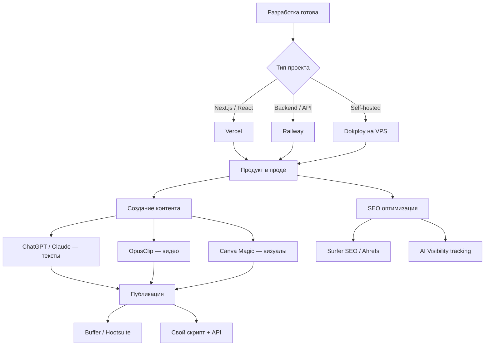

# Урок 7: Публикация с ИИ

Ты написал приложение с AI — теперь надо его задеплоить, рассказать о нём миру и не потеряться в поисковиках. В этом уроке разберём весь пайплайн публикации: от деплоя до SEO.

---

## Часть 1: Деплой AI-проектов

### Три главных платформы 2026

Когда проект с AI уходит в прод, нужна инфраструктура, которая переживёт длинные запросы, стриминг ответов и возможные GPU-задачи.

| Платформа | Лучший сценарий | Не подходит если |
|-----------|-----------------|------------------|
| **Vercel** | Next.js + serverless AI | Нужен GPU или долгий процесс |
| **Railway** | Backend сервисы, кастомный контейнер | Хочется serverless простоты |
| **Dokploy** | Self-hosted на своём сервере | Нет VPS |

---

### Vercel — для фронтенд + AI функций

Vercel — первый выбор для Next.js приложений с AI. Они запустили [Vercel AI SDK](https://sdk.vercel.ai/) — нативную интеграцию с OpenAI, Anthropic, Google прямо в serverless functions.

**Ключевые AI-фичи Vercel:**
- Встроенный AI SDK со streaming поддержкой
- Edge Runtime для ultra-low latency задач (5-20ms cold start)
- 300 секунд таймаут на функцию (Pro план)
- Cron Jobs для запланированных AI задач

**Деплой Next.js приложения:**

```bash
# Установи Vercel CLI
npm i -g vercel

# В папке проекта
vercel

# Production деплой
vercel --prod
```

**Пример AI API route (Next.js App Router):**

```typescript
// app/api/generate/route.ts
import { streamText } from 'ai'
import { openai } from '@ai-sdk/openai'

export async function POST(req: Request) {
  const { prompt } = await req.json()

  const result = await streamText({
    model: openai('gpt-4o'),
    prompt,
    maxTokens: 1000,
  })

  return result.toDataStreamResponse()
}
```

**Тарифы Vercel 2026:**
- Hobby: бесплатно (100GB трафик/мес)
- Pro: $20/month (1TB, 300s timeout, команда)
- Enterprise: кастомно

---

### Railway — для backend и полного стека

Railway — когда нужны persistent сервисы без cold start, базы данных рядом с кодом, и возможность деплоить любой Docker-образ.

**Ключевые AI-фичи Railway:**
- Persistent сервисы (нет cold start)
- Нативные PostgreSQL и Redis
- Кастомный Docker деплой
- GPU поддержка (waitlist 2026)
- Template marketplace с готовыми AI стартерами

**Сравнение cold start:**

| Платформа | Cold start | Тёплый ответ |
|-----------|-----------|--------------|
| Vercel (Node.js) | 400-800ms | 10-30ms |
| Vercel (Edge) | 20-50ms | 1-5ms |
| Railway | 0 (persistent) | 10-30ms |
| Render | 5-30s | 20-50ms |

**Деплой на Railway:**

```bash
# Установи Railway CLI
npm i -g @railway/cli

# Логин
railway login

# Создай проект
railway init

# Деплой
railway up
```

**railway.toml конфиг:**

```toml
[build]
builder = "nixpacks"
buildCommand = "npm run build"

[deploy]
startCommand = "npm start"
restartPolicyType = "ON_FAILURE"
restartPolicyMaxRetries = 10
```

**Тарифы Railway 2026:**
- Hobby: $5/month (500 часов, 512MB RAM)
- Pro: $20/month + usage (неограниченные проекты, 8GB RAM)

---

### Dokploy — self-hosted PaaS на своём сервере

Dokploy — open-source альтернатива Vercel/Railway. Запускается на любом VPS через Docker Swarm или Kubernetes. Нулевой vendor lock-in.

**Почему Dokploy:**
- **Бесплатно** — только стоимость VPS
- Автодеплой по git push (GitHub/GitLab/Bitbucket)
- Встроенные базы данных (PostgreSQL, MySQL, Redis, MongoDB)
- One-click деплой популярных open-source сервисов
- Визуальный UI, как в Heroku
- Apache 2.0 лицензия

**Установка Dokploy:**

```bash
# На чистом Ubuntu/Debian VPS
curl -sSL https://dokploy.com/install.sh | sh
```

После установки UI доступен на порту `3000`.

**Типичный workflow:**
1. Создать приложение в UI
2. Подключить GitHub репо
3. Настроить env variables
4. Push в main → автодеплой

**Dokploy vs Vercel — когда что:**

```
Vercel:   быстро, zero config, дорого на scale
Railway:  баланс удобства и гибкости, credit-based billing
Dokploy:  максимальный контроль, дёшево, требует DevOps знаний
```

---

## Часть 2: Создание контента с ИИ

### Контент-машина 2026 — инструменты

После деплоя нужно рассказать о продукте. Вот актуальный стек 2026.

#### Для текстового контента

**ChatGPT / Claude — центр всего**

Генерация текста для любого канала: посты, скрипты, описания, email рассылки. ChatGPT лучше всего для caption writing и content pillars. Claude — для длинных структурированных текстов.

Пример промпта для поста:
```
Напиши 3 варианта LinkedIn поста про запуск AI-приложения [название].
Аудитория: разработчики и стартаперы.
Тон: экспертный но живой. Без корпоративного официоза.
Добавь хук в первые 2 строки. Ограничь до 1300 символов.
```

**Jasper / Writesonic — для масштаба**

Когда нужен поток контента: Writesonic Pro (от $79/месяц) генерирует до 100 статей в месяц с SEO-аудитом.

#### Для видео-контента

**OpusClip — нарезка длинных видео**

Paste URL → AI выбирает лучшие моменты, режет в клипы, добавляет автокаптины на 20+ языках, адаптирует aspect ratio под Reels/TikTok/Shorts.

**Runway Gen-3 / Sora** — генерация видео из текста или изображений.

**Canva Magic Studio** — дизайн соцсетей с AI: генерация изображений, AI effects, background removal прямо в редакторе.

---

### Автоматизация постинга

#### Buffer — простой мультиплатформенный постинг

Buffer подключает одновременно Instagram, LinkedIn, Twitter/X, Bluesky, TikTok, YouTube. Ставишь очередь постов — система сама выбирает оптимальное время.

```
Планы Buffer 2026:
- Free: 3 канала, 10 постов в очереди
- Essentials: $6/канал/month
- Team: $12/канал/month
```

#### Hootsuite — для enterprise и команд

Hootsuite AI Assistant помогает генерировать и переформатировать контент прямо в планировщике.

```
Pro: $99/month (1 юзер, 10 аккаунтов)
Team: $249/month (3 юзера, 20 аккаунтов)
```

#### Автопостинг через API — разработческий подход

Для максимального контроля — собственный скрипт:

```python
import anthropic
import tweepy
import schedule
import time

# Клиенты
claude = anthropic.Anthropic(api_key="your_key")
twitter = tweepy.Client(
    consumer_key="...",
    consumer_secret="...",
    access_token="...",
    access_token_secret="..."
)

def generate_and_post():
    # Генерируем пост через Claude
    message = claude.messages.create(
        model="claude-opus-4-5",
        max_tokens=280,
        messages=[{
            "role": "user",
            "content": "Напиши технический твит про AI-разработку. Актуальный тренд 2026. Без хэштегов."
        }]
    )
    
    post_text = message.content[0].text
    
    # Постим в Twitter
    twitter.create_tweet(text=post_text)
    print(f"Posted: {post_text[:50]}...")

# Каждый день в 9:00
schedule.every().day.at("09:00").do(generate_and_post)

while True:
    schedule.run_pending()
    time.sleep(60)
```

---

## Часть 3: SEO с ИИ

### Почему SEO меняется в 2026

В 2026 появился новый фронт — **AI Visibility**. Теперь нужно оптимизировать не только под Google, но и под то, как ChatGPT, Perplexity и Claude упоминают твой продукт в ответах.

### AI SEO инструменты 2026

#### Surfer SEO + AI

Анализирует топ-10 конкурентов, генерирует структуру статьи, оптимизирует семантику в реальном времени. Встроенный AI writer.

```
Тарифы 2026:
Essential: $99/month (30 статей)
Scale: $219/month (100 статей)
```

#### Ahrefs — keyword research + AI visibility tracking

Tim Soulo (CMO Ahrefs) в феврале 2026: "Стандартные метрики DR/UR не мертвы, но теперь нужно отслеживать brand presence в AI платформах."

Ahrefs добавил **AI Visibility** — трекинг того, как часто и как правильно тебя упоминают в ChatGPT/Perplexity/Claude.

#### RivalFlow AI — анализ контент-гэпов

Показывает точно, чего не хватает твоему контенту по сравнению с конкурентами из SERP. Автоматически находит разделы для улучшения.

#### Narrato — AI-контент воркспейс

Полный цикл: планирование → создание → SEO-оптимизация → публикация. Подходит для команд.

### SEO best practices 2026

**Структурированные данные (Schema.org):**

```html
<script type="application/ld+json">
{
  "@context": "https://schema.org",
  "@type": "SoftwareApplication",
  "name": "YourAIApp",
  "description": "AI-powered tool for...",
  "applicationCategory": "DeveloperApplication",
  "operatingSystem": "Web",
  "offers": {
    "@type": "Offer",
    "price": "0",
    "priceCurrency": "USD"
  }
}
</script>
```

**Оптимизация под AI-читаемость:**
- Используй чёткие заголовки H1/H2/H3 — AI лучше парсит структуру
- Добавляй FAQ секции — прямые ответы на вопросы попадают в AI ответы
- Пиши для людей, структурируй для AI
- Включай конкретные данные (цифры, даты) — AI их цитирует

**Технический SEO с AI:**

```python
# Автогенерация мета-описаний для всех страниц
import anthropic

def generate_meta_description(page_title: str, page_content: str) -> str:
    client = anthropic.Anthropic()
    
    response = client.messages.create(
        model="claude-haiku-4-5",
        max_tokens=200,
        messages=[{
            "role": "user",
            "content": f"""Напиши SEO meta description (до 155 символов) для страницы:
Заголовок: {page_title}
Контент: {page_content[:500]}

Включи ключевые слова, призыв к действию. Только description, без кавычек."""
        }]
    )
    
    return response.content[0].text

# Использование
pages = [
    ("AI Vibe Coding курс", "Научись создавать приложения с AI..."),
    ("Урок 1: Replit", "Replit Agent 3 позволяет..."),
]

for title, content in pages:
    meta = generate_meta_description(title, content)
    print(f"[{title}]: {meta}")
    print(f"Длина: {len(meta)} символов\n")
```

---

## Полный пайплайн публикации



---

## Быстрый старт: деплой за 5 минут

```bash
# 1. Next.js проект готов?
npm run build  # проверь что собирается

# 2. Деплой на Vercel
npx vercel --prod

# 3. Добавь env vars в Vercel dashboard
# OPENAI_API_KEY, DATABASE_URL и т.д.

# 4. Готово! Получи URL вида: your-app.vercel.app
```

---

## Чеклист перед публикацией

- [ ] `npm run build` проходит без ошибок
- [ ] Все env переменные добавлены в деплой платформу
- [ ] API rate limits проверены (OpenAI, Anthropic)
- [ ] Error handling настроен (что видит пользователь при ошибке AI)
- [ ] Мета-теги (title, description, og:image) заполнены
- [ ] Google Search Console подключён
- [ ] Analytics добавлен (Vercel Analytics или PostHog)

---

## Источники

- [Vercel AI SDK](https://sdk.vercel.ai/) — официальная документация
- [Railway vs Vercel: Deploying AI Applications](https://getathenic.com/blog/vercel-vs-railway-vs-render-ai-deployment) — getathenic.com, октябрь 2025
- [Deploying Full Stack Apps in 2026](https://www.nucamp.co/blog/deploying-full-stack-apps-in-2026-vercel-netlify-railway-and-cloud-options) — nucamp.co, январь 2026
- [Coolify vs Dokploy](https://www.cherryservers.com/blog/coolify-vs-dokploy) — cherryservers.com, март 2026
- [Best AI SEO Tools for 2026](https://medium.com/@timsoulo/best-ai-seo-tools-for-2026-content-optimization-keyword-research-and-ai-visibility-6e9a13c354db) — Tim Soulo (Ahrefs), февраль 2026
- [Best AI Social Media Schedulers in 2026](https://sintra.ai/blog/best-ai-social-media-scheduler) — sintra.ai, январь 2026
- [Best AI Content Creation Tools in 2026](https://meetsona.ai/blog/best-ai-content-creation-tools/) — meetsona.ai, март 2026

---

*Следующий урок: [Урок 8: Desktop и Mobile приложения с ИИ →](/ai-vibe-coding/desktop-mobile)*
