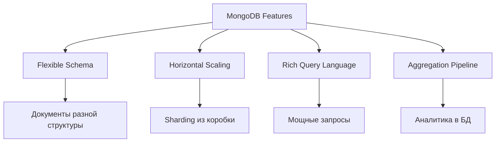

import { Playground } from '@components/Playground'

MongoDB — это документо-ориентированная NoSQL база данных, хранящая данные в формате BSON (Binary JSON). Гибкая схема, горизонтальное масштабирование и удобная работа с JSON делают её популярной для современных приложений.

## Почему MongoDB?



**Преимущества:**
- Гибкая схема (нет фиксированных колонок)
- Нативная работа с JSON
- Горизонтальное масштабирование (sharding)
- Мощный aggregation framework
- Реплицирование для высокой доступности

**Недостатки:**
- Нет JOIN'ов (денормализация)
- Больше места на диске (дублирование данных)
- Eventual consistency при репликации
- Сложнее обеспечить строгую консистентность

## Основные концепции

| SQL | MongoDB |
|---|---|
| Database | Database |
| Table | Collection |
| Row | Document |
| Column | Field |
| Index | Index |
| JOIN | Embedding / $lookup |
| Primary Key | _id (автоматически) |

## Установка и подключение

### Локальная установка

```bash
# macOS (Homebrew)
brew tap mongodb/brew
brew install mongodb-community@7.0
brew services start mongodb-community@7.0

# Ubuntu
wget -qO - https://www.mongodb.org/static/pgp/server-7.0.asc | sudo apt-key add -
echo "deb [ arch=amd64,arm64 ] https://repo.mongodb.org/apt/ubuntu jammy/mongodb-org/7.0 multiverse" | sudo tee /etc/apt/sources.list.d/mongodb-org-7.0.list
sudo apt update
sudo apt install -y mongodb-org
sudo systemctl start mongod

# Проверка
mongosh --version
```

### MongoDB Atlas (облако)

```bash
# Подключение к Atlas
mongosh "mongodb+srv://cluster0.xxxxx.mongodb.net/mydb" --apiVersion 1 --username myuser
```

## CRUD операции

### Create - Вставка документов

```javascript
// Подключение
use myapp

// Вставка одного документа
db.users.insertOne({
  username: "john_doe",
  email: "john@example.com",
  age: 30,
  status: "active",
  roles: ["user", "moderator"],
  profile: {
    firstName: "John",
    lastName: "Doe",
    bio: "Software developer"
  },
  createdAt: new Date()
})

// Вставка нескольких
db.users.insertMany([
  {
    username: "alice",
    email: "alice@example.com",
    age: 25,
    status: "active",
    roles: ["user"],
    createdAt: new Date()
  },
  {
    username: "bob",
    email: "bob@example.com",
    age: 35,
    status: "inactive",
    roles: ["user", "admin"],
    createdAt: new Date()
  }
])
```

### Read - Запросы

```javascript
// Найти всех пользователей
db.users.find()

// Найти с условием
db.users.find({ status: "active" })

// Найти одного
db.users.findOne({ username: "john_doe" })

// Проекция (выбор полей)
db.users.find(
  { status: "active" },
  { username: 1, email: 1, _id: 0 }  // 1 = включить, 0 = исключить
)

// Операторы сравнения
db.users.find({ age: { $gt: 25, $lte: 35 } })  // 25 < age <= 35
db.users.find({ status: { $in: ["active", "pending"] } })
db.users.find({ status: { $ne: "banned" } })

// Логические операторы
db.users.find({
  $and: [
    { age: { $gte: 18 } },
    { status: "active" }
  ]
})

db.users.find({
  $or: [
    { status: "active" },
    { roles: "admin" }
  ]
})

// Вложенные поля
db.users.find({ "profile.firstName": "John" })

// Массивы
db.users.find({ roles: "admin" })  // содержит "admin"
db.users.find({ roles: { $all: ["user", "admin"] } })  // содержит оба
db.users.find({ "roles.0": "user" })  // первый элемент = "user"

// Сортировка и ограничение
db.users.find().sort({ age: -1 }).limit(10).skip(5)

// Подсчёт
db.users.countDocuments({ status: "active" })
```

### Update - Обновление

```javascript
// Обновить одного
db.users.updateOne(
  { username: "john_doe" },
  { $set: { age: 31, "profile.bio": "Senior developer" } }
)

// Обновить многих
db.users.updateMany(
  { status: "inactive" },
  { $set: { status: "archived", archivedAt: new Date() } }
)

// Операторы обновления
db.users.updateOne(
  { username: "alice" },
  {
    $inc: { age: 1 },  // Инкремент
    $push: { roles: "premium" },  // Добавить в массив
    $currentDate: { lastModified: true }  // Текущая дата
  }
)

// Удалить поле
db.users.updateOne(
  { username: "bob" },
  { $unset: { temporaryField: "" } }
)

// Удалить из массива
db.users.updateOne(
  { username: "john_doe" },
  { $pull: { roles: "moderator" } }
)

// Upsert (insert if not exists)
db.users.updateOne(
  { username: "new_user" },
  { $set: { email: "new@example.com", createdAt: new Date() } },
  { upsert: true }
)

// Replace целого документа
db.users.replaceOne(
  { username: "old_user" },
  { username: "old_user", email: "updated@example.com", status: "active" }
)
```

### Delete - Удаление

```javascript
// Удалить одного
db.users.deleteOne({ username: "john_doe" })

// Удалить многих
db.users.deleteMany({ status: "archived" })

// Удалить все документы
db.users.deleteMany({})

// Удалить коллекцию
db.users.drop()
```

## Индексы

```javascript
// Создание индекса
db.users.createIndex({ email: 1 })  // 1 = ascending, -1 = descending

// Составной индекс
db.users.createIndex({ status: 1, createdAt: -1 })

// Уникальный индекс
db.users.createIndex({ username: 1 }, { unique: true })

// Частичный индекс
db.users.createIndex(
  { email: 1 },
  { partialFilterExpression: { status: "active" } }
)

// TTL индекс (автоудаление старых документов)
db.sessions.createIndex(
  { createdAt: 1 },
  { expireAfterSeconds: 3600 }  // удалить через 1 час
)

// Текстовый индекс
db.articles.createIndex({ title: "text", content: "text" })

// Список индексов
db.users.getIndexes()

// Удалить индекс
db.users.dropIndex("email_1")

// Анализ использования индекса
db.users.find({ email: "john@example.com" }).explain("executionStats")
```

## TypeScript с Mongoose

```typescript
import mongoose from 'mongoose';

// Подключение
await mongoose.connect('mongodb://localhost:27017/myapp');

// Схема
const userSchema = new mongoose.Schema({
  username: {
    type: String,
    required: true,
    unique: true,
    lowercase: true,
    trim: true
  },
  email: {
    type: String,
    required: true,
    unique: true,
    match: /^[^\s@]+@[^\s@]+\.[^\s@]+$/
  },
  age: {
    type: Number,
    min: 18,
    max: 120
  },
  status: {
    type: String,
    enum: ['active', 'inactive', 'banned'],
    default: 'active'
  },
  roles: [String],
  profile: {
    firstName: String,
    lastName: String,
    bio: String
  },
  createdAt: {
    type: Date,
    default: Date.now
  },
  updatedAt: {
    type: Date,
    default: Date.now
  }
}, {
  timestamps: true  // автоматические createdAt/updatedAt
});

// Индексы
userSchema.index({ email: 1 }, { unique: true });
userSchema.index({ status: 1, createdAt: -1 });

// Виртуальные поля
userSchema.virtual('fullName').get(function() {
  return `${this.profile.firstName} ${this.profile.lastName}`;
});

// Методы экземпляра
userSchema.methods.isAdmin = function() {
  return this.roles.includes('admin');
};

// Статические методы
userSchema.statics.findActive = function() {
  return this.find({ status: 'active' });
};

// Middleware (hooks)
userSchema.pre('save', function(next) {
  this.updatedAt = new Date();
  next();
});

// Модель
const User = mongoose.model('User', userSchema);

// CRUD с Mongoose
async function examples() {
  // Create
  const user = await User.create({
    username: 'john_doe',
    email: 'john@example.com',
    age: 30,
    roles: ['user'],
    profile: {
      firstName: 'John',
      lastName: 'Doe'
    }
  });

  // Read
  const users = await User.find({ status: 'active' })
    .select('username email')
    .sort({ createdAt: -1 })
    .limit(10);

  const oneUser = await User.findOne({ email: 'john@example.com' });
  const byId = await User.findById('507f1f77bcf86cd799439011');

  // Update
  await User.updateOne(
    { username: 'john_doe' },
    { $set: { age: 31 } }
  );

  const updated = await User.findByIdAndUpdate(
    user._id,
    { $push: { roles: 'premium' } },
    { new: true }  // вернуть обновлённый документ
  );

  // Delete
  await User.deleteOne({ username: 'john_doe' });
  await User.findByIdAndDelete(user._id);

  // Использование методов
  const activeUsers = await User.findActive();
  console.log(user.fullName);  // виртуальное поле
  console.log(user.isAdmin());  // метод экземпляра
}
```

## TypeScript с нативным драйвером

```typescript
import { MongoClient, ObjectId } from 'mongodb';

const client = new MongoClient('mongodb://localhost:27017');

interface User {
  _id?: ObjectId;
  username: string;
  email: string;
  age: number;
  status: 'active' | 'inactive' | 'banned';
  roles: string[];
  createdAt: Date;
}

async function main() {
  await client.connect();
  
  const db = client.db('myapp');
  const users = db.collection<User>('users');

  // Create
  const result = await users.insertOne({
    username: 'john_doe',
    email: 'john@example.com',
    age: 30,
    status: 'active',
    roles: ['user'],
    createdAt: new Date()
  });
  console.log('Inserted:', result.insertedId);

  // Read
  const user = await users.findOne({ username: 'john_doe' });
  
  const allActive = await users.find({ status: 'active' })
    .sort({ createdAt: -1 })
    .limit(10)
    .toArray();

  // Update
  await users.updateOne(
    { username: 'john_doe' },
    { $set: { age: 31 } }
  );

  // Delete
  await users.deleteOne({ username: 'john_doe' });

  await client.close();
}

main().catch(console.error);
```

## 💡 Best Practices

1. **Индексы:** Создавайте на часто используемых полях для поиска
2. **_id:** Используйте ObjectId для автоматической генерации уникальных ID
3. **Схема:** Хоть MongoDB schema-less, определяйте структуру в коде (Mongoose/Zod)
4. **Денормализация:** Embed связанные данные вместо JOIN'ов
5. **Проекция:** Выбирайте только нужные поля
6. **Connection Pooling:** Переиспользуйте подключения

## Когда использовать MongoDB

✅ **Хорошо для:**
- Гибкая/меняющаяся схема
- Быстрая разработка (прототипы)
- Логи, события, аналитика
- Каталоги, CMS
- Реал-тайм приложения
- IoT данные

❌ **Плохо для:**
- Сложные транзакции (банки)
- Многие JOIN'ы
- Строгая консистентность
- Реляционные данные

## ⚠️ Частые ошибки

- Отсутствие индексов (медленные запросы)
- Чрезмерная вложенность документов
- Игнорирование размера документа (16MB лимит)
- Неправильное моделирование данных

---

**Следующий урок:** [Aggregation Pipeline в MongoDB](/databases/mongodb-aggregation/) →

<Playground client:visible
  template="vanilla"
  files={{
    "/index.js": `// JavaScript-эквивалент операций MongoDB
// MongoDB хранит документы (JSON-подобные объекты)

// Коллекция — аналог таблицы
const collection = [];

// db.users.insertOne({...})
function insertOne(doc) {
  collection.push({ _id: collection.length + 1, ...doc });
}

// db.users.insertMany([...])
function insertMany(docs) {
  docs.forEach(d => insertOne(d));
}

insertMany([
  { name: "Алиса", age: 25, tags: ["dev", "js"] },
  { name: "Борис", age: 30, tags: ["dev", "python"] },
  { name: "Вика", age: 22, tags: ["design", "ui"] },
  { name: "Григорий", age: 35, tags: ["dev", "go"] },
]);

// db.users.find({ age: { $gt: 25 } })
const found = collection.filter(u => u.age > 25);
console.log("find age > 25:", found);

// db.users.find({ tags: "dev" })
const devs = collection.filter(u => u.tags.includes("dev"));
console.log("find tags: dev:", devs.map(u => u.name));

// db.users.updateOne({ name: "Алиса" }, { $set: { age: 26 } })
const alice = collection.find(u => u.name === "Алиса");
if (alice) alice.age = 26;
console.log("После updateOne:", alice);
`
  }}
/>
