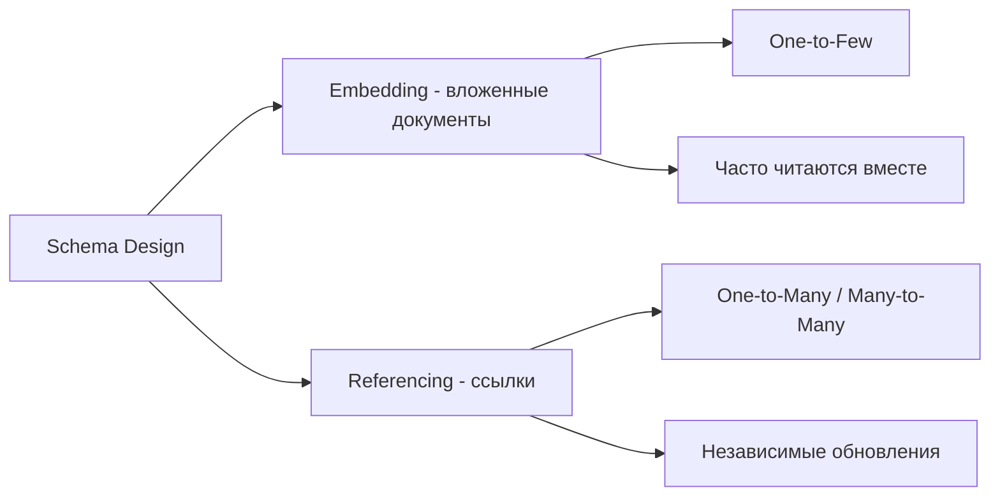

import { Playground } from '@components/Playground'

Проектирование схемы в MongoDB отличается от реляционных БД. Главный принцип: **моделируйте данные под ваши запросы**, а не под нормализацию.

## Embedding vs Referencing



### Embedding (Денормализация)

```javascript
// Пользователь с адресами (One-to-Few)
{
  _id: ObjectId("..."),
  username: "john_doe",
  email: "john@example.com",
  addresses: [
    {
      type: "home",
      street: "123 Main St",
      city: "New York",
      zip: "10001"
    },
    {
      type: "work",
      street: "456 Office Blvd",
      city: "New York",
      zip: "10002"
    }
  ]
}

// Плюсы: один запрос, атомарные обновления
// Минусы: дублирование данных, 16MB лимит документа
```

### Referencing (Нормализация)

```javascript
// Пользователь
{
  _id: ObjectId("user1"),
  username: "john_doe",
  email: "john@example.com"
}

// Посты (One-to-Many)
{
  _id: ObjectId("post1"),
  userId: ObjectId("user1"),
  title: "My First Post",
  content: "..."
}

// Плюсы: нет дублирования, гибкость
// Минусы: несколько запросов, нет транзакций (до 4.0)
```

## Паттерны проектирования

### 1. Subset Pattern

Храните часто используемые данные в основном документе, остальное отдельно.

```javascript
// Product (основная информация + топ 5 reviews)
{
  _id: ObjectId("product1"),
  name: "Laptop",
  price: 1500,
  topReviews: [  // только топ 5
    { author: "Alice", rating: 5, text: "Great!" },
    { author: "Bob", rating: 4, text: "Good" }
  ],
  reviewCount: 247
}

// Reviews (полная коллекция)
{
  _id: ObjectId("..."),
  productId: ObjectId("product1"),
  author: "Charlie",
  rating: 3,
  text: "...",
  createdAt: ISODate("...")
}
```

**Применение:** E-commerce, социальные сети (топ комментарии)

### 2. Computed Pattern

Предварительно вычисленные агрегации.

```javascript
// Order
{
  _id: ObjectId("order1"),
  items: [
    { productId: ObjectId("..."), price: 50, qty: 2 },  // 100
    { productId: ObjectId("..."), price: 30, qty: 1 }   // 30
  ],
  // Вычисленные поля (обновляются при изменении)
  subtotal: 130,
  tax: 26,
  total: 156,
  itemCount: 3
}
```

**Применение:** Избежать aggregate при каждом запросе

### 3. Bucket Pattern

Группировка данных в "вёдра" для уменьшения количества документов.

```javascript
// IoT сенсор (без bucket - миллионы документов)
{
  sensorId: "sensor1",
  temperature: 22.5,
  timestamp: ISODate("2024-01-01T10:00:00Z")
}

// С bucket (1 документ = 1 час данных)
{
  sensorId: "sensor1",
  date: ISODate("2024-01-01T10:00:00Z"),  // начало часа
  measurements: [
    { temp: 22.5, time: ISODate("2024-01-01T10:00:15Z") },
    { temp: 22.7, time: ISODate("2024-01-01T10:00:30Z") },
    // ... до конца часа
  ],
  count: 240,  // количество измерений
  avgTemp: 22.6
}
```

**Применение:** Time-series данные, логи, метрики

### 4. Polymorphic Pattern

Документы разной структуры в одной коллекции.

```javascript
// Users коллекция с разными типами
{
  _id: ObjectId("..."),
  type: "person",
  name: "John Doe",
  email: "john@example.com",
  birthDate: ISODate("1990-01-01")
}

{
  _id: ObjectId("..."),
  type: "company",
  name: "ACME Corp",
  email: "info@acme.com",
  taxId: "123456789",
  employees: 150
}
```

**Применение:** Multi-tenant приложения, CMS

### 5. Extended Reference Pattern

Дублирование часто используемых полей для избежания JOIN.

```javascript
// Order с денормализованной информацией о пользователе
{
  _id: ObjectId("order1"),
  userId: ObjectId("user1"),
  // Дублируем часто используемые поля
  userSnapshot: {
    username: "john_doe",
    email: "john@example.com"  // на момент заказа!
  },
  items: [...],
  total: 156
}

// Полная информация в users коллекции
// (может измениться, но заказ сохранит snapshot)
```

**Применение:** Аудит, исторические данные

## Практические примеры

### Blog Platform

```javascript
// User (немного данных)
{
  _id: ObjectId("user1"),
  username: "john_doe",
  email: "john@example.com",
  bio: "Developer"
}

// Post (много данных + часто читаемые комментарии)
{
  _id: ObjectId("post1"),
  authorId: ObjectId("user1"),
  // Денормализация для производительности
  authorName: "john_doe",
  title: "MongoDB Schema Design",
  content: "...",
  tags: ["mongodb", "database"],
  // Встроенные топ комментарии
  topComments: [
    {
      author: "alice",
      text: "Great post!",
      likes: 15
    }
  ],
  stats: {
    views: 1247,
    likes: 89,
    commentCount: 34
  },
  createdAt: ISODate("...")
}

// Comments (полная коллекция)
{
  _id: ObjectId("..."),
  postId: ObjectId("post1"),
  author: "bob",
  text: "...",
  createdAt: ISODate("...")
}
```

### E-commerce

```javascript
// Product
{
  _id: ObjectId("product1"),
  name: "Laptop Dell XPS 15",
  category: "computers",
  price: 1500,
  stock: 25,
  // Встроенные specs
  specs: {
    cpu: "Intel i7",
    ram: 16,
    storage: 512
  },
  images: ["url1", "url2"],
  // Предвычисленные рейтинги
  rating: {
    average: 4.5,
    count: 247
  }
}

// Order
{
  _id: ObjectId("order1"),
  userId: ObjectId("user1"),
  // Snapshot пользователя
  userSnapshot: {
    name: "John Doe",
    email: "john@example.com"
  },
  // Snapshot товаров (цена на момент заказа!)
  items: [
    {
      productId: ObjectId("product1"),
      productName: "Laptop Dell XPS 15",
      price: 1500,  // цена может измениться в products!
      quantity: 1
    }
  ],
  status: "pending",
  total: 1500,
  createdAt: ISODate("...")
}
```

## TypeScript примеры

```typescript
import mongoose from 'mongoose';

// Polymorphic Pattern
const userSchema = new mongoose.Schema({
  type: { type: String, enum: ['person', 'company'], required: true },
  name: String,
  email: String,
  // Person specific
  birthDate: Date,
  // Company specific
  taxId: String,
  employees: Number
}, { discriminatorKey: 'type' });

const User = mongoose.model('User', userSchema);

// Subset Pattern (Blog Post)
const postSchema = new mongoose.Schema({
  authorId: mongoose.Schema.Types.ObjectId,
  authorName: String,  // денормализация
  title: String,
  content: String,
  topComments: [{
    author: String,
    text: String,
    likes: Number
  }],
  stats: {
    views: { type: Number, default: 0 },
    likes: { type: Number, default: 0 },
    commentCount: { type: Number, default: 0 }
  }
});

// Pre-save hook для обновления computed полей
postSchema.pre('save', function(next) {
  if (this.isModified('topComments')) {
    this.stats.commentCount = this.topComments.length;
  }
  next();
});

// Bucket Pattern (Time Series)
const sensorDataSchema = new mongoose.Schema({
  sensorId: String,
  date: Date,  // начало bucket (час/день)
  measurements: [{
    value: Number,
    timestamp: Date
  }],
  count: Number,
  avg: Number,
  min: Number,
  max: Number
});

sensorDataSchema.index({ sensorId: 1, date: -1 });
```

## 💡 Best Practices

1. **Моделируйте под запросы**, а не под данные
2. **Embedding для 1:Few**, Referencing для 1:Many/Many:Many
3. **Денормализуйте часто читаемые данные**
4. **Используйте patterns** (Subset, Bucket, Extended Reference)
5. **Помните про 16MB лимит** документа

## Когда использовать каждый подход

### Embedding (вложенные документы)

✅ Используйте когда:
- Данные всегда нужны вместе
- One-to-Few отношения (несколько адресов, телефонов)
- Данные редко меняются отдельно
- Нужна атомарность (всё или ничего)

### Referencing (ссылки)

✅ Используйте когда:
- One-to-Many / Many-to-Many
- Данные часто обновляются независимо
- Нужна гибкость (разные коллекции)
- Избежать дублирования

## ⚠️ Частые ошибки

- Чрезмерная нормализация (как в SQL)
- Игнорирование 16MB лимита
- Embed всё подряд (раздутые документы)
- Не учитывают паттерны доступа к данным

---

**Следующий урок:** [Redis: Введение](/databases/redis-intro/) →

<Playground client:visible
  template="vanilla"
  files={{
    "/index.js": `// JavaScript-эквивалент проектирования схемы MongoDB
// Embedding vs Referencing

// Вариант 1: EMBEDDING (вложенные документы)
const blogPostEmbedded = {
  _id: 1,
  title: "Изучаем MongoDB",
  author: "Алиса",
  comments: [
    { user: "Борис", text: "Отличная статья!", date: "2024-01-15" },
    { user: "Вика", text: "Спасибо за материал", date: "2024-01-16" },
  ]
};
console.log("Embedded — всё в одном документе:");
console.log(blogPostEmbedded);

// Вариант 2: REFERENCING (ссылки)
const posts = [{ _id: 1, title: "Изучаем MongoDB", authorId: 101 }];
const authors = [{ _id: 101, name: "Алиса", email: "alice@mail.ru" }];

// "Populate" — соединяем по ссылке
const populated = posts.map(p => ({
  ...p,
  author: authors.find(a => a._id === p.authorId)
}));
console.log("\\nReferencing + populate:", populated);

// Когда embedding: данные читаются вместе, мало обновлений
// Когда referencing: данные часто обновляются, много связей
console.log("\\nEmbedding — для чтения, Referencing — для гибкости");
`
  }}
/>
