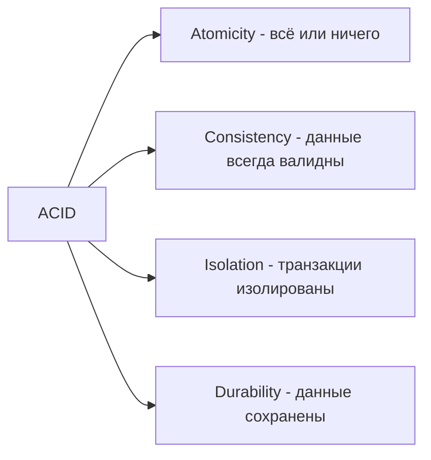

import { Playground } from '@components/Playground'

Multi-document транзакции в MongoDB (начиная с 4.0 для replica sets, 4.2 для sharded clusters) позволяют выполнять ACID операции над несколькими документами и коллекциями.

## ACID свойства



## Когда нужны транзакции?

✅ **Используйте транзакции:**
- Банковские переводы (снятие с одного счёта, пополнение другого)
- Инвентаризация (резервирование товара + создание заказа)
- Сложные бизнес-операции с несколькими изменениями

❌ **НЕ нужны транзакции:**
- Операции над одним документом (уже atomic!)
- Простые CRUD операции
- Когда eventual consistency приемлема

## Базовый пример транзакции

```javascript
const session = client.startSession();

try {
  await session.withTransaction(async () => {
    const accounts = db.collection('accounts');
    
    // Списание с первого счёта
    await accounts.updateOne(
      { _id: 'account1' },
      { $inc: { balance: -100 } },
      { session }
    );
    
    // Пополнение второго счёта
    await accounts.updateOne(
      { _id: 'account2' },
      { $inc: { balance: 100 } },
      { session }
    );
  });
  
  console.log('Transaction committed');
} catch (error) {
  console.error('Transaction aborted:', error);
} finally {
  await session.endSession();
}
```

## TypeScript примеры

```typescript
import { MongoClient, ClientSession } from 'mongodb';

const client = new MongoClient('mongodb://localhost:27017/?replicaSet=rs0');
await client.connect();
const db = client.db('bank');

// Банковский перевод
async function transferMoney(
  fromAccount: string,
  toAccount: string,
  amount: number
) {
  const session = client.startSession();
  
  try {
    const result = await session.withTransaction(async () => {
      const accounts = db.collection('accounts');
      
      // Проверка баланса
      const from = await accounts.findOne({ _id: fromAccount }, { session });
      if (!from || from.balance < amount) {
        throw new Error('Insufficient funds');
      }
      
      // Списание
      await accounts.updateOne(
        { _id: fromAccount },
        { $inc: { balance: -amount } },
        { session }
      );
      
      // Пополнение
      await accounts.updateOne(
        { _id: toAccount },
        { $inc: { balance: amount } },
        { session }
      );
      
      // Запись в журнал
      await db.collection('transactions').insertOne({
        from: fromAccount,
        to: toAccount,
        amount,
        timestamp: new Date()
      }, { session });
      
      return { success: true };
    });
    
    return result;
  } finally {
    await session.endSession();
  }
}

// E-commerce: создание заказа с резервированием товара
async function createOrder(userId: string, items: Array<{productId: string, quantity: number}>) {
  const session = client.startSession();
  
  try {
    const result = await session.withTransaction(async () => {
      const products = db.collection('products');
      const orders = db.collection('orders');
      
      // Проверка и резервирование товаров
      for (const item of items) {
        const product = await products.findOne({ _id: item.productId }, { session });
        
        if (!product || product.stock < item.quantity) {
          throw new Error(`Insufficient stock for ${item.productId}`);
        }
        
        await products.updateOne(
          { _id: item.productId },
          { $inc: { stock: -item.quantity } },
          { session }
        );
      }
      
      // Создание заказа
      const order = await orders.insertOne({
        userId,
        items,
        status: 'pending',
        createdAt: new Date()
      }, { session });
      
      return order.insertedId;
    });
    
    return result;
  } catch (error) {
    console.error('Order creation failed:', error);
    throw error;
  } finally {
    await session.endSession();
  }
}
```

## Ручное управление транзакцией

```typescript
async function manualTransaction() {
  const session = client.startSession();
  
  try {
    // Начало транзакции
    session.startTransaction({
      readConcern: { level: 'snapshot' },
      writeConcern: { w: 'majority' },
      readPreference: 'primary'
    });
    
    // Операции
    await db.collection('accounts').updateOne(
      { _id: 'acc1' },
      { $inc: { balance: -100 } },
      { session }
    );
    
    await db.collection('accounts').updateOne(
      { _id: 'acc2' },
      { $inc: { balance: 100 } },
      { session }
    );
    
    // Commit
    await session.commitTransaction();
    console.log('Transaction committed');
  } catch (error) {
    // Rollback
    await session.abortTransaction();
    console.error('Transaction aborted:', error);
  } finally {
    await session.endSession();
  }
}
```

## Mongoose транзакции

```typescript
import mongoose from 'mongoose';

await mongoose.connect('mongodb://localhost:27017/bank?replicaSet=rs0');

const Account = mongoose.model('Account', new mongoose.Schema({
  owner: String,
  balance: Number
}));

async function transfer(fromId: string, toId: string, amount: number) {
  const session = await mongoose.startSession();
  
  try {
    const result = await session.withTransaction(async () => {
      // Списание
      const from = await Account.findByIdAndUpdate(
        fromId,
        { $inc: { balance: -amount } },
        { session, new: true }
      );
      
      if (!from || from.balance < 0) {
        throw new Error('Insufficient funds');
      }
      
      // Пополнение
      await Account.findByIdAndUpdate(
        toId,
        { $inc: { balance: amount } },
        { session }
      );
      
      return { success: true };
    });
    
    return result;
  } finally {
    await session.endSession();
  }
}
```

## Настройки транзакций

```typescript
session.startTransaction({
  // Read Concern
  readConcern: { level: 'snapshot' },  // Консистентный снимок данных
  
  // Write Concern
  writeConcern: { w: 'majority', wtimeout: 5000 },  // Подтверждение от majority
  
  // Read Preference
  readPreference: 'primary',  // Читать только с Primary
  
  // Max Commit Time
  maxCommitTimeMS: 30000  // Таймаут 30 сек
});
```

## Ограничения транзакций

1. **Только в Replica Sets / Sharded Clusters**
   ```bash
   # Нельзя в standalone MongoDB
   ```

2. **16MB лимит** на все операции в транзакции

3. **Не более 1000 документов** в одной транзакции (рекомендация)

4. **DDL операции запрещены:**
   - CREATE/DROP collection
   - CREATE/DROP index

5. **60 секунд по умолчанию** для транзакции

## Производительность

```typescript
// ❌ Плохо: долгая транзакция
async function badTransaction() {
  const session = client.startSession();
  await session.withTransaction(async () => {
    // Множество операций
    for (let i = 0; i < 10000; i++) {
      await db.collection('items').insertOne({ index: i }, { session });
    }
    // Долгий external API call
    await fetch('https://external-api.com/verify');
  });
}

// ✅ Хорошо: короткая транзакция
async function goodTransaction() {
  // External calls ВНЕ транзакции
  const verified = await fetch('https://external-api.com/verify');
  if (!verified) return;
  
  const session = client.startSession();
  await session.withTransaction(async () => {
    // Только критичные DB операции
    await db.collection('accounts').updateOne(..., { session });
    await db.collection('logs').insertOne(..., { session });
  });
}
```

## Retry логика

```typescript
async function transferWithRetry(from: string, to: string, amount: number, maxRetries = 3) {
  for (let attempt = 1; attempt <= maxRetries; attempt++) {
    try {
      return await transferMoney(from, to, amount);
    } catch (error) {
      if (error.hasErrorLabel('TransientTransactionError') && attempt < maxRetries) {
        console.log(`Retrying transaction (attempt ${attempt + 1})`);
        await new Promise(resolve => setTimeout(resolve, 100 * attempt));
        continue;
      }
      throw error;
    }
  }
}
```

## 💡 Best Practices

1. **Держите транзакции короткими** - только критичные операции
2. **Используйте withTransaction()** вместо ручного управления
3. **Обрабатывайте ошибки** и делайте retry для transient errors
4. **Избегайте external calls** внутри транзакций
5. **Мониторьте** длительность и failures

## ⚠️ Частые ошибки

- Забывают передать `{ session }` в операции
- Долгие транзакции (блокируют другие операции)
- Используют транзакции там, где достаточно atomic операций
- Не обрабатывают transient errors

---

**Следующий урок:** [Schema Design в MongoDB](/databases/mongodb-schema-design/) →

<Playground client:visible
  template="vanilla"
  files={{
    "/index.js": `// JavaScript-эквивалент транзакций MongoDB
// Транзакция — атомарная группа операций

let accounts = [
  { _id: 1, name: "Алиса", balance: 10000 },
  { _id: 2, name: "Борис", balance: 5000 },
];

// Имитация session.startTransaction()
function withTransaction(operations) {
  const snapshot = JSON.parse(JSON.stringify(accounts));
  try {
    operations();
    console.log("✓ Транзакция завершена (commit)");
  } catch (err) {
    accounts = snapshot; // rollback
    console.log("✗ Откат транзакции:", err.message);
  }
}

// Перевод денег: Алиса -> Борис
withTransaction(() => {
  const from = accounts.find(a => a._id === 1);
  const to = accounts.find(a => a._id === 2);
  const amount = 3000;

  if (from.balance < amount) throw new Error("Недостаточно средств");
  from.balance -= amount;
  to.balance += amount;
});

console.log("Балансы:", accounts);

// Транзакция с ошибкой — откат
withTransaction(() => {
  accounts[0].balance -= 50000;
  if (accounts[0].balance < 0) throw new Error("Недостаточно средств");
});
console.log("После отката:", accounts);
`
  }}
/>
