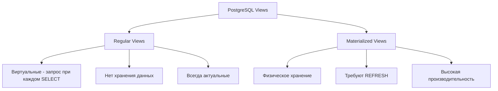

import { Playground } from '@components/Playground'

Views (представления) — это виртуальные таблицы, основанные на результате SQL-запроса. Они упрощают сложные запросы и обеспечивают слой абстракции над данными.

## Типы представлений



## Regular Views

### Создание простого View

```sql
-- Таблицы
CREATE TABLE users (
    id SERIAL PRIMARY KEY,
    username VARCHAR(50),
    email VARCHAR(100),
    status VARCHAR(20),
    created_at TIMESTAMP DEFAULT NOW()
);

CREATE TABLE orders (
    id SERIAL PRIMARY KEY,
    user_id INT REFERENCES users(id),
    amount DECIMAL(10, 2),
    status VARCHAR(20),
    created_at TIMESTAMP DEFAULT NOW()
);

-- View для активных пользователей с их заказами
CREATE VIEW active_user_orders AS
SELECT 
    u.id as user_id,
    u.username,
    u.email,
    COUNT(o.id) as order_count,
    COALESCE(SUM(o.amount), 0) as total_spent
FROM users u
LEFT JOIN orders o ON u.id = o.user_id
WHERE u.status = 'active'
GROUP BY u.id, u.username, u.email;

-- Использование
SELECT * FROM active_user_orders WHERE total_spent > 1000;
```

### View для безопасности данных

```sql
-- View скрывает чувствительные данные
CREATE VIEW public_users AS
SELECT 
    id,
    username,
    created_at,
    -- email скрыт
    -- status скрыт
FROM users;

-- Предоставление доступа только к View
GRANT SELECT ON public_users TO readonly_user;
REVOKE SELECT ON users FROM readonly_user;
```

### View с вычисляемыми полями

```sql
CREATE VIEW user_statistics AS
SELECT 
    u.id,
    u.username,
    COUNT(DISTINCT o.id) as order_count,
    COALESCE(SUM(o.amount), 0) as total_spent,
    COALESCE(AVG(o.amount), 0) as avg_order,
    MAX(o.created_at) as last_order_date,
    CASE 
        WHEN COUNT(o.id) = 0 THEN 'no_orders'
        WHEN COUNT(o.id) < 5 THEN 'new'
        WHEN COUNT(o.id) < 20 THEN 'regular'
        ELSE 'vip'
    END as customer_tier
FROM users u
LEFT JOIN orders o ON u.id = o.user_id
GROUP BY u.id, u.username;

SELECT * FROM user_statistics WHERE customer_tier = 'vip';
```

### Updatable Views

PostgreSQL позволяет обновлять простые Views:

```sql
CREATE VIEW active_users AS
SELECT id, username, email, status
FROM users
WHERE status = 'active';

-- Работает для простых Views
UPDATE active_users SET email = 'new@example.com' WHERE id = 1;
INSERT INTO active_users (username, email, status) 
VALUES ('john', 'john@example.com', 'active');

-- Для сложных Views нужны INSTEAD OF триггеры (см. урок по триггерам)
```

## Materialized Views

Materialized Views физически сохраняют результаты запроса и требуют ручного обновления.

### Создание Materialized View

```sql
-- Сложный аналитический запрос
CREATE MATERIALIZED VIEW daily_sales_summary AS
SELECT 
    DATE(created_at) as sale_date,
    COUNT(*) as order_count,
    SUM(amount) as total_revenue,
    AVG(amount) as avg_order_value,
    COUNT(DISTINCT user_id) as unique_customers
FROM orders
GROUP BY DATE(created_at)
WITH DATA; -- WITH DATA создаёт данные сразу

-- Создание индекса на Materialized View
CREATE INDEX idx_daily_sales_date ON daily_sales_summary(sale_date);

-- Использование
SELECT * FROM daily_sales_summary 
WHERE sale_date >= CURRENT_DATE - INTERVAL '30 days'
ORDER BY sale_date DESC;
```

### Обновление Materialized View

```sql
-- Полное обновление (блокирует чтение)
REFRESH MATERIALIZED VIEW daily_sales_summary;

-- Конкурентное обновление (не блокирует чтение, но медленнее)
-- Требует уникального индекса
CREATE UNIQUE INDEX idx_daily_sales_date_unique 
ON daily_sales_summary(sale_date);

REFRESH MATERIALIZED VIEW CONCURRENTLY daily_sales_summary;
```

### Практический пример: Кэш для дашборда

```sql
-- Дорогой запрос для аналитики
CREATE MATERIALIZED VIEW dashboard_metrics AS
SELECT 
    -- Общая статистика
    (SELECT COUNT(*) FROM users) as total_users,
    (SELECT COUNT(*) FROM users WHERE status = 'active') as active_users,
    (SELECT COUNT(*) FROM orders) as total_orders,
    (SELECT SUM(amount) FROM orders) as total_revenue,
    
    -- Сегодняшние метрики
    (SELECT COUNT(*) FROM orders WHERE DATE(created_at) = CURRENT_DATE) as today_orders,
    (SELECT SUM(amount) FROM orders WHERE DATE(created_at) = CURRENT_DATE) as today_revenue,
    
    -- Топ продукты (если есть таблица products)
    (
        SELECT json_agg(
            json_build_object('product_id', product_id, 'sales', sales)
        )
        FROM (
            SELECT product_id, COUNT(*) as sales
            FROM order_items
            GROUP BY product_id
            ORDER BY sales DESC
            LIMIT 10
        ) t
    ) as top_products,
    
    NOW() as last_updated
WITH DATA;

-- Обновление каждые 5 минут через cron
-- 0 */5 * * * psql -d mydb -c "REFRESH MATERIALIZED VIEW dashboard_metrics;"
```

## Сравнение Views и Materialized Views

| Характеристика | Regular View | Materialized View |
|---|---|---|
| Хранение данных | Нет (виртуальная) | Да (физическая) |
| Производительность | Зависит от запроса | Быстрая (данные готовы) |
| Актуальность | Всегда свежие | Требует REFRESH |
| Индексы | Нельзя | Можно создавать |
| Использование памяти | Минимальное | Занимает место |

## TypeScript примеры

```typescript
import { Pool } from 'pg';

const pool = new Pool({
  connectionString: process.env.DATABASE_URL,
});

// Работа с обычным View
async function getActiveUserOrders() {
  const result = await pool.query(
    'SELECT * FROM active_user_orders WHERE total_spent > $1',
    [1000]
  );
  return result.rows;
}

// Работа с Materialized View
async function getDashboardMetrics() {
  const result = await pool.query('SELECT * FROM dashboard_metrics');
  return result.rows[0];
}

// Обновление Materialized View
async function refreshDashboard() {
  await pool.query('REFRESH MATERIALIZED VIEW CONCURRENTLY dashboard_metrics');
  console.log('Dashboard metrics refreshed');
}

// Автоматическое обновление каждые 5 минут
setInterval(async () => {
  try {
    await refreshDashboard();
  } catch (error) {
    console.error('Failed to refresh dashboard:', error);
  }
}, 5 * 60 * 1000);

// Проверка свежести данных
async function checkDataFreshness() {
  const result = await pool.query(`
    SELECT 
      last_updated,
      EXTRACT(EPOCH FROM (NOW() - last_updated)) as seconds_ago
    FROM dashboard_metrics
  `);
  
  const { last_updated, seconds_ago } = result.rows[0];
  
  if (seconds_ago > 600) { // 10 минут
    console.warn('Data is stale, refreshing...');
    await refreshDashboard();
  }
  
  return { last_updated, seconds_ago };
}
```

## Рекурсивные Views

```sql
-- Иерархия категорий
CREATE TABLE categories (
    id SERIAL PRIMARY KEY,
    name VARCHAR(100),
    parent_id INT REFERENCES categories(id)
);

INSERT INTO categories (id, name, parent_id) VALUES
(1, 'Electronics', NULL),
(2, 'Computers', 1),
(3, 'Laptops', 2),
(4, 'Gaming Laptops', 3),
(5, 'Phones', 1);

-- Рекурсивный View для иерархии
CREATE VIEW category_tree AS
WITH RECURSIVE tree AS (
    -- Базовый случай: корневые категории
    SELECT id, name, parent_id, name as path, 0 as level
    FROM categories
    WHERE parent_id IS NULL
    
    UNION ALL
    
    -- Рекурсия: дочерние категории
    SELECT c.id, c.name, c.parent_id, 
           t.path || ' > ' || c.name as path,
           t.level + 1 as level
    FROM categories c
    INNER JOIN tree t ON c.parent_id = t.id
)
SELECT * FROM tree;

SELECT * FROM category_tree ORDER BY path;
-- Electronics
-- Electronics > Computers
-- Electronics > Computers > Laptops
-- Electronics > Computers > Laptops > Gaming Laptops
-- Electronics > Phones
```

## 💡 Best Practices

1. **Regular Views для:**
   - Упрощения сложных JOIN'ов
   - Безопасности (скрытие колонок)
   - Абстракции схемы БД

2. **Materialized Views для:**
   - Тяжёлых аналитических запросов
   - Агрегаций по большим таблицам
   - Данных, которые обновляются редко

3. **Обновление MV:**
   - Используйте `CONCURRENTLY` для production
   - Настройте автоматическое обновление через cron
   - Добавляйте метку `last_updated`

4. **Индексы:**
   - Создавайте индексы на Materialized Views
   - Особенно на колонки для фильтрации

## Мониторинг Views

```sql
-- Список всех Views
SELECT 
    schemaname,
    viewname,
    viewowner,
    definition
FROM pg_views
WHERE schemaname = 'public';

-- Список Materialized Views
SELECT 
    schemaname,
    matviewname,
    matviewowner,
    ispopulated, -- заполнен ли данными
    pg_size_pretty(pg_total_relation_size(schemaname||'.'||matviewname)) as size
FROM pg_matviews
WHERE schemaname = 'public';

-- Зависимости View
SELECT DISTINCT
    dependent_view.relname as view_name,
    source_table.relname as depends_on
FROM pg_depend
JOIN pg_rewrite ON pg_depend.objid = pg_rewrite.oid
JOIN pg_class as dependent_view ON pg_rewrite.ev_class = dependent_view.oid
JOIN pg_class as source_table ON pg_depend.refobjid = source_table.oid
WHERE dependent_view.relkind = 'v' -- 'v' для view, 'm' для materialized view
AND source_table.relkind = 'r' -- 'r' для таблицы
ORDER BY view_name;
```

## ⚠️ Частые ошибки

- Использование Regular Views для тяжёлых запросов (медленные SELECT)
- Забывают обновлять Materialized Views (устаревшие данные)
- Не создают индексы на Materialized Views
- Используют `REFRESH` вместо `REFRESH CONCURRENTLY` (блокировка чтения)

---

**Следующий урок:** [Window Functions в PostgreSQL](/databases/postgresql-window-functions/) →

<Playground client:visible
  template="vanilla"
  files={{
    "/index.js": `// JavaScript-эквивалент VIEW в PostgreSQL
// VIEW — виртуальная таблица на основе запроса

const orders = [
  { id: 1, userId: 1, product: "Ноутбук", amount: 89000, date: "2024-01" },
  { id: 2, userId: 2, product: "Мышь", amount: 1500, date: "2024-01" },
  { id: 3, userId: 1, product: "Клавиатура", amount: 3000, date: "2024-02" },
  { id: 4, userId: 3, product: "Монитор", amount: 25000, date: "2024-02" },
];

const users = [
  { id: 1, name: "Алиса" },
  { id: 2, name: "Борис" },
  { id: 3, name: "Вика" },
];

// CREATE VIEW order_summary AS SELECT ...
const orderSummaryView = () => orders.map(o => ({
  order_id: o.id,
  customer: users.find(u => u.id === o.userId)?.name,
  product: o.product,
  amount: o.amount
}));

console.log("VIEW order_summary:");
console.table(orderSummaryView());

// Materialized view — кэшированный результат
const materializedView = orderSummaryView();
console.log("\\nMATERIALIZED VIEW (кэш):", materializedView.length, "записей");
`
  }}
/>
