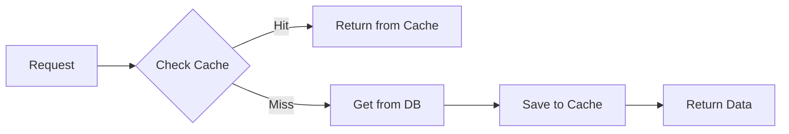

import { Playground } from '@components/Playground'

Кэширование — одна из главных задач Redis. Правильная стратегия кэширования может значительно улучшить производительность приложения.

## Cache-Aside (Lazy Loading)

Самая популярная стратегия: приложение само управляет кэшем.



```typescript
async function getCachedData(key: string) {
  // 1. Проверяем кэш
  const cached = await redis.get(key);
  if (cached) {
    return JSON.parse(cached);  // Cache Hit!
  }
  
  // 2. Cache Miss - идём в БД
  const data = await db.query(key);
  
  // 3. Сохраняем в кэш
  await redis.setEx(key, 3600, JSON.stringify(data));
  
  return data;
}
```

✅ **Плюсы:** Просто, данные загружаются по требованию  
❌ **Минусы:** Первый запрос медленный, нужна инвалидация

## Write-Through

Данные пишутся одновременно в кэш и БД.

```typescript
async function saveWithCache(id: string, data: any) {
  // 1. Сохраняем в БД
  await db.save(id, data);
  
  // 2. Обновляем кэш
  await redis.setEx(`data:${id}`, 3600, JSON.stringify(data));
}
```

✅ **Плюсы:** Кэш всегда свежий  
❌ **Минусы:** Пишем даже то, что никогда не прочитают

## Write-Behind (Write-Back)

Данные сначала в кэш, потом асинхронно в БД.

```typescript
async function writeToCache(id: string, data: any) {
  // 1. Сохраняем в кэш сразу
  await redis.setEx(`data:${id}`, 3600, JSON.stringify(data));
  
  // 2. Добавляем в очередь для записи в БД
  await redis.lPush('write_queue', JSON.stringify({ id, data }));
}

// Worker обрабатывает очередь
async function processBatch() {
  const batch = await redis.lRange('write_queue', 0, 99);
  
  for (const item of batch) {
    const { id, data } = JSON.parse(item);
    await db.save(id, data);
  }
  
  await redis.lTrim('write_queue', batch.length, -1);
}
```

✅ **Плюсы:** Быстрая запись  
❌ **Минусы:** Риск потери данных, сложность

## Refresh-Ahead

Обновляем кэш до истечения TTL на основе популярности.

```typescript
async function getWithRefresh(key: string) {
  const cached = await redis.get(key);
  const ttl = await redis.ttl(key);
  
  // Если TTL меньше 10% от начального - обновляем фоново
  if (ttl > 0 && ttl < 360) {  // для TTL=3600
    // Асинхронное обновление без блокировки
    refreshCache(key).catch(console.error);
  }
  
  if (cached) {
    return JSON.parse(cached);
  }
  
  return refreshCache(key);
}

async function refreshCache(key: string) {
  const data = await db.query(key);
  await redis.setEx(key, 3600, JSON.stringify(data));
  return data;
}
```

## Инвалидация кэша

### 1. TTL-based (простейший)

```typescript
// Установка TTL при создании
await redis.setEx('user:123', 3600, JSON.stringify(user));

// Разные TTL для разных данных
const CACHE_TTL = {
  user: 3600,        // 1 час
  posts: 300,        // 5 минут
  static: 86400      // 1 день
};
```

### 2. Event-based (при изменении данных)

```typescript
// При обновлении пользователя
async function updateUser(userId: string, data: any) {
  await db.users.update(userId, data);
  
  // Удаляем из кэша
  await redis.del(`user:${userId}`);
  
  // Также удаляем связанные ключи
  await redis.del(`user:${userId}:posts`);
  await redis.del(`user:${userId}:profile`);
}
```

### 3. Tag-based (группировка ключей)

```typescript
// Добавление тегов к ключам
async function cacheWithTags(key: string, data: any, tags: string[]) {
  await redis.setEx(key, 3600, JSON.stringify(data));
  
  // Связываем ключ с тегами
  for (const tag of tags) {
    await redis.sAdd(`tag:${tag}`, key);
  }
}

// Инвалидация по тегу
async function invalidateByTag(tag: string) {
  const keys = await redis.sMembers(`tag:${tag}`);
  
  if (keys.length > 0) {
    await redis.del(...keys);
    await redis.del(`tag:${tag}`);
  }
}

// Пример использования
await cacheWithTags('post:123', postData, ['user:456', 'category:tech']);
await invalidateByTag('user:456');  // удалит все посты пользователя
```

## Thundering Herd Problem

Проблема: много одновременных запросов к холодному кэшу → все идут в БД.

### Решение 1: Pessimistic Locking

```typescript
async function getCachedWithLock(key: string) {
  const cached = await redis.get(key);
  if (cached) return JSON.parse(cached);
  
  const lockKey = `lock:${key}`;
  const lockAcquired = await redis.set(lockKey, '1', {
    NX: true,  // только если не существует
    EX: 10     // expire через 10 сек
  });
  
  if (lockAcquired) {
    try {
      // Только первый запрос грузит данные
      const data = await db.query(key);
      await redis.setEx(key, 3600, JSON.stringify(data));
      return data;
    } finally {
      await redis.del(lockKey);
    }
  } else {
    // Остальные ждут и повторяют попытку
    await new Promise(resolve => setTimeout(resolve, 100));
    return getCachedWithLock(key);
  }
}
```

### Решение 2: Probabilistic Early Expiration

```typescript
async function getCachedProbabilistic(key: string, beta = 1.0) {
  const cached = await redis.get(key);
  const ttl = await redis.ttl(key);
  
  if (cached) {
    // Вероятностное обновление перед истечением
    const delta = Date.now() / 1000;
    const xfetch = Math.random() * beta * Math.log(delta);
    
    if (ttl < xfetch) {
      // Обновляем фоново
      refreshCache(key).catch(console.error);
    }
    
    return JSON.parse(cached);
  }
  
  return refreshCache(key);
}
```

## Layered Caching

Несколько уровней кэша для разных данных.

```typescript
class LayeredCache {
  private l1: Map<string, any> = new Map();  // In-memory (Node.js)
  private l2 = redis;  // Redis
  
  async get(key: string) {
    // L1 cache (быстрый, но локальный)
    if (this.l1.has(key)) {
      return this.l1.get(key);
    }
    
    // L2 cache (shared, но медленнее)
    const cached = await this.l2.get(key);
    if (cached) {
      const data = JSON.parse(cached);
      this.l1.set(key, data);  // сохраняем в L1
      return data;
    }
    
    // DB (самый медленный)
    const data = await db.query(key);
    
    this.l1.set(key, data);
    await this.l2.setEx(key, 3600, JSON.stringify(data));
    
    return data;
  }
  
  async invalidate(key: string) {
    this.l1.delete(key);
    await this.l2.del(key);
  }
}
```

## Cache Warming

Предварительный прогрев кэша.

```typescript
// При старте приложения
async function warmCache() {
  console.log('Warming cache...');
  
  // Загружаем часто используемые данные
  const popularUsers = await db.users.find({ popular: true });
  for (const user of popularUsers) {
    await redis.setEx(
      `user:${user.id}`,
      3600,
      JSON.stringify(user)
    );
  }
  
  console.log('Cache warmed');
}

// Периодический refresh популярных данных
setInterval(async () => {
  const topPosts = await db.posts.find().sort({ views: -1 }).limit(100);
  for (const post of topPosts) {
    await redis.setEx(`post:${post.id}`, 3600, JSON.stringify(post));
  }
}, 60 * 1000);  // каждую минуту
```

## Eviction Policies

Что удалять когда память заполнена:

```bash
# redis.conf
maxmemory 2gb
maxmemory-policy allkeys-lru  # удалять least recently used
```

**Политики:**
- `noeviction` - ошибка при нехватке памяти
- `allkeys-lru` - удалять LRU ключи (рекомендуется для кэша)
- `allkeys-lfu` - удалять least frequently used
- `volatile-lru` - LRU только среди ключей с TTL
- `volatile-ttl` - удалять ключи с наименьшим TTL

## 💡 Best Practices

1. **Всегда устанавливайте TTL** - избегайте memory leak
2. **Cache-Aside для большинства случаев**
3. **Инвалидация при изменении данных**
4. **Мониторьте hit rate** (`INFO stats`)
5. **Используйте tag-based инвалидацию** для связанных данных

## Мониторинг

```typescript
async function getCacheStats() {
  const info = await redis.info('stats');
  
  // Парсинг info
  const hits = parseInt(info.match(/keyspace_hits:(\d+)/)[1]);
  const misses = parseInt(info.match(/keyspace_misses:(\d+)/)[1]);
  
  const hitRate = hits / (hits + misses) * 100;
  
  return {
    hits,
    misses,
    hitRate: hitRate.toFixed(2) + '%'
  };
}
```

**Хороший hit rate:** больше 80%  
**Плохой hit rate:** меньше 50% (возможно, TTL слишком короткий или плохая стратегия)

## ⚠️ Частые ошибки

- Кэшируют данные без TTL
- Не инвалидируют при изменении
- Кэшируют редко используемые данные
- Thundering herd без защиты

---

**Следующий урок:** [Redis для сессий](/databases/redis-sessions/) →

<Playground client:visible
  template="vanilla"
  files={{
    "/index.js": `// JavaScript-эквивалент кэширования Redis

const cache = new Map();

// Имитация медленного запроса к БД
function fetchFromDB(id) {
  console.log("  -> Запрос к БД (медленно)...");
  return { id, name: "Товар " + id, price: id * 1000 };
}

// Cache-Aside Pattern (Lazy Loading)
function getProduct(id) {
  const key = "product:" + id;
  if (cache.has(key)) {
    console.log("  -> Из кэша (быстро)!");
    return cache.get(key);
  }
  const data = fetchFromDB(id);
  cache.set(key, data);
  return data;
}

console.log("1-й вызов (cache miss):");
console.log(getProduct(1));

console.log("\\n2-й вызов (cache hit):");
console.log(getProduct(1));

// Cache Invalidation
function updateProduct(id, changes) {
  console.log("\\nОбновление товара", id);
  cache.delete("product:" + id); // Инвалидация
  console.log("Кэш очищен для product:" + id);
}

updateProduct(1, { price: 1500 });
console.log("\\n3-й вызов (после инвалидации):");
console.log(getProduct(1));
`
  }}
/>
