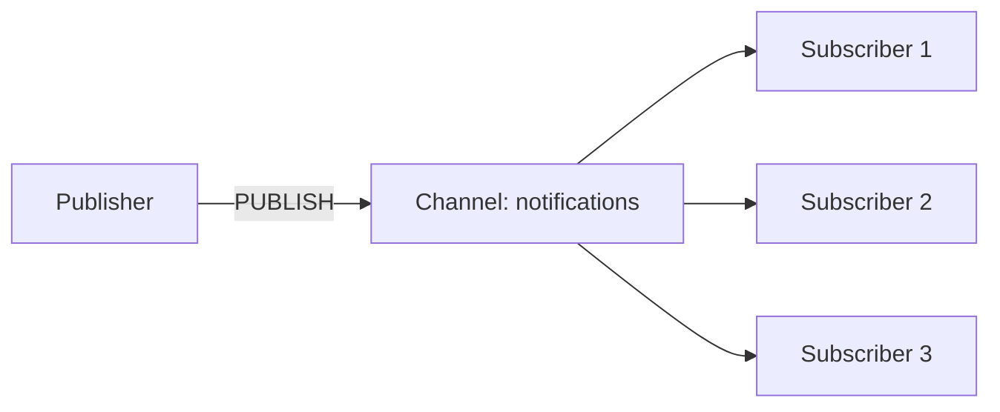

import { Playground } from '@components/Playground'

Publish/Subscribe pattern для real-time messaging между приложениями без постоянного хранения сообщений.

## Основы Pub/Sub



**Важно:** Сообщения НЕ сохраняются! Если подписчик offline — сообщение потеряно.

## Базовое использование

```typescript
import { createClient } from 'redis';

// Publisher
const publisher = createClient();
await publisher.connect();

await publisher.publish('notifications', JSON.stringify({
  type: 'new_message',
  userId: 123,
  text: 'Hello!'
}));

// Subscriber
const subscriber = createClient();
await subscriber.connect();

await subscriber.subscribe('notifications', (message) => {
  const data = JSON.parse(message);
  console.log('Received:', data);
  // Отправить push, email, WebSocket, etc.
});
```

## Real-time чат

```typescript
class ChatService {
  private publisher = createClient();
  private subscriber = createClient();
  
  async connect() {
    await Promise.all([
      this.publisher.connect(),
      this.subscriber.connect()
    ]);
  }
  
  // Отправка сообщения в комнату
  async sendMessage(roomId: string, userId: string, text: string) {
    const message = {
      roomId,
      userId,
      text,
      timestamp: Date.now()
    };
    
    await this.publisher.publish(
      `chat:room:${roomId}`,
      JSON.stringify(message)
    );
    
    // Также сохраняем в БД для истории
    await db.messages.create(message);
  }
  
  // Подписка на комнату
  async subscribeToRoom(roomId: string, callback: (message: any) => void) {
    await this.subscriber.subscribe(`chat:room:${roomId}`, (msg) => {
      callback(JSON.parse(msg));
    });
  }
  
  // Отписка
  async unsubscribeFromRoom(roomId: string) {
    await this.subscriber.unsubscribe(`chat:room:${roomId}`);
  }
}

// Использование с WebSocket
const chat = new ChatService();
await chat.connect();

io.on('connection', (socket) => {
  socket.on('join_room', async (roomId) => {
    await chat.subscribeToRoom(roomId, (message) => {
      socket.emit('new_message', message);
    });
  });
  
  socket.on('send_message', async ({ roomId, text }) => {
    await chat.sendMessage(roomId, socket.userId, text);
  });
});
```

## Pattern Matching (psubscribe)

```typescript
// Подписка на все каналы с паттерном
await subscriber.pSubscribe('notifications:*', (message, channel) => {
  console.log(`Message from ${channel}:`, message);
});

// Теперь получим сообщения из:
await publisher.publish('notifications:email', 'Email notification');
await publisher.publish('notifications:sms', 'SMS notification');
await publisher.publish('notifications:push', 'Push notification');
```

## Monitoring активности пользователей

```typescript
// Пользователь онлайн/оффлайн
class PresenceService {
  private publisher = createClient();
  
  async setUserOnline(userId: string) {
    await this.publisher.publish('presence', JSON.stringify({
      userId,
      status: 'online',
      timestamp: Date.now()
    }));
  }
  
  async setUserOffline(userId: string) {
    await this.publisher.publish('presence', JSON.stringify({
      userId,
      status: 'offline',
      timestamp: Date.now()
    }));
  }
}

// Подписка на presence events
await subscriber.subscribe('presence', (message) => {
  const { userId, status } = JSON.parse(message);
  
  // Обновить UI, отправить WebSocket всем friends
  io.to(`friends:${userId}`).emit('user_status', { userId, status });
});
```

## Live notifications

```typescript
// Notification Service
class NotificationService {
  private publisher = createClient();
  
  async notify(userId: string, notification: any) {
    await this.publisher.publish(
      `notifications:user:${userId}`,
      JSON.stringify(notification)
    );
    
    // Также сохраняем в БД
    await db.notifications.create({
      userId,
      ...notification,
      read: false
    });
  }
}

// Client подписывается на свои уведомления
async function subscribeToUserNotifications(userId: string, callback: Function) {
  await subscriber.subscribe(`notifications:user:${userId}`, (msg) => {
    callback(JSON.parse(msg));
  });
}

// Использование
await notificationService.notify('user123', {
  type: 'new_follower',
  fromUserId: 'user456',
  text: 'Alice started following you'
});
```

## Broadcast для всех пользователей

```typescript
// System-wide announcement
await publisher.publish('announcements', JSON.stringify({
  type: 'maintenance',
  text: 'Scheduled maintenance in 1 hour',
  duration: '30 minutes'
}));

// Все подписчики получат
await subscriber.subscribe('announcements', (message) => {
  const announcement = JSON.parse(message);
  io.emit('system_announcement', announcement);
});
```

## Pub/Sub + Worker Queue

```typescript
// Комбинирование Pub/Sub для уведомлений и Queue для задач

// Publisher отправляет задачу
await redis.lPush('tasks:queue', JSON.stringify(task));
await redis.publish('tasks:new', 'Task added');

// Worker подписан и обрабатывает
await subscriber.subscribe('tasks:new', async () => {
  const task = await redis.rPop('tasks:queue');
  if (task) {
    await processTask(JSON.parse(task));
  }
});
```

## Ограничения Pub/Sub

❌ **НЕ используйте Pub/Sub когда:**
- Нужна надёжная доставка (сообщения не сохраняются)
- Подписчик может быть offline
- Требуется гарантия обработки каждого сообщения

✅ **Используйте Pub/Sub для:**
- Real-time уведомления
- Чат
- Live updates
- Invalidation кэша
- Event broadcasting

Для надёжного messaging используйте **Redis Streams** или **RabbitMQ/Kafka**.

## 💡 Best Practices

1. **НЕ храните критичные данные** в Pub/Sub (нет persistence)
2. **Используйте JSON** для структурированных сообщений
3. **Namespace channels** (`chat:room:123` вместо `123`)
4. **Reconnection logic** при обрыве связи
5. **Combine с БД** для истории сообщений

---

**Следующий урок:** [Redis Streams](/databases/redis-streams/) →

<Playground client:visible
  template="vanilla"
  files={{
    "/index.js": `// JavaScript-эквивалент Redis Pub/Sub

class PubSub {
  constructor() { this.channels = new Map(); }

  subscribe(channel, callback) {
    if (!this.channels.has(channel)) this.channels.set(channel, []);
    this.channels.get(channel).push(callback);
    console.log("Подписка на канал:", channel);
  }

  publish(channel, message) {
    const subs = this.channels.get(channel) || [];
    console.log("PUBLISH " + channel + " (" + subs.length + " подписчиков)");
    subs.forEach(cb => cb(message));
    return subs.length;
  }

  unsubscribe(channel) {
    this.channels.delete(channel);
  }
}

const pubsub = new PubSub();

// Подписчики
pubsub.subscribe("notifications", (msg) => {
  console.log("  Пользователь получил:", msg);
});

pubsub.subscribe("notifications", (msg) => {
  console.log("  Email отправлен:", msg);
});

pubsub.subscribe("orders", (msg) => {
  console.log("  Новый заказ:", msg);
});

// Публикация сообщений
pubsub.publish("notifications", "Ваш заказ отправлен!");
pubsub.publish("orders", "{ orderId: 42, total: 5000 }");
pubsub.publish("notifications", "Скидка 20% на всё!");
`
  }}
/>
