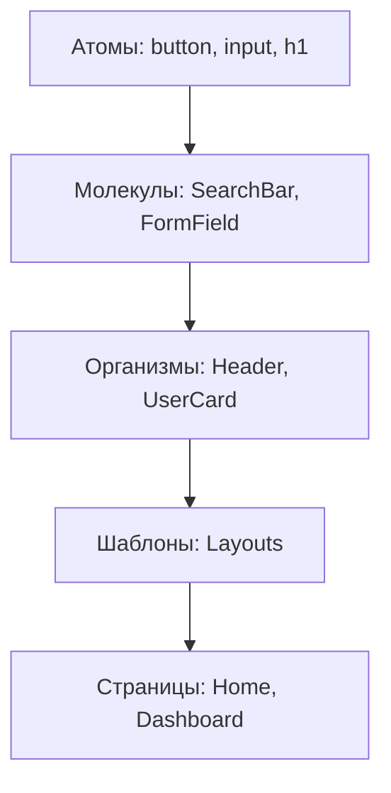

import { Playground } from '@components/Playground'


Atomic Design — это методология создания дизайн-систем, предложенная Брэдом Фростом. Она помогает структурировать компоненты от самых простых к сложным.

Icon: Atom (Атом)

## Описание

Вместо того чтобы делить компоненты по страницам, мы делим их по степени сложности и ответственности.

## Иерархия (Mermaid)



## Уровни структуры

1. **Атомы (Atoms)**: Базовые строительные блоки (HTML теги). Не могут быть разбиты на более мелкие части без потери функциональности.
2. **Молекулы (Molecules)**: Группы атомов, работающих вместе. Например, поле ввода + кнопка "Поиск".
3. **Организмы (Organisms)**: Относительно сложные секции интерфейса. Состоят из молекул и/или атомов. Например, навигационная панель.
4. **Шаблоны (Templates)**: Макеты страниц без реального контента. Определяют структуру (сетку).
5. **Страницы (Pages)**: Финальные экземпляры шаблонов с реальными данными из API или стейт-менеджера.

## Пример структуры папок

```text
src/
  components/
    atoms/
      Button/
      Input/
    molecules/
      SearchBox/
    organisms/
      Navbar/
```

## Зачем это нужно?

- **Масштабируемость**: Проект легко расширять.
- **Повторное использование**: [Компоненты](/react/components/)-атомы используются везде.
- **Единый визуальный стиль**: Изменение одного атома меняет весь проект согласованно.

---

## 🔗 Полезные ссылки
- [React Компоненты](/react/components/)

### Практика

Попробуйте примеры в интерактивном редакторе:

<Playground client:visible template="react" files={{ "/App.tsx": `import { useState } from 'react';
import type { ReactNode } from 'react';

// ===== ATOMS =====
function Button({
  children,
  variant = 'primary',
  onClick,
  fullWidth,
}: {
  children: ReactNode;
  variant?: 'primary' | 'ghost';
  onClick?: () => void;
  fullWidth?: boolean;
}) {
  return (
    <button
      onClick={onClick}
      style={{
        padding: '0.4rem 0.9rem',
        background: variant === 'primary' ? '#3b82f6' : '#334155',
        color: '#fff',
        border: 'none',
        borderRadius: '6px',
        cursor: 'pointer',
        fontWeight: 600,
        fontSize: '0.85rem',
        width: fullWidth ? '100%' : undefined,
      }}
    >
      {children}
    </button>
  );
}

function Input({
  placeholder,
  value,
  onChange,
}: {
  placeholder?: string;
  value?: string;
  onChange?: (v: string) => void;
}) {
  return (
    <input
      placeholder={placeholder}
      value={value}
      onChange={(e) => onChange?.(e.target.value)}
      style={{
        padding: '0.4rem 0.75rem',
        background: '#0f172a',
        border: '1.5px solid #334155',
        borderRadius: '6px',
        color: '#f1f5f9',
        fontSize: '0.85rem',
        outline: 'none',
        flex: 1,
        minWidth: 0,
      }}
    />
  );
}

function Avatar({ name }: { name: string }) {
  return (
    <div
      style={{
        width: '36px',
        height: '36px',
        borderRadius: '50%',
        background: '#3b82f6',
        display: 'flex',
        alignItems: 'center',
        justifyContent: 'center',
        color: '#fff',
        fontWeight: 700,
        fontSize: '0.95rem',
        flexShrink: 0,
      }}
    >
      {name[0].toUpperCase()}
    </div>
  );
}

// ===== MOLECULES =====
function SearchBox({ onSearch }: { onSearch: (q: string) => void }) {
  const [q, setQ] = useState('');
  return (
    <div style={{ display: 'flex', gap: '0.4rem' }}>
      <Input placeholder="Поиск..." value={q} onChange={setQ} />
      <Button onClick={() => onSearch(q)}>🔍</Button>
    </div>
  );
}

function UserBadge({ name, role }: { name: string; role: string }) {
  return (
    <div style={{ display: 'flex', alignItems: 'center', gap: '0.5rem' }}>
      <Avatar name={name} />
      <div>
        <div style={{ color: '#f1f5f9', fontWeight: 600, fontSize: '0.85rem' }}>{name}</div>
        <div style={{ color: '#94a3b8', fontSize: '0.72rem' }}>{role}</div>
      </div>
    </div>
  );
}

// ===== ORGANISM =====
function Navbar({ onSearch }: { onSearch: (q: string) => void }) {
  return (
    <nav
      style={{
        background: '#1e293b',
        borderRadius: '10px',
        padding: '0.75rem 1.2rem',
        display: 'flex',
        alignItems: 'center',
        justifyContent: 'space-between',
        gap: '1rem',
        flexWrap: 'wrap',
        border: '1px solid #334155',
      }}
    >
      <span style={{ color: '#60a5fa', fontWeight: 700, fontSize: '1rem' }}>⚛️ MyApp</span>
      <SearchBox onSearch={onSearch} />
      <UserBadge name="Иван" role="Admin" />
    </nav>
  );
}

const LEVELS = [
  { id: 'atoms', label: '⚛️ Атомы', color: '#3b82f6', desc: 'Button, Input, Avatar — базовые HTML-элементы' },
  { id: 'molecules', label: '🔬 Молекулы', color: '#7c3aed', desc: 'SearchBox, UserBadge — группы атомов' },
  { id: 'organisms', label: '🧬 Организмы', color: '#0891b2', desc: 'Navbar — сложные секции UI' },
] as const;

type LevelId = typeof LEVELS[number]['id'];

export default function App() {
  const [highlight, setHighlight] = useState<LevelId | null>(null);
  const [searchResult, setSearchResult] = useState('');

  const borderFor = (id: LevelId) =>
    highlight === id ? \`2px solid \${LEVELS.find((l) => l.id === id)!.color}\` : '2px solid transparent';

  return (
    <div
      style={{ fontFamily: 'sans-serif', background: '#0f172a', minHeight: '100vh', padding: '2rem', color: '#f1f5f9' }}
    >
      <h2 style={{ color: '#60a5fa', marginBottom: '0.5rem' }}>Atomic Design Demo</h2>
      <p style={{ color: '#94a3b8', marginBottom: '1.5rem', fontSize: '0.9rem' }}>
        Нажмите на уровень, чтобы подсветить соответствующие компоненты
      </p>

      <div style={{ display: 'flex', gap: '0.5rem', marginBottom: '1.2rem', flexWrap: 'wrap' }}>
        {LEVELS.map((l) => (
          <button
            key={l.id}
            onClick={() => setHighlight((h) => (h === l.id ? null : l.id))}
            style={{
              padding: '0.45rem 1rem',
              background: highlight === l.id ? l.color : '#1e293b',
              color: '#fff',
              border: '1.5px solid ' + l.color,
              borderRadius: '7px',
              cursor: 'pointer',
              fontWeight: highlight === l.id ? 700 : 400,
              fontSize: '0.85rem',
              transition: 'all 0.15s',
            }}
          >
            {l.label}
          </button>
        ))}
      </div>

      {highlight && (
        <div
          style={{
            marginBottom: '1rem',
            background: '#1e293b',
            borderRadius: '8px',
            padding: '0.6rem 1rem',
            fontSize: '0.82rem',
            color: '#94a3b8',
          }}
        >
          {LEVELS.find((l) => l.id === highlight)?.desc}
        </div>
      )}

      <div style={{ border: borderFor('organisms'), borderRadius: '12px', padding: '4px', transition: 'border 0.2s' }}>
        <div style={{ border: borderFor('molecules'), borderRadius: '10px', padding: '4px', transition: 'border 0.2s' }}>
          <div style={{ border: borderFor('atoms'), borderRadius: '8px', transition: 'border 0.2s' }}>
            <Navbar onSearch={setSearchResult} />
          </div>
        </div>
      </div>

      {searchResult && (
        <div
          style={{
            marginTop: '1rem',
            background: '#1e293b',
            borderRadius: '8px',
            padding: '0.75rem',
            color: '#34d399',
          }}
        >
          🔍 Поиск: "{searchResult}"
        </div>
      )}

      <div
        style={{
          marginTop: '1.5rem',
          display: 'flex',
          gap: '0.5rem',
          fontSize: '0.8rem',
          color: '#475569',
          flexWrap: 'wrap',
          alignItems: 'center',
        }}
      >
        <span style={{ color: '#3b82f6' }}>Атомы</span> →
        <span style={{ color: '#7c3aed' }}>Молекулы</span> →
        <span style={{ color: '#0891b2' }}>Организмы</span> →
        <span>Шаблоны</span> →
        <span>Страницы</span>
      </div>
    </div>
  );
}
` }} />
