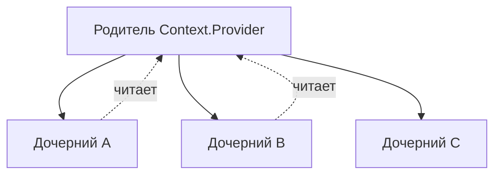

import { Playground } from '@components/Playground'


Составные компоненты — это паттерн, в котором несколько компонентов работают вместе, используя общее состояние, чтобы реализовать сложную функциональность.

Icon: LayoutGrid (Сетка разметки)

## Описание

Этот паттерн позволяет создавать компоненты с гибким API, где пользователь может сам определять порядок и структуру дочерних элементов, при этом они остаются связанными общей логикой. Классический пример — `select` и `option` в HTML.

## Mermaid Диаграмма



## Пример использования (Tabs)

```jsx
import React, { useState, useContext, createContext } from 'react';

const TabsContext = createContext();

const Tabs = ({ children, defaultValue }) => {
  const [activeTab, setActiveTab] = useState(defaultValue);
  return (
    <TabsContext.Provider value={{ activeTab, setActiveTab }}>
      <div className="tabs-container">{children}</div>
    </TabsContext.Provider>
  );
};

const TabList = ({ children }) => <div className="tab-list">{children}</div>;

const TabTrigger = ({ value, children }) => {
  const { activeTab, setActiveTab } = useContext(TabsContext);
  return (
    <button onClick={() => setActiveTab(value)} style={{ fontWeight: activeTab === value ? 'bold' : 'normal' }}>
      {children}
    </button>
  );
};

const TabContent = ({ value, children }) => {
  const { activeTab } = useContext(TabsContext);
  return activeTab === value ? <div>{children}</div> : null;
};

// Привязываем компоненты к родителю
Tabs.List = TabList;
Tabs.Trigger = TabTrigger;
Tabs.Content = TabContent;

// Использование
const App = () => (
  <Tabs defaultValue="tab1">
    <Tabs.List>
      <Tabs.Trigger value="tab1">Основы</Tabs.Trigger>
      <Tabs.Trigger value="tab2">Паттерны</Tabs.Trigger>
    </Tabs.List>
    <Tabs.Content value="tab1">Контент основ...</Tabs.Content>
    <Tabs.Content value="tab2">Контент паттернов...</Tabs.Content>
  </Tabs>
);
```

## Преимущества

- **Снижение пропс-дриллинга**: Дочерние компоненты общаются через контекст.
- **Гибкость разметки**: Можно вставлять дополнительные элементы между частями компонента.
- **Чистый API**: Понятная иерархия.

### Практика

Попробуйте примеры в интерактивном редакторе:

<Playground client:visible template="react" files={{ "/App.tsx": `import { useState, useContext, createContext } from 'react';
import type { ReactNode } from 'react';

const TabsContext = createContext<{ active: string; setActive: (v: string) => void }>({ active: '', setActive: () => {} });

function Tabs({ children, defaultValue }: { children: ReactNode; defaultValue: string }) {
  const [active, setActive] = useState(defaultValue);
  return (
    <TabsContext.Provider value={{ active, setActive }}>
      <div style={{ fontFamily: 'sans-serif', background: '#0f172a', minHeight: '100vh', padding: '2rem', color: '#f1f5f9' }}>
        {children}
      </div>
    </TabsContext.Provider>
  );
}

function TabList({ children }: { children: ReactNode }) {
  return (
    <div style={{ display: 'flex', gap: '0.5rem', marginBottom: '1.5rem', borderBottom: '1px solid #334155', paddingBottom: '0' }}>
      {children}
    </div>
  );
}

function TabTrigger({ value, children }: { value: string; children: ReactNode }) {
  const { active, setActive } = useContext(TabsContext);
  const isActive = active === value;
  return (
    <button
      onClick={() => setActive(value)}
      style={{
        padding: '0.6rem 1.2rem',
        background: isActive ? '#3b82f6' : 'transparent',
        color: isActive ? '#fff' : '#94a3b8',
        border: 'none',
        borderRadius: '6px 6px 0 0',
        cursor: 'pointer',
        fontWeight: isActive ? 700 : 400,
        fontSize: '0.95rem',
        transition: 'all 0.2s',
      }}
    >
      {children}
    </button>
  );
}

function TabContent({ value, children }: { value: string; children: ReactNode }) {
  const { active } = useContext(TabsContext);
  if (active !== value) return null;
  return (
    <div style={{
      background: '#1e293b',
      borderRadius: '0 8px 8px 8px',
      padding: '1.5rem',
      lineHeight: '1.6',
      color: '#e2e8f0',
    }}>
      {children}
    </div>
  );
}

Tabs.List = TabList;
Tabs.Trigger = TabTrigger;
Tabs.Content = TabContent;

export default function App() {
  return (
    <Tabs defaultValue="what">
      <h2 style={{ color: '#60a5fa', marginBottom: '1.5rem', fontSize: '1.4rem' }}>
        Compound Components Demo
      </h2>
      <p style={{ color: '#94a3b8', marginBottom: '1.5rem', fontSize: '0.9rem' }}>
        Несколько компонентов работают вместе через общий Context
      </p>
      <Tabs.List>
        <Tabs.Trigger value="what">Что такое?</Tabs.Trigger>
        <Tabs.Trigger value="why">Зачем?</Tabs.Trigger>
        <Tabs.Trigger value="how">Как работает?</Tabs.Trigger>
      </Tabs.List>
      <Tabs.Content value="what">
        <strong>Compound Components</strong> — паттерн, где несколько компонентов
        работают вместе через общий контекст. Родитель управляет состоянием,
        дети читают его через <code>useContext</code>.
      </Tabs.Content>
      <Tabs.Content value="why">
        Снижает prop drilling, делает API гибким. Пользователь сам выбирает
        порядок и состав дочерних компонентов — как HTML{' '}
        <code>&lt;select&gt; + &lt;option&gt;</code>.
      </Tabs.Content>
      <Tabs.Content value="how">
        <ol style={{ margin: 0, paddingLeft: '1.2rem' }}>
          <li>Родитель создаёт Context и оборачивает детей Provider-ом</li>
          <li>Дочерние компоненты читают состояние через useContext</li>
          <li>Компоненты прикрепляются к родителю: <code>Tabs.List</code>, <code>Tabs.Trigger</code></li>
        </ol>
      </Tabs.Content>
    </Tabs>
  );
}
` }} />
