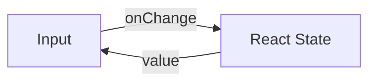
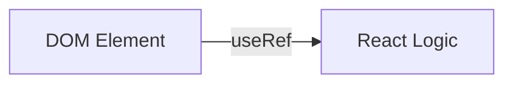

import { Playground } from '@components/Playground'


В React существует два способа работы с вводом данных в формах: управление через состояние React или использование ссылок на DOM-элементы.

Icon: ToggleLeft (Переключатель)

## Управляемые компоненты (Controlled)

Данные формы обрабатываются состоянием компонента. Это рекомендуемый способ для большинства случаев.



## Неуправляемые компоненты (Uncontrolled)

Данные формы хранятся в самом DOM, а доступ к ним осуществляется через `useRef`.



## Сравнение

| Характеристика | Управляемые | Неуправляемые |
| :--- | :--- | :--- |
| Источник истины | React [State](/react/props-state/) | DOM |
| Мгновенная валидация | Легко | Сложно |
| Форматирование ввода | Да | Нет |
| Производительность | Ререндер на каждый символ | Нет лишних ререндеров |

## Примеры кода

### Управляемый
```jsx
const ControlledInput = () => {
  const [value, setValue] = useState('');
  return <input value={value} onChange={(e) => setValue(e.target.value)} />;
};
```

### Неуправляемый
```jsx
const UncontrolledInput = () => {
  const inputRef = useRef(null);
  const handleSubmit = () => alert(inputRef.current.value);
  return (
    <>
      <input ref={inputRef} />
      <button onClick={handleSubmit}>Отправить</button>
    </>
  );
};
```

## Когда что выбирать?

Используйте **управляемые** компоненты для сложной логики, динамических фильтров и валидации.
Используйте **неуправляемые** компоненты для простых форм (например, логин/пароль), где данные нужны только при отправке, или при интеграции со сторонними библиотеками не на React.

---

## 🔗 Полезные ссылки
- [Props State](/react/props-state/)

### Практика

Попробуйте примеры в интерактивном редакторе:

<Playground client:visible template="react" files={{ "/App.tsx": `import { useState, useRef } from 'react';

const inputStyle = {
  width: '100%',
  padding: '0.5rem 0.75rem',
  background: '#0f172a',
  border: '1.5px solid #334155',
  borderRadius: '6px',
  color: '#f1f5f9',
  fontSize: '0.9rem',
  boxSizing: 'border-box' as const,
  outline: 'none',
};

function ControlledForm() {
  const [name, setName] = useState('');
  const [email, setEmail] = useState('');
  const [result, setResult] = useState('');
  const emailInvalid = email.length > 0 && !email.includes('@');

  return (
    <div>
      <div style={{ marginBottom: '0.75rem' }}>
        <label style={{ display: 'block', color: '#94a3b8', fontSize: '0.8rem', marginBottom: '0.3rem' }}>
          Имя
        </label>
        <input
          value={name}
          onChange={(e) => setName(e.target.value)}
          placeholder="Ваше имя..."
          style={inputStyle}
        />
        <div style={{ color: '#60a5fa', fontSize: '0.72rem', marginTop: '0.2rem' }}>
          state: "{name}"
        </div>
      </div>
      <div style={{ marginBottom: '0.75rem' }}>
        <label style={{ display: 'block', color: '#94a3b8', fontSize: '0.8rem', marginBottom: '0.3rem' }}>
          Email
        </label>
        <input
          value={email}
          onChange={(e) => setEmail(e.target.value)}
          placeholder="email@example.com"
          style={{ ...inputStyle, borderColor: emailInvalid ? '#ef4444' : '#334155' }}
        />
        {emailInvalid && (
          <div style={{ color: '#ef4444', fontSize: '0.72rem', marginTop: '0.2rem' }}>
            ✗ Невалидный email (мгновенная валидация!)
          </div>
        )}
      </div>
      <button
        onClick={() => setResult(name && email ? name + ' / ' + email : 'Заполните поля')}
        style={{
          padding: '0.45rem 1.1rem',
          background: '#3b82f6',
          color: '#fff',
          border: 'none',
          borderRadius: '6px',
          cursor: 'pointer',
          fontWeight: 600,
          fontSize: '0.85rem',
        }}
      >
        Отправить
      </button>
      {result && (
        <div
          style={{
            marginTop: '0.6rem',
            background: '#0f172a',
            borderRadius: '6px',
            padding: '0.5rem 0.75rem',
            color: '#34d399',
            fontSize: '0.8rem',
          }}
        >
          ✓ {result}
        </div>
      )}
    </div>
  );
}

function UncontrolledForm() {
  const nameRef = useRef<HTMLInputElement>(null);
  const emailRef = useRef<HTMLInputElement>(null);
  const [result, setResult] = useState('');

  const handleRead = () => {
    const name = nameRef.current?.value || '';
    const email = emailRef.current?.value || '';
    setResult(name && email ? name + ' / ' + email : 'Заполните поля');
  };

  return (
    <div>
      <div style={{ marginBottom: '0.75rem' }}>
        <label style={{ display: 'block', color: '#94a3b8', fontSize: '0.8rem', marginBottom: '0.3rem' }}>
          Имя
        </label>
        <input ref={nameRef} placeholder="Ваше имя..." style={inputStyle} />
        <div style={{ color: '#64748b', fontSize: '0.72rem', marginTop: '0.2rem' }}>
          значение хранится в DOM
        </div>
      </div>
      <div style={{ marginBottom: '0.75rem' }}>
        <label style={{ display: 'block', color: '#94a3b8', fontSize: '0.8rem', marginBottom: '0.3rem' }}>
          Email
        </label>
        <input ref={emailRef} placeholder="email@example.com" style={inputStyle} />
        <div style={{ color: '#64748b', fontSize: '0.72rem', marginTop: '0.2rem' }}>
          нет ре-рендеров при вводе
        </div>
      </div>
      <button
        onClick={handleRead}
        style={{
          padding: '0.45rem 1.1rem',
          background: '#7c3aed',
          color: '#fff',
          border: 'none',
          borderRadius: '6px',
          cursor: 'pointer',
          fontWeight: 600,
          fontSize: '0.85rem',
        }}
      >
        Читать ref
      </button>
      {result && (
        <div
          style={{
            marginTop: '0.6rem',
            background: '#0f172a',
            borderRadius: '6px',
            padding: '0.5rem 0.75rem',
            color: '#34d399',
            fontSize: '0.8rem',
          }}
        >
          ✓ {result}
        </div>
      )}
    </div>
  );
}

export default function App() {
  return (
    <div
      style={{ fontFamily: 'sans-serif', background: '#0f172a', minHeight: '100vh', padding: '2rem', color: '#f1f5f9' }}
    >
      <h2 style={{ color: '#60a5fa', marginBottom: '1.5rem' }}>Controlled vs Uncontrolled</h2>
      <div style={{ display: 'grid', gridTemplateColumns: '1fr 1fr', gap: '1.5rem' }}>
        <div
          style={{
            background: '#1e293b',
            borderRadius: '12px',
            padding: '1.5rem',
            border: '1px solid #3b82f6',
          }}
        >
          <h3 style={{ color: '#3b82f6', margin: '0 0 1rem', fontSize: '1rem' }}>
            ✅ Управляемый (Controlled)
          </h3>
          <ControlledForm />
          <div style={{ marginTop: '1rem', color: '#475569', fontSize: '0.75rem', lineHeight: '1.5' }}>
            Источник истины: React state
            <br />
            Мгновенная валидация ✓
          </div>
        </div>
        <div
          style={{
            background: '#1e293b',
            borderRadius: '12px',
            padding: '1.5rem',
            border: '1px solid #7c3aed',
          }}
        >
          <h3 style={{ color: '#7c3aed', margin: '0 0 1rem', fontSize: '1rem' }}>
            📌 Неуправляемый (Uncontrolled)
          </h3>
          <UncontrolledForm />
          <div style={{ marginTop: '1rem', color: '#475569', fontSize: '0.75rem', lineHeight: '1.5' }}>
            Источник истины: DOM
            <br />
            Нет ре-рендеров при вводе ✓
          </div>
        </div>
      </div>
    </div>
  );
}
` }} />
