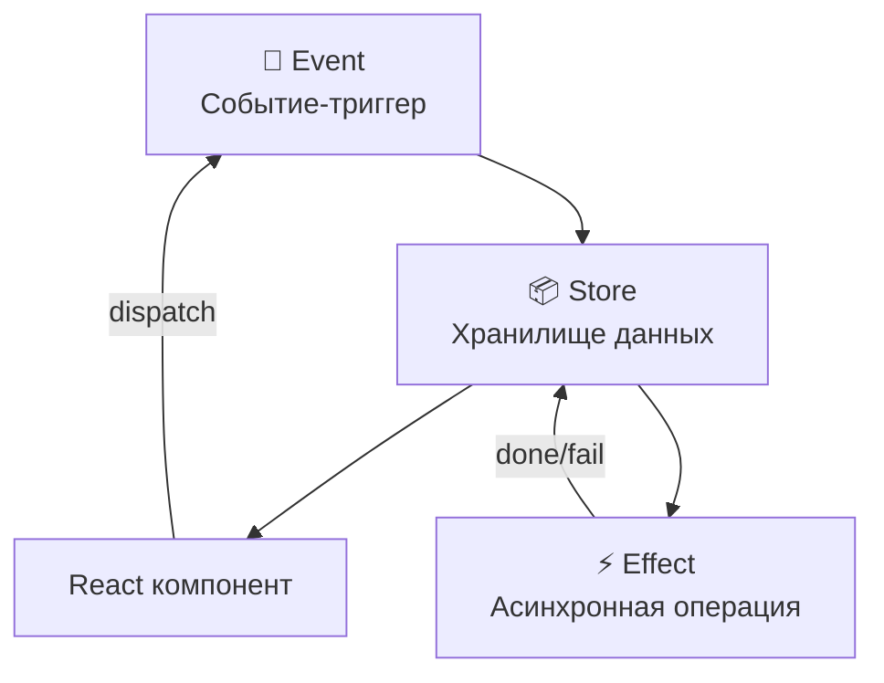

import { Playground } from '@components/Playground'


## Effector: Введение в реактивное управление состоянием

**Effector** — это мощная библиотека для управления состоянием, основанная на идеях **реактивного программирования** и **event-driven архитектуры**. Представь, что твой стейт — это электрическая сеть 🔌: события — это выключатели, сторы — аккумуляторы, а эффекты — электроприборы. Нажал выключатель → ток потёк → прибор заработал!

Effector создан в России командой под руководством **Дмитрия Горячева** и сегодня широко используется в крупных российских и зарубежных продуктах.

### Почему Effector?

[Icon: Zap] **Явный поток данных:** Ты всегда знаешь, откуда пришли данные и куда они пойдут.
[Icon: Package] **Три кита:** Store, Event, Effect — три примитива, из которых строится всё.
[Icon: Cpu] **Без магии:** Никакого Proxy, никаких мутаций — чистые функциональные преобразования.
[Icon: Globe] **SSR из коробки:** Fork API позволяет изолировать состояние на сервере.
[Icon: Layers] **TypeScript-first:** Отличный вывод типов без лишних дженериков.

### Три примитива (Units)



#### 📦 Store — хранилище данных

Store — это реактивная ячейка памяти. Он хранит текущее значение и уведомляет подписчиков при изменении.

```typescript
import { createStore } from 'effector';

// Создаём стор с начальным значением
const $counter = createStore<number>(0);
const $userName = createStore<string>('');
const $isLoading = createStore<boolean>(false);

// По соглашению, имена сторов начинаются с $
// Это не обязательно, но очень помогает читать код!
```

#### 🎯 Event — событие

Event — это функция-триггер. Она не хранит данных, только сигнализирует о том, что что-то произошло.

```typescript
import { createEvent } from 'effector';

// Событие без данных
const buttonClicked = createEvent();

// Событие с данными (payload)
const userNameChanged = createEvent<string>();
const itemAdded = createEvent<{ id: number; title: string }>();

// Вызов события — это просто вызов функции!
buttonClicked(); // триггер без данных
userNameChanged('Яша'); // триггер с данными
```

#### ⚡ Effect — эффект (асинхронные операции)

Effect — это обёртка над async-функцией с автоматическим управлением состоянием загрузки.

```typescript
import { createEffect } from 'effector';

// Создаём эффект для загрузки данных
const fetchUserFx = createEffect<number, User, Error>(async (userId) => {
  const res = await fetch(`/api/users/${userId}`);
  if (!res.ok) throw new Error('Не удалось загрузить пользователя');
  return res.json();
});

// У каждого эффекта автоматически появляются:
// fetchUserFx.pending  — $store<boolean>
// fetchUserFx.done     — Event<{params, result}>
// fetchUserFx.fail     — Event<{params, error}>
// fetchUserFx.doneData — Event<result>
// fetchUserFx.failData — Event<error>
```

### Философия Effector: явный поток данных

В Redux ты диспатчишь экшены → редьюсер меняет стейт (неявно через switch/case).
В MobX ты мутируешь объект → магия Proxy обновляет всё (неявно через @observable).
В **Effector** ты явно связываешь: «это событие → меняет этот стор → вот так».

```typescript
import { createStore, createEvent } from 'effector';

const incremented = createEvent();
const decremented = createEvent();
const reset = createEvent();

const $counter = createStore(0)
  .on(incremented, (state) => state + 1)   // явная связь
  .on(decremented, (state) => state - 1)   // явная связь
  .reset(reset);                           // сброс к начальному значению

// Это читается как: "Когда произошло incremented, стор добавляет 1"
// Никакой магии — просто функции!
```

### Сравнение с другими библиотеками

| Характеристика | Redux Toolkit | MobX | Zustand | Effector |
|---|---|---|---|---|
| Парадигма | Flux / Reducer | Реактивное ООП | Closure Store | Event-driven FP |
| Boilerplate | Средний | Минимальный | Минимальный | Минимальный |
| TypeScript | Хороший | Хороший | Отличный | Отличный |
| SSR | Через thunk | Сложно | Через middleware | Fork API (нативно) |
| Магия / Proxy | Нет | Да (Proxy) | Нет | Нет |
| Независимость от React | Да | Да | Нет | Да |
| Размер (gzip) | ~14kb | ~16kb | ~1kb | ~5kb |
| Тестируемость | Хорошая | Средняя | Хорошая | Отличная |
| Обучаемость | Средняя | Средняя | Лёгкая | Средняя |

### Пример: то же самое на всех библиотеках

```typescript
// ❌ Redux Toolkit
const counterSlice = createSlice({
  name: 'counter',
  initialState: { value: 0 },
  reducers: {
    increment: (state) => { state.value += 1; },
    decrement: (state) => { state.value -= 1; },
  },
});

// ❌ Zustand
const useCounter = create((set) => ({
  count: 0,
  increment: () => set((s) => ({ count: s.count + 1 })),
  decrement: () => set((s) => ({ count: s.count - 1 })),
}));

// ✅ Effector
const incremented = createEvent();
const decremented = createEvent();
const $count = createStore(0)
  .on(incremented, (s) => s + 1)
  .on(decremented, (s) => s - 1);
```

Заметь, насколько читаемо решение на Effector: данные и логика явно разделены!

### Архитектура приложения с Effector

```typescript
// model.ts — вся логика живёт здесь
import { createStore, createEvent, createEffect, sample } from 'effector';

// Events
export const pageOpened = createEvent();
export const searchChanged = createEvent<string>();

// Effects
export const loadUsersFx = createEffect(async () => {
  const res = await fetch('/api/users');
  return res.json();
});

// Stores
export const $users = createStore<User[]>([]);
export const $search = createStore('');
export const $isLoading = loadUsersFx.pending;

// Logic (связи между юнитами)
$search.on(searchChanged, (_, value) => value);
$users.on(loadUsersFx.doneData, (_, users) => users);

// sample: загружаем пользователей при открытии страницы
sample({ clock: pageOpened, target: loadUsersFx });
```

```tsx
// ui.tsx — компонент просто отображает данные
import { useStore, useEvent } from 'effector-react';
import { $users, $search, $isLoading, searchChanged, pageOpened } from './model';

function UserList() {
  const users = useStore($users);
  const search = useStore($search);
  const isLoading = useStore($isLoading);
  const handleSearch = useEvent(searchChanged);

  // UI-логики минимум — только отображение и вызов событий
  return (
    <div>
      <input value={search} onChange={e => handleSearch(e.target.value)} />
      {isLoading ? <Spinner /> : users.map(u => <UserCard key={u.id} user={u} />)}
    </div>
  );
}
```

### Установка

```bash
npm install effector effector-react
yarn add effector effector-react
# или
pnpm add effector effector-react
```

Для DevTools (расширение Redux DevTools):
```bash
npm install effector-logger
```

---

## 🔗 Полезные ссылки
- [Effector: Stores и Events](/react/effector-stores-events/)
- [Effector: Effects](/react/effector-effects/)
- [Effector + React](/react/effector-react/)
- [Effector: Продвинутый уровень](/react/effector-advanced/)
- [Zustand: Основы](/react/zustand-basics/)
- [Обзор State Management](/react/state-management-overview/)

### Практика

Попробуйте примеры в интерактивном редакторе:

<Playground client:visible template="react" files={{ "/App.tsx": `import { useReducer, useCallback } from "react";

// 🎯 Симуляция Effector mental model через useReducer
// В реальном Effector это выглядело бы так:
//
//   const incremented = createEvent();
//   const decremented = createEvent();
//   const reset = createEvent();
//   const $counter = createStore(0)
//     .on(incremented, (s) => s + 1)
//     .on(decremented, (s) => s - 1)
//     .reset(reset);
//
// Здесь мы симулируем тот же поток данных через useReducer:

// Events — это просто строковые константы
type CounterEvent = "incremented" | "decremented" | "reset";

// Store — начальное состояние
const initialState = { count: 0 };

// Reducer — аналог .on() handlers
function counterReducer(
  state: typeof initialState,
  event: CounterEvent
): typeof initialState {
  switch (event) {
    case "incremented": return { count: state.count + 1 };
    case "decremented": return { count: state.count - 1 };
    case "reset":       return initialState;
    default:            return state;
  }
}

// Derived state — аналог createStore(0).map(n => n * 2)
function selectDoubled(state: typeof initialState) {
  return state.count * 2;
}
function selectIsPositive(state: typeof initialState) {
  return state.count > 0;
}

const btn = (bg: string, disabled = false) => ({
  padding: "10px 20px",
  background: disabled ? "#334155" : bg,
  color: disabled ? "#64748b" : "#fff",
  border: "none",
  borderRadius: 8,
  cursor: disabled ? "not-allowed" : "pointer",
  fontWeight: 700,
  fontSize: 14,
  transition: "all .15s",
});

export default function App() {
  // useReducer ≈ createStore + .on() handlers
  const [store, dispatch] = useReducer(counterReducer, initialState);

  // useEvent ≈ диспатч события
  const incremented = useCallback(() => dispatch("incremented"), []);
  const decremented = useCallback(() => dispatch("decremented"), []);
  const reset        = useCallback(() => dispatch("reset"), []);

  // Derived stores (computed values)
  const doubled    = selectDoubled(store);
  const isPositive = selectIsPositive(store);

  return (
    <div style={{ minHeight: "100vh", background: "#0f172a", display: "flex", alignItems: "center", justifyContent: "center", fontFamily: "sans-serif", padding: 16 }}>
      <div style={{ background: "#1e293b", borderRadius: 16, padding: 32, width: 420, boxShadow: "0 8px 32px rgba(0,0,0,.5)" }}>
        {/* Header */}
        <div style={{ display: "flex", gap: 8, marginBottom: 20, flexWrap: "wrap" }}>
          <span style={{ background: "#7c3aed", color: "#fff", borderRadius: 6, fontSize: 11, fontWeight: 700, padding: "2px 8px" }}>Effector</span>
          <span style={{ background: "#1e3a5f", color: "#60a5fa", borderRadius: 6, fontSize: 11, fontWeight: 700, padding: "2px 8px" }}>mental model</span>
        </div>
        <h2 style={{ color: "#f8fafc", margin: "0 0 4px", fontSize: 20 }}>Счётчик: Event-driven</h2>
        <p style={{ color: "#64748b", fontSize: 12, marginBottom: 24, lineHeight: 1.6 }}>
          Events → Store → Derived State<br/>
          Явный поток данных, никакой магии ✨
        </p>

        {/* Store visualization */}
        <div style={{ background: "#0f172a", borderRadius: 12, padding: 20, marginBottom: 20, textAlign: "center" }}>
          <div style={{ color: "#64748b", fontSize: 11, marginBottom: 4 }}>📦 $counter (Store)</div>
          <div style={{ fontSize: 64, fontWeight: 900, color: isPositive ? "#22c55e" : store.count < 0 ? "#ef4444" : "#f8fafc", lineHeight: 1 }}>
            {store.count}
          </div>
          <div style={{ display: "flex", gap: 12, justifyContent: "center", marginTop: 12 }}>
            <div style={{ background: "#1e293b", borderRadius: 8, padding: "6px 12px", fontSize: 11, color: "#94a3b8" }}>
              <span style={{ color: "#64748b" }}>$doubled: </span>
              <span style={{ color: "#fbbf24", fontWeight: 700 }}>{doubled}</span>
            </div>
            <div style={{ background: "#1e293b", borderRadius: 8, padding: "6px 12px", fontSize: 11, color: "#94a3b8" }}>
              <span style={{ color: "#64748b" }}>$isPositive: </span>
              <span style={{ color: isPositive ? "#22c55e" : "#ef4444", fontWeight: 700 }}>{String(isPositive)}</span>
            </div>
          </div>
        </div>

        {/* Events */}
        <div style={{ marginBottom: 16 }}>
          <div style={{ color: "#64748b", fontSize: 11, marginBottom: 8 }}>🎯 Events (триггеры)</div>
          <div style={{ display: "flex", gap: 8 }}>
            <button style={btn("#22c55e")} onClick={incremented}>incremented()</button>
            <button style={btn("#ef4444")} onClick={decremented}>decremented()</button>
            <button style={btn("#64748b")} onClick={reset}>reset()</button>
          </div>
        </div>

        {/* Data flow diagram */}
        <div style={{ background: "#0f172a", borderRadius: 8, padding: 14, fontSize: 11, color: "#64748b", lineHeight: 2 }}>
          <div style={{ color: "#7c3aed", fontWeight: 700, marginBottom: 4 }}>Поток данных (как в Effector):</div>
          <div>🎯 <span style={{ color: "#fbbf24" }}>incremented</span> → .on(s =&gt; s + 1)</div>
          <div>🎯 <span style={{ color: "#fbbf24" }}>decremented</span> → .on(s =&gt; s - 1)</div>
          <div>🎯 <span style={{ color: "#fbbf24" }}>reset</span> → .reset(initialState)</div>
          <div>📦 <span style={{ color: "#60a5fa" }}>$counter</span> → derived: $doubled, $isPositive</div>
        </div>
      </div>
    </div>
  );
}
` }} />
