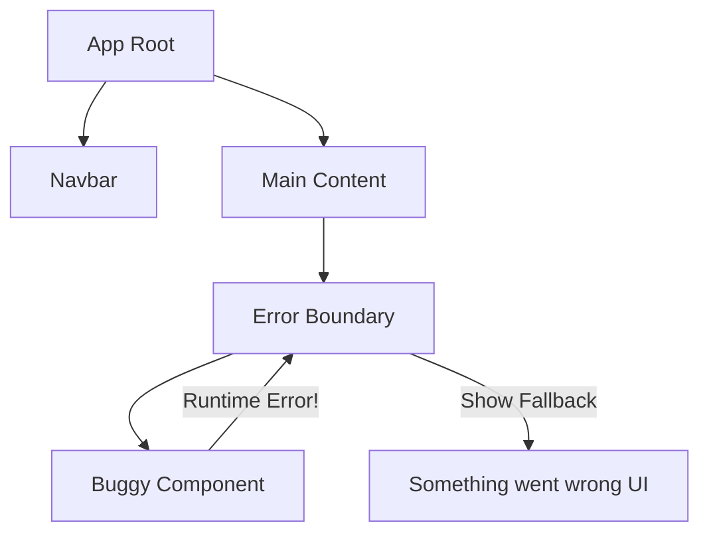

import { Playground } from '@components/Playground'


В JavaScript ошибка внутри одной части кода может "уронить" все приложение. React Error Boundaries (Предохранители) позволяют поймать ошибку в дереве компонентов, вывести запасной UI (fallback) и сохранить работоспособность остальной части приложения.

### Как это работает?

Error Boundary — это компонент-класс, который реализует методы жизненного цикла `getDerivedStateFromError` или `componentDidCatch`.

[Icon: Shield] По состоянию на 2024 год, Error Boundaries **обязательно** должны быть классовыми компонентами (или использовать сторонние библиотеки).



### Пример реализации

```tsx
import React, { ErrorInfo, ReactNode } from 'react';

interface Props { children: ReactNode; }
interface State { hasError: boolean; }

class ErrorBoundary extends React.Component<Props, State> {
  constructor(props: Props) {
    super(props);
    this.state = { hasError: false };
  }

  static getDerivedStateFromError(_: Error): State {
    // Обновляем состояние, чтобы следующий рендер показал запасной UI.
    return { hasError: true };
  }

  componentDidCatch(error: Error, errorInfo: ErrorInfo) {
    // Здесь можно отправить отчет об ошибке в Sentry или LogRocket
    console.error("Caught error:", error, errorInfo);
  }

  render() {
    if (this.state.hasError) {
      return <h1>Что-то пошло не так.</h1>;
    }
    return this.props.children;
  }
}

// Использование
<ErrorBoundary>
  <MyWidget />
</ErrorBoundary>
```

### Что НЕ ловят Error Boundaries?

- Обработчики событий (нужно использовать `try/catch`).
- Асинхронный код (`setTimeout`, `requestAnimationFrame`).
- Серверный рендеринг (SSR).
- Ошибки в самом Error Boundary (а не в его детях).

### Использование библиотек

В современном мире часто используют готовую библиотеку `react-error-boundary`, которая позволяет писать предохранители в функциональном стиле.

[Icon: Package] `npm install react-error-boundary`

```tsx
import { ErrorBoundary } from 'react-error-boundary';

function Fallback({error}) {
  return <div role="alert">Ошибка: {error.message}</div>;
}

<ErrorBoundary FallbackComponent={Fallback}>
  <ComponentThatMightCrash />
</ErrorBoundary>
```

### Практика

Попробуйте примеры в интерактивном редакторе:

<Playground client:visible template="react" files={{ "/App.tsx": `import React, { useState, useRef } from 'react';

function BuggyWidget({ shouldThrow }: { shouldThrow: boolean }) {
  if (shouldThrow) {
    throw new Error('Компонент сломался! Обнаружена критическая ошибка.');
  }
  return (
    <div
      style={{
        background: '#064e3b',
        border: '1px solid #34d399',
        borderRadius: '8px',
        padding: '1rem',
        textAlign: 'center',
        color: '#34d399',
        fontWeight: 600,
      }}
    >
      ✅ Компонент работает нормально
    </div>
  );
}

interface EBState {
  hasError: boolean;
  error: Error | null;
}

class ErrorBoundary extends React.Component<{ children: React.ReactNode }, EBState> {
  constructor(props: { children: React.ReactNode }) {
    super(props);
    this.state = { hasError: false, error: null };
  }

  static getDerivedStateFromError(error: Error): EBState {
    return { hasError: true, error };
  }

  componentDidCatch(error: Error, info: React.ErrorInfo) {
    console.error('ErrorBoundary caught:', error, info);
  }

  reset = () => this.setState({ hasError: false, error: null });

  render() {
    if (this.state.hasError) {
      return (
        <div
          style={{
            background: '#450a0a',
            border: '1px solid #ef4444',
            borderRadius: '8px',
            padding: '1.2rem',
          }}
        >
          <div style={{ color: '#ef4444', fontWeight: 700, marginBottom: '0.5rem', fontSize: '1rem' }}>
            ⚠️ Что-то пошло не так
          </div>
          <code style={{ color: '#fca5a5', fontSize: '0.85rem', display: 'block', marginBottom: '0.75rem' }}>
            {this.state.error?.message}
          </code>
          <button
            onClick={this.reset}
            style={{
              padding: '0.4rem 1rem',
              background: '#ef4444',
              color: '#fff',
              border: 'none',
              borderRadius: '6px',
              cursor: 'pointer',
              fontWeight: 600,
            }}
          >
            Восстановить
          </button>
        </div>
      );
    }
    return this.props.children;
  }
}

export default function App() {
  const [shouldThrow, setShouldThrow] = useState(false);
  const [counter, setCounter] = useState(0);

  return (
    <div
      style={{ fontFamily: 'sans-serif', background: '#0f172a', minHeight: '100vh', padding: '2rem', color: '#f1f5f9' }}
    >
      <h2 style={{ color: '#60a5fa', marginBottom: '0.5rem' }}>Error Boundary Demo</h2>
      <p style={{ color: '#94a3b8', marginBottom: '1.5rem', fontSize: '0.9rem' }}>
        Предохранитель ловит ошибки в дочерних компонентах и показывает fallback UI
      </p>

      <div style={{ display: 'flex', gap: '0.75rem', marginBottom: '1.5rem', flexWrap: 'wrap' }}>
        <button
          onClick={() => setShouldThrow(true)}
          style={{
            padding: '0.5rem 1.2rem',
            background: '#ef4444',
            color: '#fff',
            border: 'none',
            borderRadius: '7px',
            cursor: 'pointer',
            fontWeight: 600,
          }}
        >
          💥 Сломать компонент
        </button>
        <button
          onClick={() => { setShouldThrow(false); }}
          style={{
            padding: '0.5rem 1.2rem',
            background: '#334155',
            color: '#e2e8f0',
            border: 'none',
            borderRadius: '7px',
            cursor: 'pointer',
          }}
        >
          Сбросить флаг
        </button>
        <button
          onClick={() => setCounter((c) => c + 1)}
          style={{
            padding: '0.5rem 1.2rem',
            background: '#334155',
            color: '#e2e8f0',
            border: 'none',
            borderRadius: '7px',
            cursor: 'pointer',
          }}
        >
          Счётчик вне границы: {counter}
        </button>
      </div>

      <div
        style={{
          background: '#1e293b',
          borderRadius: '12px',
          padding: '1.5rem',
          border: '1px solid #334155',
        }}
      >
        <div style={{ color: '#475569', fontSize: '0.8rem', marginBottom: '0.5rem', fontFamily: 'monospace' }}>
          {'<ErrorBoundary>'}
        </div>
        <ErrorBoundary key={String(shouldThrow)}>
          <BuggyWidget shouldThrow={shouldThrow} />
        </ErrorBoundary>
        <div style={{ color: '#475569', fontSize: '0.8rem', marginTop: '0.5rem', fontFamily: 'monospace' }}>
          {'</ErrorBoundary>'}
        </div>
      </div>

      <div
        style={{
          marginTop: '1rem',
          background: '#1e293b',
          borderRadius: '8px',
          padding: '0.75rem 1rem',
          color: '#34d399',
          fontSize: '0.85rem',
        }}
      >
        ✓ Остальное приложение продолжает работать (счётчик: {counter})
      </div>

      <div
        style={{
          marginTop: '1rem',
          background: '#1e293b',
          borderRadius: '8px',
          padding: '1rem',
          fontSize: '0.82rem',
          color: '#94a3b8',
          lineHeight: '1.6',
        }}
      >
        <span style={{ color: '#60a5fa' }}>getDerivedStateFromError</span> — обновляет состояние
        для fallback UI
        <br />
        <span style={{ color: '#60a5fa' }}>componentDidCatch</span> — логирует ошибку (Sentry и
        т.д.)
      </div>
    </div>
  );
}
` }} />
