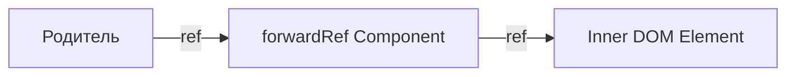

import { Playground } from '@components/Playground'


Пересылка рефов — это техника автоматической передачи рефа через компонент одному из его дочерних элементов.

Icon: ArrowRightCircle (Стрелка вправо)

## Описание

Обычно функциональные компоненты не принимают атрибут `ref`, так как у них нет экземпляров. `forwardRef` позволяет вашему компоненту "подставить" реф к внутреннему DOM-узлу.

## Mermaid Диаграмма



## Пример использования

```jsx
import React, { forwardRef, useRef } from 'react';

// Компонент, принимающий ref
const CustomInput = forwardRef((props, ref) => (
  <div className="input-wrapper">
    <label>{props.label}</label>
    <input ref={ref} {...props} />
  </div>
));

// Использование в родителе
const Parent = () => {
  const inputRef = useRef(null);

  const focusInput = () => {
    inputRef.current.focus();
  };

  return (
    <>
      <CustomInput ref={inputRef} label="Имя пользователя" />
      <button onClick={focusInput}>Установить фокус</button>
    </>
  );
};
```

## Когда использовать?

1. **[Компоненты](/react/components/) UI-библиотек**: Кнопки, инпуты, ссылки, которым может понадобиться прямой доступ к DOM для управления фокусом, выделением или измерения размеров.
2. **Интеграция с DOM-библиотеками**: Если вы используете сторонние JS-плагины, которым нужен узел DOM.
3. **[HOC](/react/hoc-pattern/)**: Пересылка рефа через компоненты высшего порядка.

## Помните

Не стоит злоупотреблять рефами. Большинство задач следует решать через декларативные пропсы и состояние.

---

## 🔗 Полезные ссылки
- [React Компоненты](/react/components/)
- [Higher-Order Components (HOC)](/react/hoc-pattern/)

### Практика

Попробуйте примеры в интерактивном редакторе:

<Playground client:visible template="react" files={{ "/App.tsx": `import { forwardRef, useRef, useState } from 'react';

interface CustomInputProps {
  label: string;
  placeholder?: string;
}

const CustomInput = forwardRef<HTMLInputElement, CustomInputProps>(
  ({ label, placeholder }, ref) => (
    <div style={{ marginBottom: '1rem' }}>
      <label
        style={{
          display: 'block',
          color: '#94a3b8',
          fontSize: '0.85rem',
          marginBottom: '0.4rem',
        }}
      >
        {label}
      </label>
      <input
        ref={ref}
        placeholder={placeholder}
        style={{
          width: '100%',
          padding: '0.6rem 0.9rem',
          background: '#0f172a',
          border: '1.5px solid #334155',
          borderRadius: '7px',
          color: '#f1f5f9',
          fontSize: '1rem',
          outline: 'none',
          boxSizing: 'border-box',
        }}
        onFocus={(e) => (e.target.style.borderColor = '#3b82f6')}
        onBlur={(e) => (e.target.style.borderColor = '#334155')}
      />
    </div>
  )
);

export default function App() {
  const firstRef = useRef<HTMLInputElement>(null);
  const lastRef = useRef<HTMLInputElement>(null);
  const [message, setMessage] = useState('');

  const handleSubmit = () => {
    const first = firstRef.current?.value || '';
    const last = lastRef.current?.value || '';
    setMessage(first && last ? 'Привет, ' + first + ' ' + last + '!' : 'Заполните оба поля');
  };

  return (
    <div
      style={{ fontFamily: 'sans-serif', background: '#0f172a', minHeight: '100vh', padding: '2rem', color: '#f1f5f9' }}
    >
      <h2 style={{ color: '#60a5fa', marginBottom: '0.5rem' }}>forwardRef Demo</h2>
      <p style={{ color: '#94a3b8', marginBottom: '1.5rem', fontSize: '0.9rem' }}>
        Родитель держит <code>ref</code> на DOM-элементы внутри дочерних компонентов
      </p>

      <div
        style={{
          background: '#1e293b',
          borderRadius: '12px',
          padding: '1.5rem',
          maxWidth: '380px',
        }}
      >
        <CustomInput ref={firstRef} label="Имя" placeholder="Введите имя..." />
        <CustomInput ref={lastRef} label="Фамилия" placeholder="Введите фамилию..." />

        <div style={{ display: 'flex', gap: '0.5rem', flexWrap: 'wrap', marginBottom: '1rem' }}>
          <button
            onClick={() => firstRef.current?.focus()}
            style={{
              padding: '0.5rem 0.9rem',
              background: '#334155',
              color: '#e2e8f0',
              border: 'none',
              borderRadius: '6px',
              cursor: 'pointer',
              fontSize: '0.85rem',
            }}
          >
            Фокус: Имя
          </button>
          <button
            onClick={() => lastRef.current?.focus()}
            style={{
              padding: '0.5rem 0.9rem',
              background: '#334155',
              color: '#e2e8f0',
              border: 'none',
              borderRadius: '6px',
              cursor: 'pointer',
              fontSize: '0.85rem',
            }}
          >
            Фокус: Фамилия
          </button>
          <button
            onClick={() => {
              if (firstRef.current) firstRef.current.value = '';
              if (lastRef.current) lastRef.current.value = '';
              setMessage('');
            }}
            style={{
              padding: '0.5rem 0.9rem',
              background: '#334155',
              color: '#e2e8f0',
              border: 'none',
              borderRadius: '6px',
              cursor: 'pointer',
              fontSize: '0.85rem',
            }}
          >
            Очистить
          </button>
          <button
            onClick={handleSubmit}
            style={{
              padding: '0.5rem 0.9rem',
              background: '#3b82f6',
              color: '#fff',
              border: 'none',
              borderRadius: '6px',
              cursor: 'pointer',
              fontWeight: 600,
              fontSize: '0.85rem',
            }}
          >
            Отправить
          </button>
        </div>

        {message && (
          <div
            style={{
              background: '#0f172a',
              borderRadius: '7px',
              padding: '0.75rem',
              color: '#34d399',
              fontWeight: 600,
            }}
          >
            {message}
          </div>
        )}
      </div>

      <div
        style={{
          marginTop: '1.5rem',
          background: '#1e293b',
          borderRadius: '8px',
          padding: '1rem',
          fontSize: '0.85rem',
          color: '#94a3b8',
        }}
      >
        <span style={{ color: '#60a5fa' }}>forwardRef:</span> позволяет передавать{' '}
        <code>ref</code> через функциональный компонент к нужному DOM-узлу
      </div>
    </div>
  );
}
` }} />
