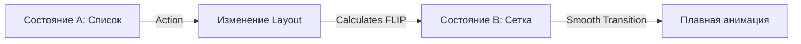

import { Playground } from '@components/Playground'


Layout-анимации во [Framer Motion](/react/framer-motion-intro/) позволяют автоматически анимировать изменение размеров и положения элементов в DOM без написания сложной логики.

Icon: Maximize (Максимизировать)

## Описание

Когда вы меняете CSS-свойства, которые влияют на макет (например, `justify-content` или `width`), браузер обычно "прыгает" в новое состояние. Проп `layout` заставляет [Framer Motion](/react/framer-motion-intro/) вычислить разницу и плавно анимировать переход.

## Mermaid Диаграмма



## Пример: Переключатель (Switch)

```jsx
import { useState } from 'react';
import { motion } from 'framer-motion';

const Switch = () => {
  const [isOn, setIsOn] = useState(false);

  return (
    <div 
      className="switch" 
      data-ison={isOn} 
      onClick={() => setIsOn(!isOn)}
      style={{
        width: '100px',
        height: '50px',
        background: isOn ? 'green' : 'gray',
        display: 'flex',
        justifyContent: isOn ? 'flex-end' : 'flex-start',
        padding: '5px',
        borderRadius: '25px',
        cursor: 'pointer'
      }}
    >
      <motion.div 
        layout 
        transition={{ type: "spring", stiffness: 700, damping: 30 }}
        style={{ width: '40px', height: '40px', background: 'white', borderRadius: '50%' }}
      />
    </div>
  );
};
```

## Shared Layout (layoutId)

Если вам нужно анимировать переход элемента из одного компонента в другой (например, индикатор выбранного пункта меню), используйте `layoutId`.

```jsx
{items.map(item => (
  <li key={item.id} onClick={() => setSelected(item)}>
    {item.label}
    {selected === item && (
      <motion.div layoutId="underline" style={{ height: '2px', background: 'blue' }} />
    )}
  </li>
))}
```

Все элементы с одинаковым `layoutId` будут плавно "перетекать" друг в друга при смене активного элемента.

---

## 🔗 Полезные ссылки
- [Основы Framer Motion](/react/framer-motion-intro/)

### Практика

Попробуйте примеры в интерактивном редакторе:

<Playground client:visible template="react" files={{
    "/App.tsx": `import { useState, useRef, useEffect } from 'react';

// ─── 1. Switch (layout prop simulation) ──────────────────────────────────────
function AnimatedSwitch({ on, onToggle }: { on: boolean; onToggle: () => void }) {
  return (
    <div
      onClick={onToggle}
      style={{
        width: 60, height: 32, borderRadius: 16, padding: 4,
        background: on ? '#10b981' : '#334155',
        display: 'flex', justifyContent: on ? 'flex-end' : 'flex-start',
        cursor: 'pointer', transition: 'background 0.35s',
        alignItems: 'center',
      }}
    >
      <div style={{
        width: 24, height: 24, borderRadius: '50%', background: '#fff',
        boxShadow: '0 1px 4px #0006',
        transform: on ? 'translateX(0)' : 'translateX(0)',
        transition: 'transform 0.35s cubic-bezier(0.68,-0.55,0.27,1.55)',
      }} />
    </div>
  );
}

// ─── 2. Tab indicator (layoutId simulation) ───────────────────────────────────
const tabs = ['Главная', 'Проекты', 'Блог', 'Контакты'];

function TabMenu() {
  const [active, setActive] = useState(0);
  const [indicator, setIndicator] = useState({ left: 0, width: 0 });
  const btnRefs = useRef<(HTMLButtonElement | null)[]>([]);
  const containerRef = useRef<HTMLDivElement>(null);

  useEffect(() => {
    const btn = btnRefs.current[active];
    const container = containerRef.current;
    if (btn && container) {
      const bRect = btn.getBoundingClientRect();
      const cRect = container.getBoundingClientRect();
      setIndicator({ left: bRect.left - cRect.left, width: bRect.width });
    }
  }, [active]);

  return (
    <div ref={containerRef} style={{ position: 'relative', display: 'flex', background: '#0f172a', borderRadius: 10, padding: 4 }}>
      <div style={{
        position: 'absolute', top: 4, bottom: 4, borderRadius: 8,
        background: '#3b82f6',
        left: indicator.left, width: indicator.width,
        transition: 'left 0.3s cubic-bezier(0.4,0,0.2,1), width 0.3s cubic-bezier(0.4,0,0.2,1)',
      }} />
      {tabs.map((t, i) => (
        <button
          key={t}
          ref={el => { btnRefs.current[i] = el; }}
          onClick={() => setActive(i)}
          style={{
            position: 'relative', zIndex: 1,
            padding: '7px 14px', border: 'none', background: 'transparent', cursor: 'pointer',
            color: active === i ? '#fff' : '#64748b', fontSize: 12, fontWeight: active === i ? 600 : 400,
            borderRadius: 8, transition: 'color 0.2s',
          }}
        >{t}</button>
      ))}
    </div>
  );
}

// ─── 3. List ↔ Grid (AnimatePresence + layout simulation) ────────────────────
const items = [
  { id: 1, label: 'React', color: '#3b82f6' },
  { id: 2, label: 'TypeScript', color: '#8b5cf6' },
  { id: 3, label: 'Node.js', color: '#10b981' },
  { id: 4, label: 'CSS', color: '#f59e0b' },
  { id: 5, label: 'Vite', color: '#ef4444' },
  { id: 6, label: 'Prisma', color: '#06b6d4' },
];

function ListGridToggle() {
  const [layout, setLayout] = useState<'list' | 'grid'>('list');
  const [visible, setVisible] = useState(items.map(i => i.id));

  const toggle = (id: number) => {
    setVisible(v => v.includes(id) ? v.filter(x => x !== id) : [...v, id].sort());
  };

  return (
    <div>
      <div style={{ display: 'flex', gap: 8, marginBottom: 12, flexWrap: 'wrap' }}>
        <button
          onClick={() => setLayout(l => l === 'list' ? 'grid' : 'list')}
          style={{ padding: '6px 14px', background: '#7c3aed', color: '#fff', border: 'none', borderRadius: 6, cursor: 'pointer', fontSize: 12 }}
        >{layout === 'list' ? '⊞ Сетка' : '☰ Список'}</button>
        {items.map(item => (
          <button
            key={item.id}
            onClick={() => toggle(item.id)}
            style={{
              padding: '4px 10px', border: \`1px solid \${item.color}\`,
              background: visible.includes(item.id) ? item.color + '33' : 'transparent',
              color: item.color, borderRadius: 6, cursor: 'pointer', fontSize: 11,
            }}
          >{visible.includes(item.id) ? '✓' : '+'} {item.label}</button>
        ))}
      </div>
      <div style={{
        display: layout === 'grid' ? 'grid' : 'flex',
        gridTemplateColumns: 'repeat(3, 1fr)',
        flexDirection: layout === 'list' ? 'column' : undefined,
        gap: 8,
      }}>
        {items.filter(i => visible.includes(i.id)).map(item => (
          <div
            key={item.id}
            style={{
              background: item.color + '22', border: \`1px solid \${item.color}66\`,
              borderRadius: 8, padding: '10px 14px', color: item.color,
              fontWeight: 600, fontSize: 13,
              transition: 'all 0.35s cubic-bezier(0.4,0,0.2,1)',
            }}
          >{item.label}</div>
        ))}
      </div>
    </div>
  );
}

// ─── App ─────────────────────────────────────────────────────────────────────
export default function App() {
  const [switchOn, setSwitchOn] = useState(false);

  return (
    <div style={{ background: '#0f172a', minHeight: '100vh', padding: 24, fontFamily: 'system-ui, sans-serif' }}>
      <div style={{ maxWidth: 600, margin: '0 auto' }}>
        <h2 style={{ color: '#e2e8f0', marginTop: 0, marginBottom: 4 }}>Framer Motion — Layout Анимации</h2>
        <p style={{ color: '#475569', fontSize: 13, marginBottom: 20 }}>layout · layoutId · AnimatePresence</p>

        {/* Switch */}
        <div style={{ background: '#1e293b', borderRadius: 12, padding: 18, marginBottom: 12 }}>
          <div style={{ color: '#94a3b8', fontSize: 11, marginBottom: 12 }}>
            <code style={{ color: '#38bdf8' }}>layout</code> prop — Spring Switch
          </div>
          <div style={{ display: 'flex', alignItems: 'center', gap: 14 }}>
            <AnimatedSwitch on={switchOn} onToggle={() => setSwitchOn(v => !v)} />
            <span style={{ color: '#64748b', fontSize: 13 }}>{switchOn ? '✅ ON' : '⭕ OFF'}</span>
          </div>
          <pre style={{ margin: '10px 0 0', fontSize: 10, color: '#475569', overflowX: 'auto' }}>{
\`<motion.div layout transition={{ type: "spring", stiffness: 700, damping: 30 }} />\`
          }</pre>
        </div>

        {/* Tab indicator */}
        <div style={{ background: '#1e293b', borderRadius: 12, padding: 18, marginBottom: 12 }}>
          <div style={{ color: '#94a3b8', fontSize: 11, marginBottom: 12 }}>
            <code style={{ color: '#38bdf8' }}>layoutId</code> — Shared Tab Indicator
          </div>
          <TabMenu />
          <pre style={{ margin: '10px 0 0', fontSize: 10, color: '#475569', overflowX: 'auto' }}>{
\`{active === i && <motion.div layoutId="tab-indicator" />}\`
          }</pre>
        </div>

        {/* List / Grid */}
        <div style={{ background: '#1e293b', borderRadius: 12, padding: 18 }}>
          <div style={{ color: '#94a3b8', fontSize: 11, marginBottom: 12 }}>
            <code style={{ color: '#38bdf8' }}>AnimatePresence</code> + <code style={{ color: '#38bdf8' }}>layout</code> — Список / Сетка
          </div>
          <ListGridToggle />
          <pre style={{ margin: '10px 0 0', fontSize: 10, color: '#475569', overflowX: 'auto' }}>{
\`<AnimatePresence>
  {items.map(i => (
    <motion.div key={i.id} layout exit={{ opacity: 0, scale: 0.8 }} />
  ))}
</AnimatePresence>\`
          }</pre>
        </div>
      </div>
    </div>
  );
}
`
  }} />
