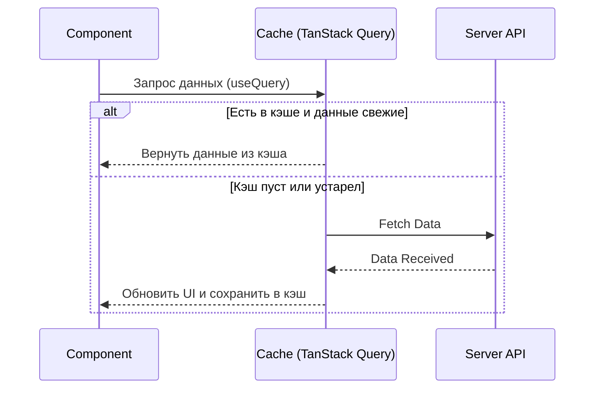

import { Playground } from '@components/Playground'


**TanStack Query** (ранее React Query) — это, пожалуй, самый важный инструмент в современном React-стеке. Он берет на себя все сложности работы с асинхронными данными: кэширование, фоновое обновление, обработку ошибок и состояний загрузки.

### Зачем он нужен?

В React есть два типа стейта: **Client [State](/react/props-state/)** (тема, формы) и **Server [State](/react/props-state/)** (данные из БД). Использовать `useEffect` + `useState` для данных с сервера — плохая практика, потому что вы не получаете кэширования "из коробки".



### Базовый пример

Сначала оборачиваем приложение в `QueryClientProvider`.

```tsx
import { useQuery } from '@tanstack/react-query';

function TodoList() {
  const { data, isLoading, error } = useQuery({
    queryKey: ['todos'], // Ключ для кэширования
    queryFn: () => fetch('/api/todos').then(res => res.json()), // Сама функция запроса
  });

  if (isLoading) return <span>Загрузка...</span>;
  if (error) return <span>Ошибка: {error.message}</span>;

  return (
    <ul>
      {data.map(todo => <li key={todo.id}>{todo.title}</li>)}
    </ul>
  );
}
```

### Ключевые фичи

[Icon: Archive] **Кэширование:** Данные сохраняются в памяти и мгновенно доступны при повторном переходе на страницу.
[Icon: Refresh-Cw] **Stale-While-Revalidate:** Показывает старые данные, пока в фоне скачиваются новые.
[Icon: Wifi-Off] **Авто-ретраи:** Если запрос упал из-за сети, библиотека сама попробует его повторить.
[Icon: Zap] **Window Focus Refetching:** Обновляет данные, когда пользователь возвращается на вкладку браузера.

[Icon: Star] TanStack Query позволяет сократить код работы с API на 50-70%, избавляя от необходимости писать бесконечные `useEffect` и `if (loading)`.

---

## 🔗 Полезные ссылки
- [Props State](/react/props-state/)

### Практика

Попробуйте примеры в интерактивном редакторе:

<Playground client:visible template="react" files={{ "/App.tsx": `import { useState, useEffect, useCallback } from 'react';

interface Post {
  id: number;
  title: string;
  body: string;
  userId: number;
}

interface QueryState<T> {
  data: T | null;
  isLoading: boolean;
  error: string | null;
  isFetching: boolean;
}

// Simulates useQuery from TanStack Query
function useQuery<T>(queryKey: string, fetcher: () => Promise<T>) {
  const [state, setState] = useState<QueryState<T>>({ data: null, isLoading: true, error: null, isFetching: true });

  const fetch = useCallback(async (background = false) => {
    if (!background) setState(p => ({ ...p, isLoading: !p.data, isFetching: true }));
    else setState(p => ({ ...p, isFetching: true }));
    try {
      const result = await fetcher();
      setState({ data: result, isLoading: false, error: null, isFetching: false });
    } catch (e: any) {
      setState(p => ({ ...p, isLoading: false, error: e.message, isFetching: false }));
    }
  }, [queryKey]);

  useEffect(() => { fetch(); }, [queryKey]);
  return { ...state, refetch: () => fetch(true) };
}

const MOCK_POSTS: Post[] = [
  { id: 1, userId: 1, title: 'Введение в React Query', body: 'TanStack Query упрощает работу с серверным стейтом.' },
  { id: 2, userId: 1, title: 'Кэширование запросов', body: 'Данные сохраняются и мгновенно отображаются.' },
  { id: 3, userId: 2, title: 'Stale-While-Revalidate', body: 'Старые данные показываются, пока загружаются новые.' },
];

function fakeFetch(userId: number): Promise<Post[]> {
  return new Promise((resolve, reject) =>
    setTimeout(() => {
      if (userId === 99) reject(new Error('Пользователь не найден'));
      else resolve(MOCK_POSTS.filter(p => userId === 0 || p.userId === userId));
    }, 900)
  );
}

export default function App() {
  const [userId, setUserId] = useState(0);
  const { data, isLoading, error, isFetching, refetch } = useQuery(
    \`posts-\${userId}\`,
    () => fakeFetch(userId)
  );

  return (
    <div style={{ minHeight: '100vh', background: '#0f172a', fontFamily: 'system-ui,sans-serif', padding: '32px 20px', display: 'flex', flexDirection: 'column', alignItems: 'center' }}>
      <h1 style={{ color: '#60a5fa', fontSize: '1.4rem', marginBottom: 8 }}>🔄 TanStack Query</h1>
      <p style={{ color: '#64748b', fontSize: '0.85rem', marginBottom: 24 }}>Симуляция useQuery с кэшированием</p>

      <div style={{ display: 'flex', gap: 8, marginBottom: 20, flexWrap: 'wrap', justifyContent: 'center' }}>
        {[{ label: 'Все посты', id: 0 }, { label: 'User 1', id: 1 }, { label: 'User 2', id: 2 }, { label: '💥 Ошибка', id: 99 }].map(o => (
          <button key={o.id} onClick={() => setUserId(o.id)}
            style={{ padding: '8px 16px', borderRadius: 8, background: userId === o.id ? '#3b82f6' : '#1e293b', color: userId === o.id ? '#fff' : '#94a3b8', border: '1px solid #334155', cursor: 'pointer', fontWeight: userId === o.id ? 600 : 400 }}>
            {o.label}
          </button>
        ))}
        <button onClick={() => refetch()} style={{ padding: '8px 16px', borderRadius: 8, background: '#1e293b', color: '#fbbf24', border: '1px solid #334155', cursor: 'pointer' }}>
          ↺ Refetch
        </button>
      </div>

      <div style={{ background: '#1e293b', borderRadius: 12, padding: 20, width: '100%', maxWidth: 500, marginBottom: 16 }}>
        <div style={{ display: 'flex', gap: 8, marginBottom: 14, flexWrap: 'wrap' }}>
          {[
            { label: 'isLoading', val: isLoading, color: '#fbbf24' },
            { label: 'isFetching', val: isFetching, color: '#60a5fa' },
            { label: 'error', val: !!error, color: '#f87171' },
            { label: 'hasData', val: !!data, color: '#4ade80' },
          ].map(s => (
            <span key={s.label} style={{ padding: '3px 10px', borderRadius: 20, background: '#0f172a', fontSize: '0.72rem', color: s.val ? s.color : '#475569', border: \`1px solid \${s.val ? s.color : '#334155'}\` }}>
              {s.label}: <b>{String(s.val)}</b>
            </span>
          ))}
        </div>

        {isLoading && (
          <div style={{ textAlign: 'center', padding: 24 }}>
            <div style={{ color: '#60a5fa', fontSize: '1.5rem', marginBottom: 8 }}>⏳</div>
            <p style={{ color: '#94a3b8' }}>Загрузка данных...</p>
          </div>
        )}
        {error && (
          <div style={{ background: '#450a0a', borderRadius: 8, padding: 16, textAlign: 'center' }}>
            <p style={{ color: '#f87171', margin: 0 }}>❌ {error}</p>
          </div>
        )}
        {data && !isLoading && data.map(post => (
          <div key={post.id} style={{ background: '#0f172a', borderRadius: 8, padding: 14, marginBottom: 8, opacity: isFetching ? 0.6 : 1, transition: 'opacity 0.2s' }}>
            <h3 style={{ color: '#e2e8f0', fontSize: '0.9rem', margin: '0 0 6px' }}>{post.title}</h3>
            <p style={{ color: '#64748b', fontSize: '0.78rem', margin: 0 }}>{post.body}</p>
          </div>
        ))}
      </div>

      <div style={{ background: '#1e293b', borderRadius: 12, padding: 16, width: '100%', maxWidth: 500 }}>
        <pre style={{ color: '#7dd3fc', fontSize: '0.7rem', lineHeight: 1.7, margin: 0, overflowX: 'auto', whiteSpace: 'pre-wrap' }}>{[
          "const { data, isLoading, error } = useQuery({",
          \`  queryKey: ['posts', \${userId}],\`,
          "  queryFn: () => fetch('/api/posts').then(r => r.json()),",
          "});",
        ].join('\n')}</pre>
      </div>
    </div>
  );
}
` }} />
