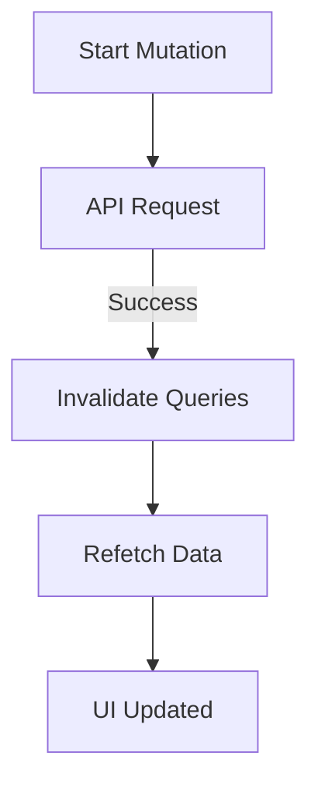

import { Playground } from '@components/Playground'


В то время как `useQuery` используется для *чтения* данных, хук **`useMutation`** предназначен для их *изменения* (создания, обновления, удаления).

### Проблема синхронизации

Когда вы отправляете POST-запрос на сервер, ваш локальный кэш (то, что было загружено через `useQuery`) устаревает. Вам нужно сообщить [TanStack Query](/react/react-query-intro/), что данные нужно загрузить заново.



### Пример использования `useMutation`

```tsx
import { useMutation, useQueryClient } from '@tanstack/react-query';

function AddTodo() {
  const queryClient = useQueryClient();

  const mutation = useMutation({
    mutationFn: (newTodo) => {
      return fetch('/api/todos', {
        method: 'POST',
        body: JSON.stringify(newTodo),
      });
    },
    onSuccess: () => {
      // 1. Инвалидируем кэш по ключу 'todos'
      // Это заставит все компоненты, использующие ['todos'], перекачать данные
      queryClient.invalidateQueries({ queryKey: ['todos'] });
    },
  });

  return (
    <button onClick={() => mutation.mutate({ title: 'Купить молоко' })}>
      Добавить задачу
    </button>
  );
}
```

### Optimistic Updates (Оптимистичные обновления)

Это техника, при которой мы обновляем UI *до того*, как сервер пришлет ответ. Если запрос упадет, мы откатываем изменения.

[Icon: Zap] Это создает ощущение мгновенного интерфейса.

```tsx
onMutate: async (newTodo) => {
  await queryClient.cancelQueries({ queryKey: ['todos'] });
  const previousTodos = queryClient.getQueryData(['todos']);
  queryClient.setQueryData(['todos'], (old) => [...old, newTodo]);
  return { previousTodos }; // Сохраняем стейт для отката
},
onError: (err, newTodo, context) => {
  queryClient.setQueryData(['todos'], context.previousTodos);
},
```

### Итог

[Icon: Check] **Mutation:** Логика изменения данных.
[Icon: Refresh-Ccw] **Invalidation:** Способ держать кэш в актуальном состоянии.
[Icon: Layout] **DevTools:** Используйте [React Query](/react/react-query-intro/) DevTools, чтобы видеть, какие запросы сейчас в статусе `fetching`, `stale` или `inactive`.

---

## 🔗 Полезные ссылки
- [TanStack Query (React Query): Работа с серверным стейтом](/react/react-query-intro/)

### Практика

Попробуйте примеры в интерактивном редакторе:

<Playground client:visible template="react" files={{ "/App.tsx": `import { useState } from 'react';

interface Todo {
  id: number;
  title: string;
  completed: boolean;
  optimistic?: boolean;
}

type MutationStatus = 'idle' | 'loading' | 'success' | 'error';

// Simulates useMutation
function useMutation<TData, TVariables>(
  mutationFn: (vars: TVariables) => Promise<TData>,
  options?: { onSuccess?: (data: TData) => void; onError?: (err: Error) => void }
) {
  const [status, setStatus] = useState<MutationStatus>('idle');
  const [error, setError] = useState<string | null>(null);

  const mutate = async (variables: TVariables) => {
    setStatus('loading');
    setError(null);
    try {
      const data = await mutationFn(variables);
      setStatus('success');
      options?.onSuccess?.(data);
    } catch (e: any) {
      setStatus('error');
      setError(e.message);
      options?.onError?.(e);
    }
  };

  return { mutate, status, isLoading: status === 'loading', isError: status === 'error', error };
}

let nextId = 4;
const delay = (ms: number) => new Promise(r => setTimeout(r, ms));

export default function App() {
  const [todos, setTodos] = useState<Todo[]>([
    { id: 1, title: 'Изучить React Query', completed: true },
    { id: 2, title: 'Написать тесты', completed: false },
    { id: 3, title: 'Задеплоить приложение', completed: false },
  ]);
  const [input, setInput] = useState('');
  const [useOptimistic, setUseOptimistic] = useState(false);
  const [shouldFail, setShouldFail] = useState(false);

  const addMutation = useMutation(
    async (title: string) => {
      await delay(800);
      if (shouldFail) throw new Error('Сервер недоступен');
      return { id: nextId++, title, completed: false };
    },
    {
      onSuccess: (newTodo) => {
        setTodos(p => p.filter(t => !t.optimistic).concat(newTodo));
      },
      onError: () => {
        setTodos(p => p.filter(t => !t.optimistic));
      },
    }
  );

  const toggleMutation = useMutation(
    async ({ id, completed }: { id: number; completed: boolean }) => {
      await delay(400);
      return { id, completed };
    },
    { onSuccess: ({ id, completed }) => setTodos(p => p.map(t => t.id === id ? { ...t, completed } : t)) }
  );

  const handleAdd = () => {
    if (!input.trim()) return;
    if (useOptimistic) {
      const optimisticTodo: Todo = { id: Date.now(), title: input.trim(), completed: false, optimistic: true };
      setTodos(p => [...p, optimisticTodo]);
    }
    addMutation.mutate(input.trim());
    setInput('');
  };

  return (
    <div style={{ minHeight: '100vh', background: '#0f172a', fontFamily: 'system-ui,sans-serif', padding: '32px 20px', display: 'flex', flexDirection: 'column', alignItems: 'center' }}>
      <h1 style={{ color: '#60a5fa', fontSize: '1.4rem', marginBottom: 8 }}>⚡ useMutation + Optimistic Updates</h1>
      <p style={{ color: '#64748b', fontSize: '0.85rem', marginBottom: 20 }}>Мутации и инвалидация кэша</p>

      <div style={{ display: 'flex', gap: 12, marginBottom: 20, flexWrap: 'wrap', justifyContent: 'center' }}>
        <label style={{ display: 'flex', alignItems: 'center', gap: 6, color: '#94a3b8', fontSize: '0.82rem', cursor: 'pointer' }}>
          <input type="checkbox" checked={useOptimistic} onChange={e => setUseOptimistic(e.target.checked)} style={{ accentColor: '#3b82f6' }} />
          Optimistic update
        </label>
        <label style={{ display: 'flex', alignItems: 'center', gap: 6, color: '#94a3b8', fontSize: '0.82rem', cursor: 'pointer' }}>
          <input type="checkbox" checked={shouldFail} onChange={e => setShouldFail(e.target.checked)} style={{ accentColor: '#ef4444' }} />
          Симулировать ошибку
        </label>
      </div>

      <div style={{ background: '#1e293b', borderRadius: 12, padding: 24, width: '100%', maxWidth: 480, marginBottom: 16 }}>
        <div style={{ display: 'flex', gap: 8, marginBottom: 16 }}>
          <input
            value={input}
            onChange={e => setInput(e.target.value)}
            onKeyDown={e => e.key === 'Enter' && handleAdd()}
            placeholder="Новая задача..."
            style={{ flex: 1, padding: '8px 12px', borderRadius: 8, border: '1px solid #334155', background: '#0f172a', color: '#f1f5f9', outline: 'none' }}
          />
          <button onClick={handleAdd} disabled={addMutation.isLoading}
            style={{ padding: '8px 16px', borderRadius: 8, background: addMutation.isLoading ? '#1d4ed8' : '#3b82f6', color: '#fff', border: 'none', cursor: addMutation.isLoading ? 'wait' : 'pointer', fontWeight: 600, whiteSpace: 'nowrap' }}>
            {addMutation.isLoading ? '⏳...' : '+ Добавить'}
          </button>
        </div>

        {addMutation.isError && <div style={{ background: '#450a0a', borderRadius: 8, padding: '8px 12px', color: '#f87171', fontSize: '0.8rem', marginBottom: 12 }}>❌ {addMutation.error}</div>}

        <ul style={{ listStyle: 'none', padding: 0, margin: 0 }}>
          {todos.map(todo => (
            <li key={todo.id} style={{ display: 'flex', alignItems: 'center', gap: 10, padding: '10px 12px', background: '#0f172a', borderRadius: 8, marginBottom: 6, opacity: todo.optimistic ? 0.6 : 1, transition: 'opacity 0.3s' }}>
              <input type="checkbox" checked={todo.completed}
                onChange={e => toggleMutation.mutate({ id: todo.id, completed: e.target.checked })}
                style={{ accentColor: '#3b82f6', width: 16, height: 16 }}
              />
              <span style={{ color: todo.completed ? '#475569' : '#e2e8f0', textDecoration: todo.completed ? 'line-through' : 'none', flex: 1, fontSize: '0.88rem' }}>{todo.title}</span>
              {todo.optimistic && <span style={{ color: '#60a5fa', fontSize: '0.7rem' }}>⏳</span>}
            </li>
          ))}
        </ul>
      </div>

      <div style={{ background: '#1e293b', borderRadius: 12, padding: 16, width: '100%', maxWidth: 480 }}>
        <pre style={{ color: '#7dd3fc', fontSize: '0.7rem', lineHeight: 1.7, margin: 0, overflowX: 'auto', whiteSpace: 'pre-wrap' }}>{[
          "const mutation = useMutation({",
          "  mutationFn: (newTodo) => postTodo(newTodo),",
          "  onSuccess: () => {",
          "    queryClient.invalidateQueries({ queryKey: ['todos'] });",
          "  },",
          "});",
        ].join('\n')}</pre>
      </div>
    </div>
  );
}
` }} />
