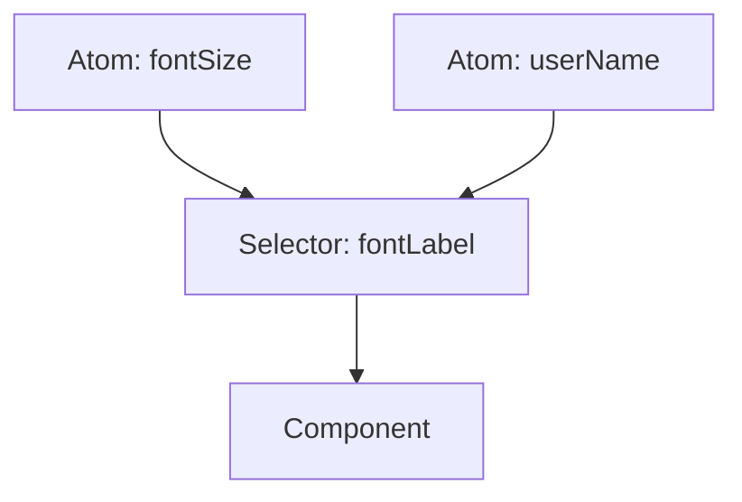

import { Playground } from '@components/Playground'


**Recoil** — это библиотека управления состоянием от Facebook (Meta), которая также реализует атомарный подход. Она была создана для решения проблем производительности в очень крупных и сложных приложениях.

### Ключевые понятия

1.  **Atoms:** Единицы состояния. Если атом обновляется, каждый подписанный компонент рендерится заново.
2.  **Selectors:** Чистые функции, которые принимают атомы (или другие селекторы) в качестве входных данных и возвращают новое значение.



### Настройка

Для работы Recoil все приложение должно быть обернуто в `RecoilRoot`.

```tsx
import { RecoilRoot } from 'recoil';

function App() {
  return (
    <RecoilRoot>
      <MyComponent />
    </RecoilRoot>
  );
}
```

### Создание и использование

```tsx
import { atom, selector, useRecoilState, useRecoilValue } from 'recoil';

// Атом
const textState = atom({
  key: 'textState', // уникальный ID (обязателен)
  default: '',
});

// Селектор
const charCountState = selector({
  key: 'charCountState',
  get: ({get}) => {
    const text = get(textState);
    return text.length;
  },
});

function TextInput() {
  const [text, setText] = useRecoilState(textState);
  const count = useRecoilValue(charCountState);

  return (
    <div>
      <input type="text" onChange={(e) => setText(e.target.value)} />
      <p>Количество символов: {count}</p>
    </div>
  );
}
```

### Особенности Recoil

[Icon: Search] **Кэширование:** Селекторы автоматически кэшируют свои результаты. Если входные атомы не изменились, селектор не будет пересчитываться.
[Icon: Cloud-Rain] **Асинхронные селекторы:** Селекторы могут возвращать `Promise`, что позволяет интегрировать запросы к данным прямо в граф состояния.
[Icon: Github] **Внимание:** На текущий момент разработка Recoil замедлилась, и многие переходят на [Jotai](/react/jotai-atomic/), который предлагает похожий API, но в более легком и современном исполнении.

[Icon: Shield-Alert] Используйте Recoil, если вам нужна глубокая интеграция с экосистемой React и поддержка специфических фич вроде Concurrent Mode.

---

## 🔗 Полезные ссылки
- [Props State](/react/props-state/)
- [Use Context](/react/use-context/)
- [Обзор подходов к управлению стейтом](/react/state-management-overview/)
- [Jotai: Атомарное управление состоянием](/react/jotai-atomic/)

### Практика

Попробуйте примеры в интерактивном редакторе:

<Playground client:visible template="react" files={{ "/App.tsx": `import { useState, useMemo } from "react";

// Симуляция Recoil: atoms + selectors через useState + useMemo
// В реальном Recoil: atom({ key, default }) и selector({ key, get })

// --- Атомы (единицы глобального состояния) ---
// textState = atom({ key: "textState", default: "" })
// fontSizeState = atom({ key: "fontSizeState", default: 16 })
// isDarkState = atom({ key: "isDarkState", default: true })

// --- Селекторы (вычисляются из атомов) ---
// charCountState = selector({ key: "charCountState", get: ({get}) => get(textState).length })
// wordCountState = selector(...)
// fontLabelState = selector(...)

export default function App() {
  // useRecoilState(atom) → [value, setter]
  const [text, setText] = useState("Привет, Recoil!");
  const [fontSize, setFontSize] = useState(16);
  const [isDark, setIsDark] = useState(true);

  // Селекторы — автоматически пересчитываются при изменении атомов
  // useRecoilValue(selector) → value (read-only)
  const charCount = useMemo(() => text.length, [text]);
  const wordCount = useMemo(() => text.trim() ? text.trim().split(/\s+/).length : 0, [text]);
  const fontLabel = useMemo(() => fontSize + "px / " + (fontSize <= 14 ? "маленький" : fontSize <= 18 ? "средний" : "большой"), [fontSize]);
  const previewStyle = useMemo(() => ({
    fontSize: fontSize + "px",
    color: isDark ? "#f8fafc" : "#0f172a",
    background: isDark ? "#0f172a" : "#f1f5f9",
  }), [fontSize, isDark]);

  const bg = isDark ? "#0f172a" : "#f1f5f9";
  const cardBg = isDark ? "#1e293b" : "#ffffff";
  const labelColor = isDark ? "#94a3b8" : "#64748b";

  const btn = (active: boolean, color: string) => ({
    padding: "6px 14px", background: active ? color : "#334155",
    color: "#fff", border: "none", borderRadius: 8, cursor: "pointer", fontWeight: 700, fontSize: 12,
  });

  return (
    <div style={{ minHeight: "100vh", background: bg, display: "flex", alignItems: "center", justifyContent: "center", fontFamily: "sans-serif", padding: 16, transition: "background .3s" }}>
      <div style={{ background: cardBg, borderRadius: 12, padding: 28, width: 420, boxShadow: "0 8px 32px rgba(0,0,0,.4)", transition: "background .3s" }}>
        <div style={{ display: "flex", justifyContent: "space-between", alignItems: "center", marginBottom: 14 }}>
          <span style={{ background: "#14b8a6", color: "#fff", borderRadius: 6, fontSize: 11, fontWeight: 700, padding: "2px 8px" }}>Recoil</span>
          <button style={btn(isDark, isDark ? "#6366f1" : "#94a3b8")} onClick={() => setIsDark(!isDark)}>
            {isDark ? "🌙 тёмная" : "☀️ светлая"}
          </button>
        </div>

        <h2 style={{ color: isDark ? "#f8fafc" : "#0f172a", margin: "0 0 4px", fontSize: 18 }}>Atoms & Selectors</h2>
        <p style={{ color: labelColor, fontSize: 11, marginBottom: 20 }}>
          Атомы → независимые единицы; Селекторы → вычисляются из атомов
        </p>

        <div style={{ background: isDark ? "#0f172a" : "#f8fafc", borderRadius: 8, padding: "14px 16px", marginBottom: 14 }}>
          <div style={{ color: "#64748b", fontSize: 11, marginBottom: 8 }}>
            // atom {"{ key: 'textState', default: '' }"}
          </div>
          <textarea
            value={text}
            onChange={e => setText(e.target.value)}
            rows={3}
            style={{ width: "100%", padding: "8px 10px", borderRadius: 8, border: "1px solid #334155", background: isDark ? "#1e293b" : "#fff", color: isDark ? "#f8fafc" : "#0f172a", fontSize: 13, resize: "vertical", boxSizing: "border-box" }}
          />
          <div style={{ display: "flex", gap: 16, marginTop: 8 }}>
            <span style={{ color: "#a78bfa", fontSize: 12 }}>📝 символов: <b>{charCount}</b></span>
            <span style={{ color: "#34d399", fontSize: 12 }}>📖 слов: <b>{wordCount}</b></span>
          </div>
        </div>

        <div style={{ background: isDark ? "#0f172a" : "#f8fafc", borderRadius: 8, padding: "14px 16px", marginBottom: 14 }}>
          <div style={{ color: "#64748b", fontSize: 11, marginBottom: 8 }}>
            // atom {"{ key: 'fontSizeState', default: 16 }"}
          </div>
          <div style={{ display: "flex", alignItems: "center", gap: 12 }}>
            <input
              type="range" min={12} max={28} value={fontSize}
              onChange={e => setFontSize(Number(e.target.value))}
              style={{ flex: 1 }}
            />
            <span style={{ color: "#60a5fa", fontWeight: 700, minWidth: 40 }}>{fontLabel}</span>
          </div>
        </div>

        <div style={{ ...previewStyle, borderRadius: 8, padding: "14px 16px", lineHeight: 1.5, transition: "all .2s", minHeight: 60 }}>
          <div style={{ color: isDark ? "#64748b" : "#94a3b8", fontSize: 10, marginBottom: 6 }}>
            // Предпросмотр (useRecoilValue(previewSelector)):
          </div>
          {text || <span style={{ color: isDark ? "#334155" : "#cbd5e1" }}>начните вводить текст...</span>}
        </div>
      </div>
    </div>
  );
}
` }} />
