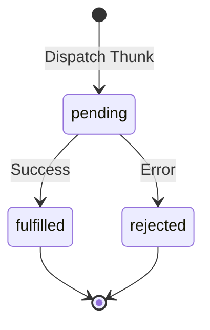

import { Playground } from '@components/Playground'


Для обработки асинхронных операций (например, запросов к API) в [Redux Toolkit](/react/redux-toolkit-intro/) используется функция `createAsyncThunk`. Она управляет жизненным циклом промиса и автоматически генерирует экшены для состояний "загрузка", "успех" и "ошибка".

### Жизненный цикл Thunk



### Создание асинхронного экшена

```tsx
import { createAsyncThunk, createSlice } from '@reduxjs/toolkit';

// 1. Создаем Thunk
export const fetchUserById = createAsyncThunk(
  'users/fetchById',
  async (userId: number, thunkAPI) => {
    const response = await fetch(`https://api.example.com/user/${userId}`);
    if (!response.ok) return thunkAPI.rejectWithValue('Ошибка загрузки');
    return await response.json();
  }
);

// 2. Описываем стейт
interface UserState {
  data: any;
  loading: 'idle' | 'pending' | 'succeeded' | 'failed';
  error: string | null;
}

const initialState: UserState = {
  data: null,
  loading: 'idle',
  error: null,
};

// 3. Обрабатываем в слайсе через extraReducers
const userSlice = createSlice({
  name: 'users',
  initialState,
  reducers: {},
  extraReducers: (builder) => {
    builder
      .addCase(fetchUserById.pending, (state) => {
        state.loading = 'pending';
      })
      .addCase(fetchUserById.fulfilled, (state, action) => {
        state.loading = 'succeeded';
        state.data = action.payload;
      })
      .addCase(fetchUserById.rejected, (state, action) => {
        state.loading = 'failed';
        state.error = action.payload as string;
      });
  },
});
```

### Преимущества `createAsyncThunk`

[Icon: Hard-Drive] **Стандартизация:** Весь проект следует одной логике обработки запросов.
[Icon: Shield-Check] **Типизация:** Отличная поддержка TypeScript для аргументов и возвращаемых значений.
[Icon: Activity] **DevTools:** Вы четко видите в истории экшенов, когда запрос начался и чем закончился.

[Icon: Info] Хотя `createAsyncThunk` очень мощный, для простых GET-запросов многие разработчики сейчас предпочитают **[RTK](/react/redux-toolkit-intro/) Query**, который входит в состав [Redux Toolkit](/react/redux-toolkit-intro/) и берет на себя еще и кэширование.

---

## 🔗 Полезные ссылки
- [Props State](/react/props-state/)
- [Use Context](/react/use-context/)
- [Redux Toolkit (RTK): Современный Redux](/react/redux-toolkit-intro/)
- [Обзор подходов к управлению стейтом](/react/state-management-overview/)

### Практика

Попробуйте примеры в интерактивном редакторе:

<Playground client:visible template="react" files={{ "/App.tsx": `import { useReducer } from "react";

// Симуляция createAsyncThunk — жизненный цикл промиса
type LoadingStatus = "idle" | "pending" | "fulfilled" | "rejected";

interface User { id: number; name: string; email: string }
interface State { user: User | null; status: LoadingStatus; error: string | null }
type Action =
  | { type: "pending" }
  | { type: "fulfilled"; payload: User }
  | { type: "rejected"; payload: string }
  | { type: "reset" };

const initialState: State = { user: null, status: "idle", error: null };

// Аналог extraReducers(builder) в createSlice
function reducer(state: State, action: Action): State {
  switch (action.type) {
    case "pending":   return { ...state, status: "pending", error: null };
    case "fulfilled": return { status: "fulfilled", user: action.payload, error: null };
    case "rejected":  return { ...state, status: "rejected", error: action.payload };
    case "reset":     return initialState;
  }
}

// Симуляция createAsyncThunk — имитация запроса к API
function fetchUser(id: number, dispatch: React.Dispatch<Action>) {
  dispatch({ type: "pending" });
  setTimeout(() => {
    if (id % 3 === 0) {
      // Каждый третий ID вызывает ошибку
      dispatch({ type: "rejected", payload: "Пользователь #" + id + " не найден (404)" });
    } else {
      dispatch({
        type: "fulfilled",
        payload: { id, name: "Пользователь #" + id, email: "user" + id + "@example.com" },
      });
    }
  }, 1200);
}

const statusColors: Record<LoadingStatus, string> = {
  idle: "#64748b", pending: "#f59e0b", fulfilled: "#22c55e", rejected: "#ef4444",
};
const statusLabels: Record<LoadingStatus, string> = {
  idle: "⬜ idle", pending: "⏳ pending...", fulfilled: "✅ fulfilled", rejected: "❌ rejected",
};

export default function App() {
  const [state, dispatch] = useReducer(reducer, initialState);

  const btn = (bg: string, disabled?: boolean) => ({
    padding: "10px 20px", background: disabled ? "#334155" : bg, color: "#fff",
    border: "none", borderRadius: 8, cursor: disabled ? "not-allowed" : "pointer",
    fontWeight: 700, fontSize: 14, opacity: disabled ? 0.5 : 1,
  });

  const userId = Math.floor(Math.random() * 9) + 1;

  return (
    <div style={{ minHeight: "100vh", background: "#0f172a", display: "flex", alignItems: "center", justifyContent: "center", fontFamily: "sans-serif", padding: 16 }}>
      <div style={{ background: "#1e293b", borderRadius: 12, padding: 28, width: 400, boxShadow: "0 8px 32px rgba(0,0,0,.5)" }}>
        <span style={{ background: "#f59e0b", color: "#000", borderRadius: 6, fontSize: 11, fontWeight: 700, padding: "2px 8px" }}>
          RTK Async
        </span>
        <h2 style={{ color: "#f8fafc", margin: "10px 0 4px", fontSize: 18 }}>createAsyncThunk — жизненный цикл</h2>
        <p style={{ color: "#94a3b8", fontSize: 11, marginBottom: 20 }}>
          pending → fulfilled / rejected (каждый 3-й ID даёт ошибку)
        </p>

        <div style={{ background: "#0f172a", borderRadius: 10, padding: "14px 16px", marginBottom: 20 }}>
          <div style={{ fontSize: 11, color: "#64748b", marginBottom: 8 }}>// Текущий статус thunk:</div>
          <div style={{ display: "flex", alignItems: "center", gap: 10 }}>
            <div style={{ width: 10, height: 10, borderRadius: "50%", background: statusColors[state.status] }} />
            <span style={{ color: statusColors[state.status], fontWeight: 700, fontSize: 16 }}>
              {statusLabels[state.status]}
            </span>
          </div>
        </div>

        {state.status === "fulfilled" && state.user && (
          <div style={{ background: "#064e3b", border: "1px solid #22c55e", borderRadius: 8, padding: "12px 14px", marginBottom: 16 }}>
            <div style={{ color: "#86efac", fontWeight: 700, marginBottom: 4 }}>{state.user.name}</div>
            <div style={{ color: "#6ee7b7", fontSize: 12 }}>{state.user.email}</div>
            <div style={{ color: "#4ade80", fontSize: 11, marginTop: 4 }}>ID: {state.user.id}</div>
          </div>
        )}

        {state.status === "rejected" && state.error && (
          <div style={{ background: "#450a0a", border: "1px solid #ef4444", borderRadius: 8, padding: "12px 14px", marginBottom: 16 }}>
            <div style={{ color: "#fca5a5", fontSize: 13 }}>{state.error}</div>
          </div>
        )}

        <div style={{ display: "flex", gap: 8 }}>
          <button
            style={btn("#3b82f6", state.status === "pending")}
            disabled={state.status === "pending"}
            onClick={() => fetchUser(Math.floor(Math.random() * 9) + 1, dispatch)}
          >
            {state.status === "pending" ? "Загрузка..." : "fetchUser()"}
          </button>
          <button style={btn("#64748b")} onClick={() => dispatch({ type: "reset" })}>
            reset
          </button>
        </div>
      </div>
    </div>
  );
}
` }} />
