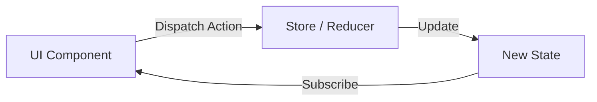

import { Playground } from '@components/Playground'


**Redux Toolkit** — это официальный, рекомендуемый подход к написанию логики Redux. Он был создан, чтобы решить три главные проблемы классического Redux:
1. "Слишком сложная настройка стора".
2. "Слишком много шаблонного кода (boilerplate)".
3. "Необходимость добавлять много пакетов для полезной работы".

### Основные концепции RTK

Redux работает по принципу однонаправленного потока данных.



### Ключевые функции

- **`configureStore()`**: Упрощает создание стора, автоматически подключает Redux DevTools и `redux-thunk`.
- **`createSlice()`**: Объединяет в себе Action Creators и Reducers. Больше не нужно писать `switch-case`.
- **`createAsyncThunk()`**: Стандарт для работы с асинхронными запросами.

### Почему это удобно? (Immer)

[Icon: Zap] RTK использует внутри библиотеку **Immer**. Это позволяет нам писать "мутирующий" код в редьюсерах, который на самом деле остается иммутабельным.

```javascript
// В классическом Redux:
return { ...state, count: state.count + 1 };

// В Redux Toolkit:
state.count += 1; // Immer сделает копию за вас!
```

### Установка

```bash
npm install @reduxjs/toolkit react-redux
```

### Настройка Store

```tsx
import { configureStore } from '@reduxjs/toolkit';
import counterReducer from './counterSlice';

export const store = configureStore({
  reducer: {
    counter: counterReducer,
  },
});

// Типы для TypeScript
export type RootState = ReturnType<typeof store.getState>;
export type AppDispatch = typeof store.dispatch;
```

[Icon: Layers] RTK — это "батарейки в комплекте". Он заставляет вас следовать лучшим практикам, делая код чище и понятнее.

---

## 🔗 Полезные ссылки
- [Props State](/react/props-state/)
- [Use Context](/react/use-context/)
- [Обзор подходов к управлению стейтом](/react/state-management-overview/)

### Практика

Попробуйте примеры в интерактивном редакторе:

<Playground client:visible template="react" files={{ "/App.tsx": `import { useReducer } from "react";

// Симуляция createSlice — объединяет reducer + action creators
type Action =
  | { type: "increment" }
  | { type: "decrement" }
  | { type: "incrementByAmount"; payload: number }
  | { type: "reset" };

interface State { value: number; lastAction: string }
const initialState: State = { value: 0, lastAction: "—" };

// Имитация Immer-редьюсера внутри createSlice
function reducer(state: State, action: Action): State {
  switch (action.type) {
    case "increment":
      return { ...state, value: state.value + 1, lastAction: "increment()" };
    case "decrement":
      return { ...state, value: state.value - 1, lastAction: "decrement()" };
    case "incrementByAmount":
      return { ...state, value: state.value + action.payload, lastAction: "incrementByAmount(" + action.payload + ")" };
    case "reset":
      return { value: 0, lastAction: "reset()" };
  }
}

export default function App() {
  // useDispatch + useSelector симуляция через useReducer
  const [state, dispatch] = useReducer(reducer, initialState);

  const btn = (bg: string) => ({
    padding: "10px 20px", background: bg, color: "#fff",
    border: "none", borderRadius: 8, cursor: "pointer", fontWeight: 700, fontSize: 14,
  });

  return (
    <div style={{ minHeight: "100vh", background: "#0f172a", display: "flex", alignItems: "center", justifyContent: "center", fontFamily: "sans-serif" }}>
      <div style={{ background: "#1e293b", borderRadius: 12, padding: 32, width: 380, boxShadow: "0 8px 32px rgba(0,0,0,.5)" }}>
        <span style={{ background: "#3b82f6", color: "#fff", borderRadius: 6, fontSize: 11, fontWeight: 700, padding: "2px 8px" }}>
          Redux Toolkit
        </span>
        <h2 style={{ color: "#f8fafc", margin: "12px 0 4px", fontSize: 20 }}>Counter — createSlice</h2>
        <p style={{ color: "#94a3b8", fontSize: 12, marginBottom: 24 }}>
          Reducer + Action Creators объединены в одном слайсе
        </p>
        <div style={{ color: "#60a5fa", fontSize: 72, fontWeight: 700, textAlign: "center", lineHeight: 1, marginBottom: 20 }}>
          {state.value}
        </div>
        <div style={{ display: "flex", gap: 8, justifyContent: "center", flexWrap: "wrap" }}>
          <button style={btn("#ef4444")} onClick={() => dispatch({ type: "decrement" })}>− 1</button>
          <button style={btn("#22c55e")} onClick={() => dispatch({ type: "increment" })}>+ 1</button>
          <button style={btn("#3b82f6")} onClick={() => dispatch({ type: "incrementByAmount", payload: 5 })}>+ 5</button>
          <button style={btn("#64748b")} onClick={() => dispatch({ type: "reset" })}>reset</button>
        </div>
        <div style={{ background: "#0f172a", borderRadius: 8, padding: "12px 14px", marginTop: 20 }}>
          <div style={{ color: "#64748b", fontSize: 11, marginBottom: 4 }}>// Последний dispatched экшен:</div>
          <div style={{ color: "#86efac", fontSize: 13, fontWeight: 700 }}>counter/{state.lastAction}</div>
        </div>
        <div style={{ background: "#0f172a", borderRadius: 8, padding: "10px 14px", marginTop: 8, fontSize: 11, color: "#64748b", lineHeight: 1.7 }}>
          // В RTK пишем: state.value += 1<br />
          // Immer делает это иммутабельным за нас!
        </div>
      </div>
    </div>
  );
}
` }} />
