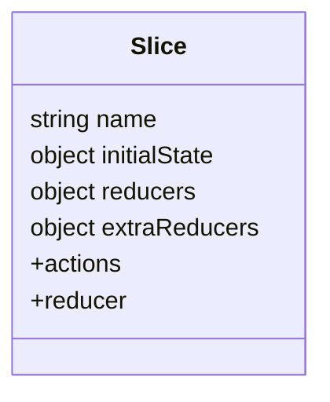

import { Playground } from '@components/Playground'


**Slice** (Слайс) — это основной строительный блок логики в [Redux Toolkit](/react/redux-toolkit-intro/). Он содержит в себе начальное состояние, редьюсеры и автоматически генерирует экшены.

### Структура Слайса

Вместо того чтобы разделять файлы на `actions.js`, `reducers.js` и `constants.js`, мы объединяем их.



### Пример создания Слайса

```tsx
import { createSlice, PayloadAction } from '@reduxjs/toolkit';

interface CounterState {
  value: number;
}

const initialState: CounterState = {
  value: 0,
};

export const counterSlice = createSlice({
  name: 'counter',
  initialState,
  reducers: {
    increment: (state) => {
      // Благодаря Immer, мы можем "мутировать" стейт
      state.value += 1;
    },
    decrement: (state) => {
      state.value -= 1;
    },
    incrementByAmount: (state, action: PayloadAction<number>) => {
      state.value += action.payload;
    },
  },
});

// Экспортируем экшены для использования в компонентах
export const { increment, decrement, incrementByAmount } = counterSlice.actions;

// Экспортируем редьюсер для стора
export default counterSlice.reducer;
```

### Использование в компоненте

Для взаимодействия со стором используются два хука из `react-redux`:
1.  **`useSelector`**: Для чтения данных.
2.  **`useDispatch`**: Для отправки экшенов.

```tsx
import { useSelector, useDispatch } from 'react-redux';
import { increment, incrementByAmount } from './counterSlice';
import { RootState } from './store';

function Counter() {
  const count = useSelector((state: RootState) => state.counter.value);
  const dispatch = useDispatch();

  return (
    <div>
      <span>{count}</span>
      <button onClick={() => dispatch(increment())}>+1</button>
      <button onClick={() => dispatch(incrementByAmount(5))}>+5</button>
    </div>
  );
}
```

[Icon: Alert-Circle] **Важно:** Никогда не используйте асинхронный код внутри обычных `reducers`. Для этого существуют `extraReducers` и `createAsyncThunk`.

---

## 🔗 Полезные ссылки
- [Props State](/react/props-state/)
- [Use Context](/react/use-context/)
- [Redux Toolkit (RTK): Современный Redux](/react/redux-toolkit-intro/)
- [Обзор подходов к управлению стейтом](/react/state-management-overview/)

### Практика

Попробуйте примеры в интерактивном редакторе:

<Playground client:visible template="react" files={{ "/App.tsx": `import { useReducer, useState } from "react";

// Симуляция createSlice с несколькими reducers
type Action =
  | { type: "counter/increment" }
  | { type: "counter/decrement" }
  | { type: "counter/incrementByAmount"; payload: number }
  | { type: "counter/reset" };

interface State { value: number; history: string[] }
const initialState: State = { value: 0, history: [] };

// Аналог объекта reducers внутри createSlice
function reducer(state: State, action: Action): State {
  const addHistory = (label: string, next: number) => ({
    value: next,
    history: [label, ...state.history].slice(0, 6),
  });
  switch (action.type) {
    case "counter/increment":
      return addHistory("↑ increment → " + (state.value + 1), state.value + 1);
    case "counter/decrement":
      return addHistory("↓ decrement → " + (state.value - 1), state.value - 1);
    case "counter/incrementByAmount":
      return addHistory("⚡ +amount(" + action.payload + ") → " + (state.value + action.payload), state.value + action.payload);
    case "counter/reset":
      return { value: 0, history: ["⊘ reset → 0", ...state.history].slice(0, 6) };
  }
}

// Автосгенерированные action creators (аналог counterSlice.actions)
const actions = {
  increment: (): Action => ({ type: "counter/increment" }),
  decrement: (): Action => ({ type: "counter/decrement" }),
  incrementByAmount: (n: number): Action => ({ type: "counter/incrementByAmount", payload: n }),
  reset: (): Action => ({ type: "counter/reset" }),
};

export default function App() {
  const [state, dispatch] = useReducer(reducer, initialState);
  const [amount, setAmount] = useState(10);

  const btn = (bg: string) => ({
    padding: "8px 16px", background: bg, color: "#fff",
    border: "none", borderRadius: 8, cursor: "pointer", fontWeight: 700, fontSize: 13,
  });

  return (
    <div style={{ minHeight: "100vh", background: "#0f172a", display: "flex", alignItems: "center", justifyContent: "center", fontFamily: "sans-serif", padding: 16 }}>
      <div style={{ background: "#1e293b", borderRadius: 12, padding: 28, width: 400, boxShadow: "0 8px 32px rgba(0,0,0,.5)" }}>
        <span style={{ background: "#8b5cf6", color: "#fff", borderRadius: 6, fontSize: 11, fontWeight: 700, padding: "2px 8px" }}>
          RTK Slices
        </span>
        <h2 style={{ color: "#f8fafc", margin: "10px 0 4px", fontSize: 18 }}>counterSlice — reducers</h2>
        <p style={{ color: "#94a3b8", fontSize: 11, marginBottom: 20 }}>
          Каждый case — отдельная функция-редьюсер в слайсе
        </p>

        <div style={{ color: "#a78bfa", fontSize: 64, fontWeight: 700, textAlign: "center", lineHeight: 1, marginBottom: 16 }}>
          {state.value}
        </div>

        <div style={{ display: "flex", gap: 8, justifyContent: "center", flexWrap: "wrap", marginBottom: 12 }}>
          <button style={btn("#ef4444")} onClick={() => dispatch(actions.decrement())}>decrement</button>
          <button style={btn("#22c55e")} onClick={() => dispatch(actions.increment())}>increment</button>
          <button style={btn("#64748b")} onClick={() => dispatch(actions.reset())}>reset</button>
        </div>

        <div style={{ display: "flex", gap: 8, alignItems: "center", justifyContent: "center", marginBottom: 20 }}>
          <input
            type="number"
            value={amount}
            onChange={e => setAmount(Number(e.target.value))}
            style={{ width: 70, padding: "7px 10px", borderRadius: 8, border: "1px solid #334155", background: "#0f172a", color: "#f8fafc", fontSize: 14 }}
          />
          <button style={btn("#3b82f6")} onClick={() => dispatch(actions.incrementByAmount(amount))}>
            incrementByAmount
          </button>
        </div>

        <div style={{ background: "#0f172a", borderRadius: 8, padding: "12px 14px" }}>
          <div style={{ color: "#64748b", fontSize: 11, marginBottom: 8 }}>// История экшенов (dispatch log):</div>
          {state.history.length === 0 && (
            <div style={{ color: "#475569", fontSize: 12 }}>нажмите кнопку...</div>
          )}
          {state.history.map((h, i) => (
            <div key={i} style={{ color: i === 0 ? "#86efac" : "#475569", fontSize: 12, lineHeight: 1.6 }}>{h}</div>
          ))}
        </div>
      </div>
    </div>
  );
}
` }} />
