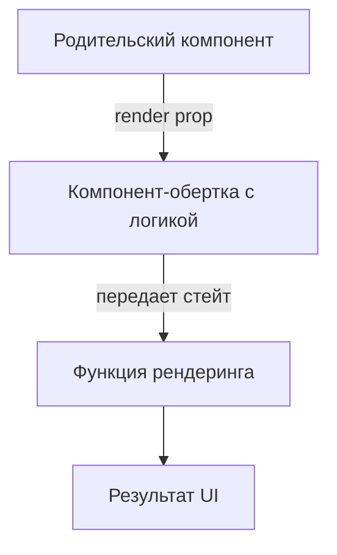

import { Playground } from '@components/Playground'


Паттерн Render [Props](/react/props-state/) — это техника совместного использования кода между React-компонентами с помощью пропса, значение которого является функцией.

Icon: Layers (Слои)

## Описание

Вместо того чтобы жестко прописывать, что должен рендерить компонент, мы передаем ему функцию, которая возвращает React-элемент. Это позволяет компоненту сосредоточиться на логике (например, отслеживании положения мыши), а пользователю компонента — на представлении.

## Mermaid Диаграмма



## Пример использования

```jsx
import React, { useState } from 'react';

// Компонент, который инкапсулирует логику отслеживания мыши
const MouseTracker = ({ render }) => {
  const [position, setPosition] = useState({ x: 0, y: 0 });

  const handleMouseMove = (event) => {
    setPosition({
      x: event.clientX,
      y: event.clientY
    });
  };

  return (
    <div style={{ height: '200px', border: '1px solid #ccc' }} onMouseMove={handleMouseMove}>
      {render(position)}
    </div>
  );
};

// Использование
const App = () => (
  <MouseTracker 
    render={({ x, y }) => (
      <h1>Положение мыши: {x}, {y}</h1>
    )}
  />
);
```

## Почему это важно?

Хотя хуки (`useMouse`) во многих случаях заменили Render [Props](/react/props-state/), этот паттерн все еще полезен при создании сложных UI-компонентов (например, библиотек для форм или таблиц), где нужно передать управление отрисовкой части контента.

---

## 🔗 Полезные ссылки
- [Props State](/react/props-state/)

### Практика

Попробуйте примеры в интерактивном редакторе:

<Playground client:visible template="react" files={{ "/App.tsx": `import { useState } from 'react';
import type { ReactNode } from 'react';

function MouseTracker({ render }: { render: (pos: { x: number; y: number }) => ReactNode }) {
  const [pos, setPos] = useState({ x: 0, y: 0 });
  return (
    <div
      onMouseMove={(e) => {
        const rect = e.currentTarget.getBoundingClientRect();
        setPos({ x: Math.round(e.clientX - rect.left), y: Math.round(e.clientY - rect.top) });
      }}
      style={{
        height: '180px',
        background: '#1e293b',
        borderRadius: '10px',
        border: '1px solid #334155',
        cursor: 'crosshair',
        display: 'flex',
        alignItems: 'center',
        justifyContent: 'center',
        position: 'relative',
        overflow: 'hidden',
      }}
    >
      {render(pos)}
    </div>
  );
}

function Toggle({ render }: { render: (state: { on: boolean; toggle: () => void }) => ReactNode }) {
  const [on, setOn] = useState(false);
  return <>{render({ on, toggle: () => setOn((v) => !v) })}</>;
}

export default function App() {
  return (
    <div style={{ fontFamily: 'sans-serif', background: '#0f172a', minHeight: '100vh', padding: '2rem', color: '#f1f5f9' }}>
      <h2 style={{ color: '#60a5fa', marginBottom: '0.5rem' }}>Render Props Demo</h2>
      <p style={{ color: '#94a3b8', marginBottom: '1.5rem', fontSize: '0.9rem' }}>
        Компонент инкапсулирует <strong>логику</strong> и передаёт данные через функцию-пропс
      </p>

      <h3 style={{ color: '#e2e8f0', fontSize: '1rem', marginBottom: '0.75rem' }}>1. MouseTracker</h3>
      <MouseTracker
        render={({ x, y }) => (
          <div style={{ textAlign: 'center' }}>
            <div style={{ fontSize: '2rem', marginBottom: '0.5rem' }}>🖱️</div>
            <div style={{ color: '#60a5fa', fontWeight: 'bold', fontSize: '1.2rem' }}>
              X: {x} / Y: {y}
            </div>
            <div style={{ color: '#64748b', fontSize: '0.8rem', marginTop: '0.3rem' }}>
              Двигайте мышью внутри блока
            </div>
            <div
              style={{
                position: 'absolute',
                width: '8px',
                height: '8px',
                background: '#3b82f6',
                borderRadius: '50%',
                left: x - 4,
                top: y - 4,
                pointerEvents: 'none',
              }}
            />
          </div>
        )}
      />

      <h3 style={{ color: '#e2e8f0', fontSize: '1rem', margin: '1.5rem 0 0.75rem' }}>2. Toggle</h3>
      <Toggle
        render={({ on, toggle }) => (
          <div
            style={{
              background: '#1e293b',
              borderRadius: '10px',
              padding: '1.2rem',
              display: 'flex',
              alignItems: 'center',
              gap: '1rem',
            }}
          >
            <button
              onClick={toggle}
              style={{
                padding: '0.5rem 1.5rem',
                background: on ? '#3b82f6' : '#334155',
                color: '#fff',
                border: 'none',
                borderRadius: '6px',
                cursor: 'pointer',
                fontWeight: 600,
                transition: 'background 0.2s',
              }}
            >
              {on ? 'ON' : 'OFF'}
            </button>
            <span style={{ color: on ? '#34d399' : '#ef4444', fontWeight: 600 }}>
              {on ? '✓ Включено' : '✗ Выключено'}
            </span>
          </div>
        )}
      />

      <div
        style={{
          marginTop: '1.5rem',
          background: '#1e293b',
          borderRadius: '8px',
          padding: '1rem',
          fontSize: '0.85rem',
          color: '#94a3b8',
        }}
      >
        <span style={{ color: '#60a5fa' }}>Ключевая идея:</span> компонент управляет{' '}
        <em>логикой</em>, а функция-пропс — <em>представлением</em>
      </div>
    </div>
  );
}
` }} />
