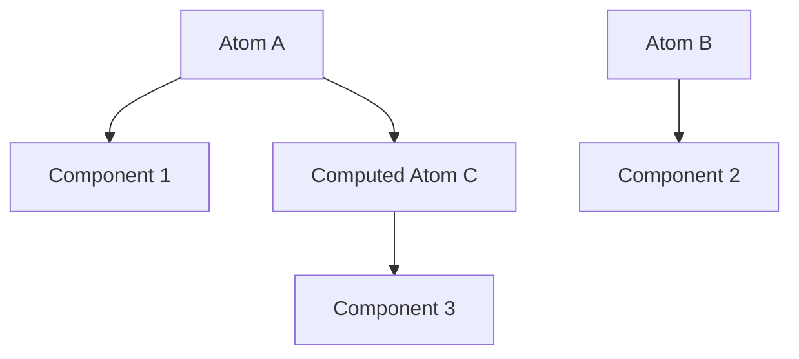

import { Playground } from '@components/Playground'


Jotai — это библиотека для управления состоянием в React, вдохновленная Recoil. Она использует "атомарный" подход: вы разделяете состояние на маленькие независимые кусочки (атомы).

### Философия атомов

Вместо одного большого объекта (как в Redux), вы создаете множество мелких атомов. Компоненты подписываются только на те атомы, которые им нужны.



### Основные понятия

1.  **Atom:** Базовый кирпичик состояния.
2.  **useAtom:** Хук для чтения и записи атома (аналог `useState`).
3.  **Derived Atoms:** Атомы, которые вычисляются на основе других атомов.

### Пример кода

```tsx
import { atom, useAtom } from 'jotai';

// Создание атома
const countAtom = atom(0);

// Использование
const [count, setCount] = useAtom(countAtom);
```

### Сравнение с другими подходами

| Подход | Масштабируемость | Ререндеры | Сложность |
| :--- | :--- | :--- | :--- |
| **Context** | Низкая | Высокие | Низкая |
| **Zustand** | Высокая | Низкие | Низкая |
| **Jotai** | Высокая | Минимальные | Низкая |

Jotai особенно хорош, когда у вас много мелких зависимых состояний, которые должны обновляться независимо.

---

## Интерактивный пример

<Playground client:visible
  template="react"
  files={{
    "/package.json": `{
  "dependencies": {
    "react": "^18.0.0",
    "react-dom": "^18.0.0",
    "jotai": "^2.6.0"
  }
}`,
    "/App.js": `import { atom, useAtom, useAtomValue, useSetAtom } from 'jotai';

// Атомы — маленькие кусочки состояния
const countAtom = atom(0);
const stepAtom = atom(1);
const doubleAtom = atom((get) => get(countAtom) * 2);
const historyAtom = atom([]);

const btn = (bg) => ({ background: bg || '#89b4fa', color: '#1e1e2e', border: 'none', padding: '7px 14px', borderRadius: 6, cursor: 'pointer', fontWeight: 'bold', margin: '0 3px' });

function Controls() {
  const [count, setCount] = useAtom(countAtom);
  const [step] = useAtom(stepAtom);
  const setHistory = useSetAtom(historyAtom);
  const push = (next) => { setHistory(h => [...h.slice(-4), next]); setCount(next); };
  return (
    <div style={{ display: 'flex', justifyContent: 'center', gap: 4, marginTop: 12 }}>
      <button onClick={() => push(count - step)} style={btn()}>−{step}</button>
      <button onClick={() => push(count + step)} style={btn()}>+{step}</button>
      <button onClick={() => { push(0); }} style={btn('#45475a')}>↺</button>
    </div>
  );
}

function StepSelector() {
  const [step, setStep] = useAtom(stepAtom);
  return (
    <div style={{ textAlign: 'center', marginTop: 8 }}>
      <span style={{ fontSize: 13, color: '#bac2de', marginRight: 8 }}>Шаг:</span>
      {[1, 5, 10].map(s => (
        <button key={s} onClick={() => setStep(s)} style={{ ...btn(step === s ? '#cba6f7' : '#45475a'), fontSize: 13, padding: '4px 10px' }}>{s}</button>
      ))}
    </div>
  );
}

function Display() {
  const count = useAtomValue(countAtom);
  const double = useAtomValue(doubleAtom);
  return (
    <div style={{ textAlign: 'center', padding: '12px 0' }}>
      <div style={{ fontSize: 52, fontWeight: 'bold', color: '#89b4fa' }}>{count}</div>
      <div style={{ fontSize: 13, color: '#bac2de' }}>×2 = <strong style={{ color: '#a6e3a1' }}>{double}</strong> (derived atom)</div>
    </div>
  );
}

function History() {
  const history = useAtomValue(historyAtom);
  return (
    <div style={{ background: '#181825', borderRadius: 6, padding: 10, marginTop: 12, fontFamily: 'monospace', fontSize: 13 }}>
      <span style={{ color: '#bac2de' }}>История: </span>
      {history.length === 0 ? <span style={{ color: '#585b70' }}>—</span> :
        history.map((v, i) => <span key={i} style={{ color: '#a6e3a1', marginRight: 6 }}>{v}</span>)}
    </div>
  );
}

export default function App() {
  return (
    <div style={{ padding: 20, background: '#1e1e2e', color: '#cdd6f4', minHeight: '100vh', fontFamily: 'sans-serif' }}>
      <h2 style={{ margin: '0 0 4px' }}>Jotai — атомарное состояние</h2>
      <p style={{ color: '#bac2de', fontSize: 13, margin: '0 0 16px' }}>atom() • useAtom() • derived atoms</p>
      <div style={{ background: '#313244', borderRadius: 8, padding: 16 }}>
        <Display />
        <Controls />
        <StepSelector />
        <History />
      </div>
    </div>
  );
}`,
  }}
/>
