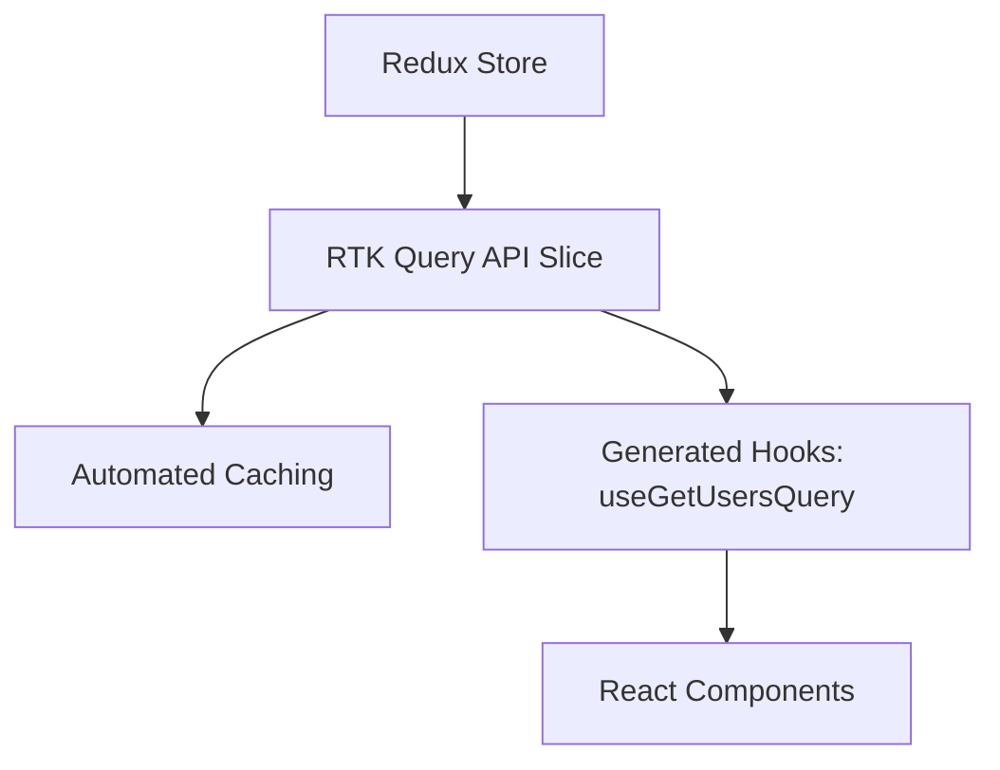

import { Playground } from '@components/Playground'

Redux Toolkit (RTK) — это официальный стандарт написания логики Redux. Он решает главную проблему классического Redux: избыточность кода.

### RTK Query: Управление данными

RTK Query — это мощный инструмент для загрузки и кеширования данных, встроенный в Redux Toolkit. Он работает аналогично TanStack Query, но глубоко интегрирован в глобальный стейт Redux.

### Основные концепции RTK

1.  **Slices:** Объединяют в себе начальное состояние, редьюсеры и экшены.
2.  **createAsyncThunk:** Стандартный способ обработки асинхронных экшенов.
3.  **Selectors (createSelector):** Мемоизированные выборки данных из стейта.

### Почему RTK все еще актуален?

Несмотря на популярность Zustand и Jotai, Redux Toolkit остается выбором №1 для огромных корпоративных приложений (Enterprise) по причинам:
- Жесткая структура кода.
- Лучшие инструменты отладки (Redux DevTools).
- Огромная экосистема и предсказуемость.

---

## Интерактивный пример

<Playground client:visible
  template="react"
  files={{
    "/package.json": `{
  "dependencies": {
    "react": "^18.0.0",
    "react-dom": "^18.0.0",
    "@reduxjs/toolkit": "^2.0.0",
    "react-redux": "^9.0.0"
  }
}`,
    "/store.js": `import { configureStore, createSlice } from '@reduxjs/toolkit';

const counterSlice = createSlice({
  name: 'counter',
  initialState: { value: 0, history: [] },
  reducers: {
    increment: (state) => { state.history.push(state.value); state.value += 1; },
    decrement: (state) => { state.history.push(state.value); state.value -= 1; },
    incrementByAmount: (state, action) => { state.history.push(state.value); state.value += action.payload; },
    reset: (state) => { state.history.push(state.value); state.value = 0; },
  },
});

export const { increment, decrement, incrementByAmount, reset } = counterSlice.actions;
export const store = configureStore({ reducer: { counter: counterSlice.reducer } });`,
    "/App.js": `import { Provider, useSelector, useDispatch } from 'react-redux';
import { store, increment, decrement, incrementByAmount, reset } from './store';

const btn = (bg) => ({ background: bg || '#89b4fa', color: '#1e1e2e', border: 'none', padding: '8px 16px', borderRadius: 6, cursor: 'pointer', fontWeight: 'bold', margin: '0 4px' });

function Counter() {
  const { value, history } = useSelector((s) => s.counter);
  const dispatch = useDispatch();
  return (
    

      <h2 style={{ margin: '0 0 4px' }}>Redux Toolkit</h2>
      
createSlice + configureStore + useSelector/useDispatch

      

        
{value}

        

          <button onClick={() => dispatch(decrement())} style={btn()}>−1</button>
          <button onClick={() => dispatch(increment())} style={btn()}>+1</button>
          <button onClick={() => dispatch(incrementByAmount(5))} style={btn('#a6e3a1')}>+5</button>
          <button onClick={() => dispatch(incrementByAmount(-5))} style={btn('#fab387')}>−5</button>
          <button onClick={() => dispatch(reset())} style={btn('#45475a')}>↺</button>
        

      

      

        
История изменений:

        

          {history.length === 0 ? Нет изменений :
            history.slice(-5).map((v, i) => {v})}
          {history.length > 0 && → {value}}
        

      

    

  );
}

export default function App() {
  return <Provider store={store}><Counter /></Provider>;
}`,
  }}
/>
