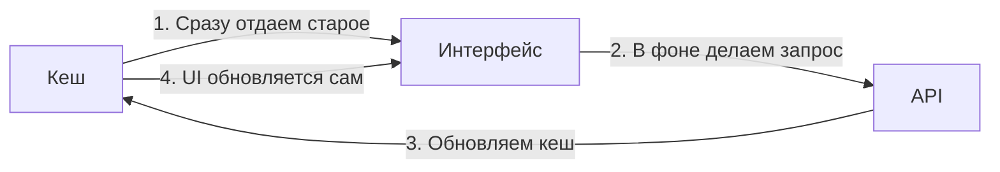

import { Playground } from '@components/Playground'

SWR (Stale-While-Revalidate) — это библиотека от команды Vercel (создателей Next.js) для получения данных. Название происходит от стратегии HTTP-кеширования: сначала вернуть данные из кеша (stale), затем отправить запрос на обновление (revalidate) и в конце вернуть актуальные данные.

### Ключевые особенности

SWR очень похож на TanStack Query, но он гораздо меньше по размеру и сфокусирован на простоте.

### Преимущества SWR

- **Минимализм:** Практически не требует настройки.
- **Интеграция с Next.js:** Работает идеально "из коробки".
- **Фоновые обновления:** Автоматически обновляет данные при возвращении фокуса на вкладку.

### Сравнение: SWR vs TanStack Query

| Характеристика | SWR | TanStack Query |
| :--- | :--- | :--- |
| **Размер** | Очень маленький | Средний |
| **Мутации** | Базовые | Продвинутые |
| **DevTools** | Нет официальных | Есть |
| **Сложные сценарии** | Требуют кода | Встроены |

SWR — отличный выбор, если вам нужно просто и быстро добавить кеширование запросов без переусложнения.

---

## Интерактивный пример

<Playground client:visible
  template="react"
  files={{
    "/package.json": `{
  "dependencies": {
    "react": "^18.0.0",
    "react-dom": "^18.0.0",
    "swr": "^2.2.4"
  }
}`,
    "/App.js": `import useSWR from 'swr';
import { useState } from 'react';

// Мок-данные для разных "эндпоинтов"
const mockData = {
  '/api/users': [
    { id: 1, name: 'Алекс', role: 'Dev' },
    { id: 2, name: 'Мария', role: 'Design' },
    { id: 3, name: 'Дмитрий', role: 'PM' },
  ],
  '/api/posts': [
    { id: 1, title: 'Введение в SWR', views: 1240 },
    { id: 2, title: 'React хуки', views: 890 },
    { id: 3, title: 'Zustand vs Redux', views: 2100 },
  ],
};

// Мок-фетчер с искусственной задержкой
const fetcher = (url) =>
  new Promise((resolve, reject) => {
    setTimeout(() => {
      const data = mockData[url];
      if (data) resolve(data);
      else reject(new Error('Not found'));
    }, 800);
  });

function DataView({ url }) {
  const { data, error, isLoading, mutate } = useSWR(url, fetcher);
  if (isLoading) return 
⏳ Загрузка...
;
  if (error) return 
❌ {error.message}
;
  return (
    

      {data.map(item => (
        

          {item.name || item.title}
          {item.role || item.views + ' views'}
        

      ))}
      <button onClick={() => mutate()} style={{ background: '#89b4fa', color: '#1e1e2e', border: 'none', padding: '6px 14px', borderRadius: 6, cursor: 'pointer', marginTop: 8 }}>
        🔄 Revalidate
      </button>
    

  );
}

export default function App() {
  const [url, setUrl] = useState('/api/users');
  return (
    

      <h2 style={{ margin: '0 0 4px' }}>SWR — stale-while-revalidate</h2>
      
Кэш + фоновое обновление

      

        {['/api/users', '/api/posts'].map(u => (
          <button key={u} onClick={() => setUrl(u)}
            style={{ background: url === u ? '#89b4fa' : '#313244', color: url === u ? '#1e1e2e' : '#cdd6f4', border: 'none', padding: '8px 14px', borderRadius: 6, cursor: 'pointer' }}>
            {u}
          </button>
        ))}
      

      

        
useSWR("{url}", fetcher)

        <DataView key={url} url={url} />
      

    

  );
}`,
  }}
/>
