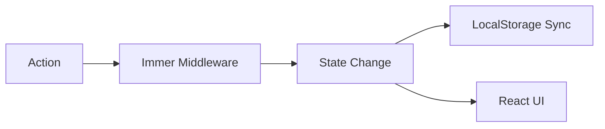

import { Playground } from '@components/Playground'


Zustand — это не просто хранилище для простых переменных. Его гибкость позволяет создавать сложные системы управления состоянием с middleware и глубокой интеграцией.

### Селекторы и оптимизация

Селекторы позволяют компонентам подписываться на конкретные поля. Это предотвращает ререндеринг, если изменились другие поля в сторе.

```tsx
// Плохо: ререндер при любом изменении стора
const state = useStore();

// Хорошо: ререндер только при изменении count
const count = useStore((state) => state.count);
```

### Middleware: Immer и Persist

Zustand поддерживает расширения. Самые популярные:
1.  **persist:** Автоматическое сохранение стейта в `localStorage`.
2.  **immer:** Позволяет писать мутирующий код, который под капотом становится иммутабельным.
3.  **devtools:** Интеграция с Redux DevTools.

### Пример со сложной логикой



### Преимущества перед Redux Toolkit

- Нет необходимости в `Provider`.
- Меньше шаблонного кода (boilerplate).
- Простая работа с асинхронностью.

---

## Интерактивный пример

<Playground client:visible
  template="react"
  files={{
    "/package.json": `{
  "dependencies": {
    "react": "^18.0.0",
    "react-dom": "^18.0.0",
    "zustand": "^4.4.0"
  }
}`,
    "/App.js": `import { create } from 'zustand';

const useStore = create((set) => ({
  todos: [],
  filter: 'all',
  addTodo: (text) => set((s) => ({ todos: [...s.todos, { id: Date.now(), text, done: false }] })),
  toggleTodo: (id) => set((s) => ({ todos: s.todos.map(t => t.id === id ? { ...t, done: !t.done } : t) })),
  removeTodo: (id) => set((s) => ({ todos: s.todos.filter(t => t.id !== id) })),
  setFilter: (filter) => set({ filter }),
}));

export default function App() {
  const { todos, filter, addTodo, toggleTodo, removeTodo, setFilter } = useStore();
  const [input, setInput] = useStore(() => ['', null]);

  const [text, setText] = [
    useStore(s => s._text) || '',
    (v) => useStore.setState({ _text: v }),
  ];

  // Local input state via simple React trick
  const [localText, setLocalText] = [
    typeof window !== 'undefined' ? (window._zt || '') : '',
    (v) => { if (typeof window !== 'undefined') window._zt = v; },
  ];

  const visible = todos.filter(t =>
    filter === 'all' ? true : filter === 'active' ? !t.done : t.done
  );

  const handleAdd = (e) => {
    e.preventDefault();
    const val = e.target.elements.todo.value.trim();
    if (val) { addTodo(val); e.target.reset(); }
  };

  const filterBtn = (f, label) => (
    <button key={f} onClick={() => setFilter(f)}
      style={{ background: filter === f ? '#89b4fa' : '#45475a', color: filter === f ? '#1e1e2e' : '#cdd6f4', border: 'none', padding: '5px 12px', borderRadius: 6, cursor: 'pointer', margin: '0 3px' }}>
      {label}
    </button>
  );

  return (
    <div style={{ padding: 20, background: '#1e1e2e', color: '#cdd6f4', minHeight: '100vh', fontFamily: 'sans-serif' }}>
      <h2 style={{ margin: '0 0 4px' }}>Zustand — Todo App</h2>
      <p style={{ color: '#bac2de', fontSize: 13, margin: '0 0 16px' }}>Глобальный стор без Provider</p>
      <form onSubmit={handleAdd} style={{ display: 'flex', gap: 8, marginBottom: 12 }}>
        <input name="todo" placeholder="Новая задача..." style={{ flex: 1, background: '#313244', color: '#cdd6f4', border: '1px solid #45475a', padding: '8px 10px', borderRadius: 6 }} />
        <button type="submit" style={{ background: '#89b4fa', color: '#1e1e2e', border: 'none', padding: '8px 16px', borderRadius: 6, cursor: 'pointer', fontWeight: 'bold' }}>+</button>
      </form>
      <div style={{ marginBottom: 12 }}>
        {filterBtn('all', 'Все')} {filterBtn('active', 'Активные')} {filterBtn('done', 'Готовые')}
        <span style={{ marginLeft: 8, fontSize: 13, color: '#585b70' }}>{todos.length} задач</span>
      </div>
      {visible.length === 0 && <p style={{ color: '#585b70' }}>Нет задач</p>}
      {visible.map(t => (
        <div key={t.id} style={{ display: 'flex', alignItems: 'center', background: '#313244', borderRadius: 8, padding: '10px 14px', marginBottom: 6, gap: 10 }}>
          <input type="checkbox" checked={t.done} onChange={() => toggleTodo(t.id)} style={{ cursor: 'pointer', width: 16, height: 16 }} />
          <span style={{ flex: 1, textDecoration: t.done ? 'line-through' : 'none', color: t.done ? '#585b70' : '#cdd6f4' }}>{t.text}</span>
          <button onClick={() => removeTodo(t.id)} style={{ background: 'none', border: 'none', color: '#f38ba8', cursor: 'pointer', fontSize: 18, padding: 0 }}>×</button>
        </div>
      ))}
    </div>
  );
}`,
  }}
/>
