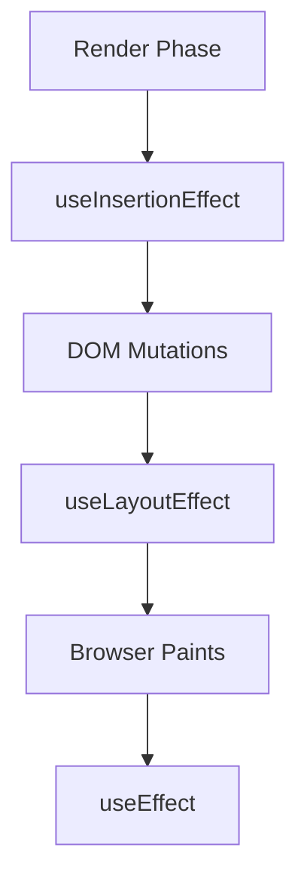

import { Playground } from '@components/Playground'


`useInsertionEffect` — это специализированная версия `useLayoutEffect`, предназначенная исключительно для библиотек **CSS-in-JS**. Он запускается *до* любых изменений в DOM и *до* того, как сработают `useLayoutEffect`.

### Почему он существует?

[Icon: Info] Основная проблема традиционных CSS-in-JS библиотек заключается в том, что когда стили добавляются или изменяются во время рендеринга (например, в `useEffect`), браузер вынужден пересчитывать стили (recalculate styles) для всего дерева элементов. Если это происходит часто, производительность падает.

`useInsertionEffect` позволяет библиотекам вставлять теги `<style>` в DOM до того, как браузер начнет вычислять макет (layout).

### Порядок выполнения хуков

1.  **Render:** React вычисляет, что должно быть в DOM.
2.  **useInsertionEffect:** Вставка стилей в DOM.
3.  **[useLayoutEffect](/react/use-layout-effect/):** Чтение макета и синхронные изменения DOM.
4.  **useEffect:** Асинхронные эффекты (запросы, подписки).



### Пример использования

Обычно этот хук используется внутри абстракций CSS-in-JS. Вот упрощенный пример:

```tsx
import { useInsertionEffect } from 'react';

// Гипотетическая функция для генерации и вставки стилей
function useCSS(styleObject) {
  useInsertionEffect(() => {
    const styleTag = document.createElement('style');
    styleTag.textContent = generateCSS(styleObject);
    document.head.appendChild(styleTag);

    return () => {
      document.head.removeChild(styleTag);
    };
  }, [styleObject]);
}

function MyComponent() {
  useCSS({ color: 'red', fontSize: '20px' });
  return <div className="dynamic-style">Привет, мир!</div>;
}
```

### Ключевые ограничения

- **Только для библиотек:** Если вы не пишете свою CSS-in-JS библиотеку, вам почти наверняка не нужен этот хук.
- **Нет доступа к refs:** Внутри `useInsertionEffect` вы не можете получить доступ к `ref.current` элементов вашего компонента, так как DOM еще не обновлен.
- **Только на клиенте:** Как и другие эффекты, он не работает при серверном рендеринге (SSR).

[Icon: Alert-Triangle] **Важно:** Не используйте этот хук для побочных эффектов, которые не связаны со стилями. Для обычных задач используйте `useEffect` или `useLayoutEffect`.

---

## 🔗 Полезные ссылки
- [string`. Если ширина контейнера заголовка (например, `div`) становится меньше 300px, текст должен усекаться и добавляться многоточие (`...`). Изменение должно происходить плавно и без мерцания при изменении размера окна браузера.
    *   Подсказка: Вам понадобится `useRef` для элемента заголовка и `ResizeObserver` для отслеживания изменений размера, который вы будете подключать/отключать в `useLayoutEffect` или `useEffect`. Но само применение усечения, зависящее от размеров, лучше делать через `useLayoutEffect`.

3.  **Адаптивный тултип (всплывающая подсказка)**:
    Создайте компонент `Tooltip` (который рендерится внутри `Button` или `HoverArea` компонента). Когда пользователь наводит курсор на элемент, появляется тултип. `Tooltip` должен позиционироваться относительно элемента, на который навели, и *гарантировать*, что он не выходит за пределы видимой области экрана (viewport). Пересчет позиции должен происходить в `useLayoutEffect` при первом появлении тултипа или при скролле/ресайзе страницы.
    *   Подсказка: `getBoundingClientRect()` элемента-триггера и `window.innerWidth`/`window.innerHeight` для viewport. Используйте `useState` для хранения позиции тултипа (`top`, `left`).

### ### 💡 Совет

Используйте `useLayoutEffect` только тогда, когда вам абсолютно необходимо синхронно взаимодействовать с DOM после его изменения React](/react/use-layout-effect/)

### Практика

Попробуйте примеры в интерактивном редакторе:

<Playground client:visible template="react" files={{ "/App.tsx": `import { useInsertionEffect, useState } from 'react';

interface Theme {
  name: string;
  bg: string;
  text: string;
  border: string;
}

// CSS-in-JS хук: вставляет <style> в <head> ДО рисования компонента (как Emotion/styled-components)
function useThemeStyle(theme: Theme) {
  const cls = 'theme-' + theme.name;
  useInsertionEffect(() => {
    // Создаём тег <style> и добавляем в <head> до любых DOM-мутаций
    const el = document.createElement('style');
    el.setAttribute('data-theme', cls);
    el.textContent =
      '.' + cls + ' {' +
      ' background: ' + theme.bg + ';' +
      ' color: ' + theme.text + ';' +
      ' border: 2px solid ' + theme.border + ';' +
      ' border-radius: 12px; padding: 20px; transition: transform 0.2s; }' +
      ' .' + cls + ':hover { transform: scale(1.02); }';
    document.head.appendChild(el);
    // Очистка: удаляем тег при размонтировании или смене темы
    return () => { document.head.removeChild(el); };
  }, [cls, theme.bg, theme.text, theme.border]);
  return cls;
}

const THEMES: Theme[] = [
  { name: 'ocean',  bg: '#0c4a6e', text: '#e0f2fe', border: '#0ea5e9' },
  { name: 'forest', bg: '#14532d', text: '#dcfce7', border: '#22c55e' },
  { name: 'sunset', bg: '#7c2d12', text: '#ffedd5', border: '#f97316' },
  { name: 'violet', bg: '#4c1d95', text: '#ede9fe', border: '#a78bfa' },
];

function ThemedCard({ theme }: { theme: Theme }) {
  const cls = useThemeStyle(theme); // стиль вставляется до отрисовки — без мерцания
  return (
    <div className={cls}>
      <div style={{ fontWeight: 'bold', fontSize: 15, marginBottom: 4 }}>{theme.name}</div>
      <div style={{ fontSize: 12, opacity: 0.8 }}>{theme.bg}</div>
    </div>
  );
}

export default function App() {
  const [visible, setVisible] = useState<string[]>(['ocean', 'forest']);

  const toggle = (name: string) =>
    setVisible(prev => prev.includes(name) ? prev.filter(n => n !== name) : [...prev, name]);

  return (
    <div style={{ minHeight: '100vh', background: '#0f172a', padding: 24, fontFamily: 'sans-serif' }}>
      <h2 style={{ color: '#38bdf8', marginTop: 0, marginBottom: 4 }}>useInsertionEffect</h2>
      <p style={{ color: '#94a3b8', fontSize: 14, marginBottom: 20 }}>
        Вставляет {'<style>'} тег в {'<head>'} до отрисовки DOM — основа CSS-in-JS библиотек. Никакого мерцания.
      </p>
      <div style={{ display: 'flex', gap: 8, flexWrap: 'wrap', marginBottom: 20 }}>
        {THEMES.map(t => (
          <button
            key={t.name}
            onClick={() => toggle(t.name)}
            style={{
              background: visible.includes(t.name) ? t.border : '#1e293b',
              color: '#fff',
              border: '1px solid ' + t.border,
              borderRadius: 8,
              padding: '6px 14px',
              cursor: 'pointer',
              fontSize: 13,
            }}
          >
            {(visible.includes(t.name) ? '✓ ' : '') + t.name}
          </button>
        ))}
      </div>
      <div style={{ display: 'grid', gridTemplateColumns: '1fr 1fr', gap: 12, marginBottom: 16 }}>
        {THEMES.filter(t => visible.includes(t.name)).map(t => (
          <ThemedCard key={t.name} theme={t} />
        ))}
      </div>
      <div style={{ background: '#1e293b', borderRadius: 8, padding: 12, fontSize: 13 }}>
        <div style={{ color: '#38bdf8', marginBottom: 4 }}>Порядок хуков:</div>
        <div style={{ color: '#94a3b8' }}>
          Render → <b style={{ color: '#f59e0b' }}>useInsertionEffect</b> → DOM → useLayoutEffect → Paint → useEffect
        </div>
        <div style={{ color: '#64748b', marginTop: 4, fontSize: 12 }}>
          {'Активных <style> тегов: ' + visible.length}
        </div>
      </div>
    </div>
  );
}
` }} />
