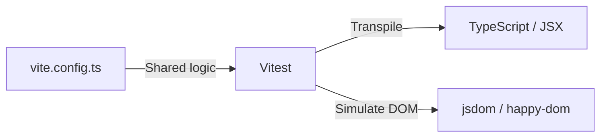

import { Playground } from '@components/Playground'


Vitest — это современная альтернатива Jest, созданная командой Vite. Она нативно поддерживает ESM, TypeScript и [JSX](/react/jsx/), работая в разы быстрее.

Icon: Zap (Молния)

## Описание

Если ваш проект использует Vite, то Vitest — лучший выбор, так как он использует тот же конфиг и те же плагины для трансформации кода.

## Mermaid Диаграмма



## Установка

```bash
npm install -D vitest @testing-library/react @testing-library/jest-dom jsdom
```

## Конфигурация (`vite.config.ts`)

```typescript
import { defineConfig } from 'vitest/config';
import react from '@vitejs/plugin-react';

export default defineConfig({
  plugins: [react()],
  test: {
    globals: true,
    environment: 'jsdom',
    setupFiles: './src/setupTests.ts',
  },
});
```

## Файл настройки (`src/setupTests.ts`)

```typescript
import '@testing-library/jest-dom';
```

## Скрипты в `package.json`

```json
"scripts": {
  "test": "vitest",
  "test:ui": "vitest --ui",
  "coverage": "vitest run --coverage"
}
```

## Почему Vitest?

- **Скорость**: Мгновенный Hot Module Replacement (HMR) для тестов.
- **Совместимость**: Почти 100% совместимость с API Jest (`describe`, `it`, `expect`).
- **UI Mode**: Потрясающий интерактивный интерфейс для запуска тестов в браузере.
- **Интеграция**: Не нужно настраивать Babel или сложные трансформации вручную.

---

## 🔗 Полезные ссылки
- [React Testing Library: Основы](/react/rtl-basics/)
- [Jsx](/react/jsx/)

### Практика

Попробуйте примеры в интерактивном редакторе:

<Playground client:visible template="react" files={{ "/App.tsx": `import { useState } from 'react';

const CONFIG_CODE = [
  "// vite.config.ts",
  "import { defineConfig } from 'vitest/config';",
  "import react from '@vitejs/plugin-react';",
  "",
  "export default defineConfig({",
  "  plugins: [react()],",
  "  test: {",
  "    globals: true,",
  "    environment: 'jsdom',",
  "    setupFiles: './src/setupTests.ts',",
  "  },",
  "});",
].join('\n');

const TEST_CODE = [
  "// Button.test.tsx",
  "import { render, screen, fireEvent } from '@testing-library/react';",
  "import { describe, it, expect, vi } from 'vitest';",
  "import Button from './Button';",
  "",
  "describe('Button', () => {",
  "  it('renders label', () => {",
  "    render(<Button label=\"Click me\" />);",
  "    expect(screen.getByRole('button', { name: /click me/i }))",
  "      .toBeInTheDocument();",
  "  });",
  "",
  "  it('calls onClick', () => {",
  "    const fn = vi.fn();",
  "    render(<Button label=\"Go\" onClick={fn} />);",
  "    fireEvent.click(screen.getByRole('button'));",
  "    expect(fn).toHaveBeenCalledTimes(1);",
  "  });",
  "});",
].join('\n');

function Button({ label, variant = 'primary', onClick }: { label: string; variant?: 'primary' | 'secondary' | 'danger'; onClick?: () => void }) {
  const colors: Record<string, string> = { primary: '#3b82f6', secondary: '#475569', danger: '#ef4444' };
  const [clicked, setClicked] = useState(false);
  return (
    <button
      onClick={() => { setClicked(true); onClick?.(); setTimeout(() => setClicked(false), 600); }}
      style={{ padding: '8px 18px', borderRadius: 8, background: clicked ? '#1d4ed8' : colors[variant], color: '#fff', border: 'none', cursor: 'pointer', fontWeight: 600, transform: clicked ? 'scale(0.96)' : 'scale(1)', transition: 'all 0.1s' }}
    >{label}</button>
  );
}

export default function App() {
  const [log, setLog] = useState<string[]>([]);
  const track = (label: string) => setLog(p => ['✓ onClick: "' + label + '"', ...p].slice(0, 5));

  return (
    <div style={{ minHeight: '100vh', background: '#0f172a', fontFamily: 'system-ui,sans-serif', padding: '32px 20px', display: 'flex', flexDirection: 'column', alignItems: 'center' }}>
      <h1 style={{ color: '#60a5fa', fontSize: '1.4rem', marginBottom: 8 }}>⚡ Vitest + React</h1>
      <p style={{ color: '#64748b', fontSize: '0.85rem', marginBottom: 24 }}>Быстрое тестирование с нативной поддержкой TSX</p>

      <div style={{ background: '#1e293b', borderRadius: 12, padding: 24, width: '100%', maxWidth: 500, marginBottom: 20 }}>
        <p style={{ color: '#94a3b8', fontSize: '0.8rem', marginBottom: 16 }}>🧩 Button — тестируемый компонент</p>
        <div style={{ display: 'flex', gap: 10, flexWrap: 'wrap', marginBottom: 14 }}>
          <Button label="Primary" variant="primary" onClick={() => track('Primary')} />
          <Button label="Secondary" variant="secondary" onClick={() => track('Secondary')} />
          <Button label="Danger" variant="danger" onClick={() => track('Danger')} />
        </div>
        {log.length > 0 && (
          <div style={{ background: '#0f172a', borderRadius: 8, padding: 10 }}>
            {log.map((l, i) => <div key={i} style={{ color: '#4ade80', fontSize: '0.75rem', lineHeight: 1.6 }}>{l}</div>)}
          </div>
        )}
      </div>

      <div style={{ background: '#1e293b', borderRadius: 12, padding: 20, width: '100%', maxWidth: 500, marginBottom: 16 }}>
        <p style={{ color: '#94a3b8', fontSize: '0.75rem', fontWeight: 600, textTransform: 'uppercase', marginBottom: 10, letterSpacing: '0.08em' }}>⚙️ Конфигурация</p>
        <pre style={{ color: '#7dd3fc', fontSize: '0.7rem', lineHeight: 1.7, margin: 0, overflowX: 'auto', whiteSpace: 'pre-wrap' }}>{CONFIG_CODE}</pre>
      </div>

      <div style={{ background: '#1e293b', borderRadius: 12, padding: 20, width: '100%', maxWidth: 500 }}>
        <p style={{ color: '#94a3b8', fontSize: '0.75rem', fontWeight: 600, textTransform: 'uppercase', marginBottom: 10, letterSpacing: '0.08em' }}>🧪 Vitest тест</p>
        <pre style={{ color: '#86efac', fontSize: '0.7rem', lineHeight: 1.7, margin: 0, overflowX: 'auto', whiteSpace: 'pre-wrap' }}>{TEST_CODE}</pre>
      </div>
    </div>
  );
}
` }} />
