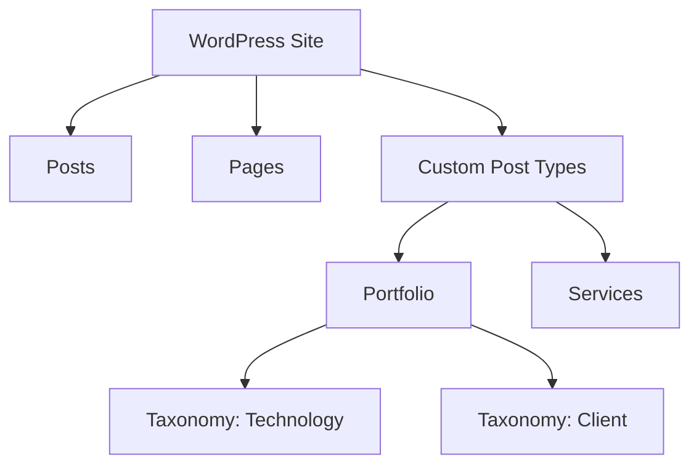

import { Playground } from '@components/Playground'

WordPress по умолчанию предоставляет два основных типа контента: Записи (Posts) и Страницы (Pages). Для создания сложных сайтов, таких как портфолио, каталоги недвижимости или базы знаний, необходимо создавать свои типы записей и способы их группировки.

## Регистрация Custom Post Type (CPT)

Для регистрации используется функция `register_post_type()`. Рекомендуется вызывать её на хуке `init`.

```php
function yasha_register_portfolio_cpt() {
    $args = [
        'labels' => [
            'name' => 'Проекты',
            'singular_name' => 'Проект',
        ],
        'public'      => true,
        'has_archive' => true,
        'menu_icon'   => 'dashicons-portfolio',
        'supports'    => ['title', 'editor', 'thumbnail', 'excerpt'],
        'show_in_rest' => true, // Обязательно для поддержки Gutenberg
    ];

    register_post_type('portfolio', $args);
}
add_action('init', 'yasha_register_portfolio_cpt');
```

### Основные параметры:
- `public`: определяет, будет ли тип записи доступен в админке и на фронтенде.
- `has_archive`: создает страницу архива (например, `/portfolio/`).
- `show_in_rest`: включает поддержку блочного редактора Gutenberg.
- `supports`: определяет доступные поля (заголовок, редактор, миниатюра и т.д.).

## Таксономии (Taxonomies)

Таксономии позволяют группировать контент. Стандартные примеры — Категории и Теги. Мы можем создать свои, например «Технологии» для проектов.

```php
function yasha_register_tech_taxonomy() {
    $args = [
        'labels' => [
            'name' => 'Технологии',
            'singular_name' => 'Технология',
        ],
        'hierarchical' => true, // Поведение как у категорий (false — как у тегов)
        'show_in_rest' => true,
    ];

    register_taxonomy('technology', ['portfolio'], $args);
}
add_action('init', 'yasha_register_tech_taxonomy');
```

## Визуализация структуры контента



## Работа с CPT в коде

Для вывода кастомных записей используется стандартный `WP_Query` с указанием `post_type`.

```php
$query = new WP_Query([
    'post_type' => 'portfolio',
    'posts_per_page' => 10,
    'tax_query' => [
        [
            'taxonomy' => 'technology',
            'field'    => 'slug',
            'terms'    => 'react',
        ],
    ],
]);

if ($query->have_posts()) {
    while ($query->have_posts()) {
        $query->the_post();
        the_title('<h2>', '</h2>');
    }
    wp_reset_postdata();
}
```

## Резюме
Использование CPT и таксономий превращает WordPress из блог-платформы в полноценную CMS для любых типов данных. Всегда включайте `show_in_rest`, если планируете использовать Gutenberg.

## Интерактивный пример

Конструктор Custom Post Type:

<Playground client:visible
  template="static"
  files={{
    "/index.html": {
      code: `<!DOCTYPE html>
<html lang="ru">
<head>
<meta charset="UTF-8">
<style>
* { box-sizing: border-box; margin: 0; padding: 0; }
body { font-family: monospace; background: #0f172a; color: #e2e8f0; padding: 20px; }
h3 { color: #818cf8; margin-bottom: 12px; }
.form { display: flex; flex-direction: column; gap: 8px; margin-bottom: 14px; }
.row { display: flex; align-items: center; gap: 8px; font-size: 12px; }
.row label { min-width: 100px; color: #94a3b8; }
.row input, .row select { background: #1e293b; border: 1px solid #334155; border-radius: 4px; padding: 5px 8px; color: #e2e8f0; font-family: monospace; font-size: 12px; flex: 1; }
.supports { display: flex; gap: 6px; flex-wrap: wrap; }
.supports label { font-size: 11px; display: flex; align-items: center; gap: 4px; cursor: pointer; color: #94a3b8; min-width: auto; }
.output { background: #1e293b; border: 1px solid #334155; border-radius: 8px; padding: 12px; font-size: 11px; color: #94a3b8; white-space: pre; overflow-x: auto; }
.php { color: #c084fc; }
.str { color: #fbbf24; }
.func { color: #22d3ee; }
</style>
</head>
<body>
<h3>Custom Post Type Builder</h3>
<div class="form">
  <div class="row"><label>Post Type:</label><input id="slug" value="portfolio" oninput="gen()"></div>
  <div class="row"><label>Label:</label><input id="label" value="Portfolio" oninput="gen()"></div>
  <div class="row"><label>Icon:</label><select id="icon" onchange="gen()"><option value="dashicons-portfolio">portfolio</option><option value="dashicons-admin-post">post</option><option value="dashicons-products">products</option><option value="dashicons-calendar">calendar</option></select></div>
  <div class="row"><label>Supports:</label>
    <div class="supports">
      <label><input type="checkbox" checked onchange="gen()" data-support="title"> title</label>
      <label><input type="checkbox" checked onchange="gen()" data-support="editor"> editor</label>
      <label><input type="checkbox" checked onchange="gen()" data-support="thumbnail"> thumbnail</label>
      <label><input type="checkbox" onchange="gen()" data-support="excerpt"> excerpt</label>
      <label><input type="checkbox" onchange="gen()" data-support="custom-fields"> custom-fields</label>
    </div>
  </div>
</div>
<div class="output" id="output"></div>
<script>
function gen() {
  const slug = document.getElementById("slug").value || "my_cpt";
  const label = document.getElementById("label").value || "My CPT";
  const icon = document.getElementById("icon").value;
  const supports = [];
  document.querySelectorAll("[data-support]").forEach(cb => { if (cb.checked) supports.push(cb.dataset.support); });
  const code =
    "<span class=\\"php\\">function</span> register_" + slug + "() {\\n" +
    "  <span class=\\"func\\">register_post_type</span>(<span class=\\"str\\"> + slug + </span>, [\\n" +
    "    <span class=\\"str\\">labels</span> => [\\n" +
    "      <span class=\\"str\\">name</span> => <span class=\\"str\\"> + label + </span>,\\n" +
    "      <span class=\\"str\\">singular_name</span> => <span class=\\"str\\"> + label + </span>,\\n" +
    "    ],\\n" +
    "    <span class=\\"str\\">public</span> => <span class=\\"php\\">true</span>,\\n" +
    "    <span class=\\"str\\">menu_icon</span> => <span class=\\"str\\"> + icon + </span>,\\n" +
    "    <span class=\\"str\\">supports</span> => [" + supports.map(s => "<span class=\\"str\\"> + s + </span>").join(", ") + "],\\n" +
    "    <span class=\\"str\\">has_archive</span> => <span class=\\"php\\">true</span>,\\n" +
    "    <span class=\\"str\\">show_in_rest</span> => <span class=\\"php\\">true</span>,\\n" +
    "  ]);\\n}\\n\\n" +
    "<span class=\\"func\\">add_action</span>(<span class=\\"str\\">init</span>, <span class=\\"str\\">register_ + slug + </span>);";
  document.getElementById("output").innerHTML = code;
}
gen();
<\/script>
</body>
</html>`,
      active: true,
    },
  }}
/>
