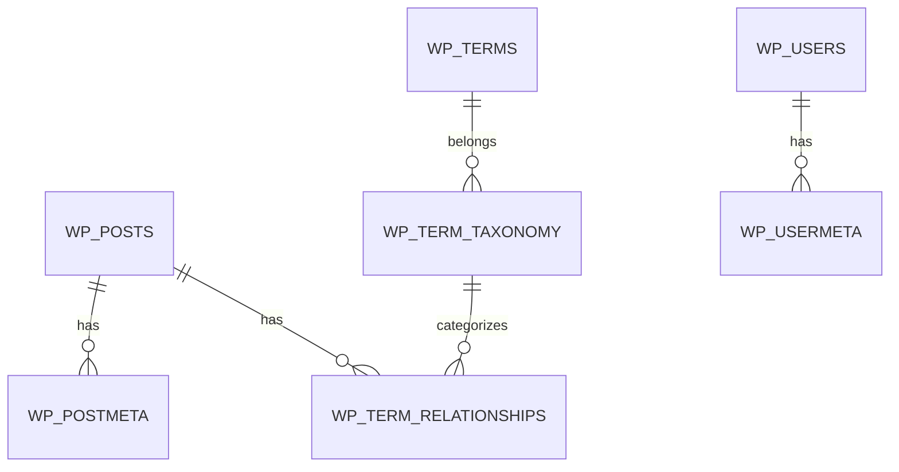

import { Playground } from '@components/Playground'

Хотя WordPress предоставляет высокоуровневые API (`WP_Query`, `get_post`), иногда требуется прямой доступ к базе данных для сложных отчетов или работы с кастомными таблицами.

## Объект $wpdb

`$wpdb` — это глобальный объект класса `wpdb`, который инкапсулирует работу с MySQL.

```php
global $wpdb;

// Получение одной переменной
$user_count = $wpdb->get_var( "SELECT COUNT(*) FROM $wpdb->users" );

// Получение одной строки
$user = $wpdb->get_row( "SELECT * FROM $wpdb->users WHERE ID = 1" );

// Получение списка результатов
$results = $wpdb->get_results( "SELECT post_title FROM $wpdb->posts WHERE post_status = 'publish'" );
```

## Структура таблиц WordPress



### Основные таблицы:
- `wp_posts`: Записи, страницы, вложения и CPT.
- `wp_postmeta`: Дополнительные данные (метаполя) для записей.
- `wp_options`: Настройки сайта и плагинов.
- `wp_terms`: Названия категорий/тегов.

## Создание кастомных таблиц

При разработке сложных систем (например, системы логов) лучше создать свою таблицу.

```php
function yasha_create_custom_table() {
    global $wpdb;
    $table_name = $wpdb->prefix . 'yasha_logs';
    $charset_collate = $wpdb->get_charset_collate();

    $sql = "CREATE TABLE $table_name (
        id mediumint(9) NOT NULL AUTO_INCREMENT,
        time datetime DEFAULT '0000-00-00 00:00:00' NOT NULL,
        message text NOT NULL,
        PRIMARY KEY  (id)
    ) $charset_collate;";

    require_once( ABSPATH . 'wp-admin/includes/upgrade.php' );
    dbDelta( $sql );
}
```

## Операции CRUD

```php
// Insert
$wpdb->insert( 
    $wpdb->prefix . 'yasha_logs', 
    [ 'time' => current_time( 'mysql' ), 'message' => 'Test log' ],
    [ '%s', '%s' ] 
);

// Update
$wpdb->update( 
    $wpdb->prefix . 'yasha_logs', 
    [ 'message' => 'Updated message' ], 
    [ 'id' => 1 ], 
    [ '%s' ], 
    [ '%d' ] 
);
```

## Резюме
- Используйте `$wpdb->prefix` для поддержки кастомных префиксов таблиц.
- Всегда экранируйте данные через `$wpdb->prepare()`.
- Используйте `dbDelta` для безопасного создания и обновления структуры таблиц.

## Интерактивный пример

Структура базы данных WordPress:

<Playground client:visible
  template="static"
  files={{
    "/index.html": {
      code: `<!DOCTYPE html>
<html lang="ru">
<head>
<meta charset="UTF-8">
<style>
* { box-sizing: border-box; margin: 0; padding: 0; }
body { font-family: monospace; background: #0f172a; color: #e2e8f0; padding: 20px; }
h3 { color: #818cf8; margin-bottom: 12px; }
.tables { display: grid; grid-template-columns: repeat(3, 1fr); gap: 8px; margin-bottom: 14px; }
.table { background: #1e293b; border: 1px solid #334155; border-radius: 8px; padding: 10px; cursor: pointer; transition: all .2s; }
.table:hover { border-color: #818cf8; }
.table.active { border-color: #818cf8; background: #1e1b4b; }
.table .name { color: #22d3ee; font-weight: 700; font-size: 12px; }
.table .rows { color: #64748b; font-size: 10px; }
.schema { background: #1e293b; border: 1px solid #334155; border-radius: 8px; padding: 14px; font-size: 12px; }
.col { display: flex; gap: 10px; padding: 4px 0; border-bottom: 1px solid #0f172a; }
.col .fname { color: #f59e0b; min-width: 120px; }
.col .ftype { color: #64748b; min-width: 80px; }
.col .fkey { color: #818cf8; font-size: 10px; }
</style>
</head>
<body>
<h3>WordPress Database Schema</h3>
<div class="tables" id="tables"></div>
<div class="schema" id="schema"></div>
<script>
const tables = {
  "wp_posts": { rows: 156, cols: [
    { name: "ID", type: "BIGINT", key: "PRIMARY" },
    { name: "post_author", type: "BIGINT", key: "FK → users" },
    { name: "post_date", type: "DATETIME", key: "" },
    { name: "post_content", type: "LONGTEXT", key: "" },
    { name: "post_title", type: "TEXT", key: "" },
    { name: "post_status", type: "VARCHAR(20)", key: "INDEX" },
    { name: "post_type", type: "VARCHAR(20)", key: "INDEX" },
  ]},
  "wp_users": { rows: 12, cols: [
    { name: "ID", type: "BIGINT", key: "PRIMARY" },
    { name: "user_login", type: "VARCHAR(60)", key: "UNIQUE" },
    { name: "user_pass", type: "VARCHAR(255)", key: "" },
    { name: "user_email", type: "VARCHAR(100)", key: "" },
    { name: "user_registered", type: "DATETIME", key: "" },
  ]},
  "wp_options": { rows: 342, cols: [
    { name: "option_id", type: "BIGINT", key: "PRIMARY" },
    { name: "option_name", type: "VARCHAR(191)", key: "UNIQUE" },
    { name: "option_value", type: "LONGTEXT", key: "" },
    { name: "autoload", type: "VARCHAR(20)", key: "INDEX" },
  ]},
  "wp_postmeta": { rows: 1240, cols: [
    { name: "meta_id", type: "BIGINT", key: "PRIMARY" },
    { name: "post_id", type: "BIGINT", key: "FK → posts" },
    { name: "meta_key", type: "VARCHAR(255)", key: "INDEX" },
    { name: "meta_value", type: "LONGTEXT", key: "" },
  ]},
  "wp_terms": { rows: 45, cols: [
    { name: "term_id", type: "BIGINT", key: "PRIMARY" },
    { name: "name", type: "VARCHAR(200)", key: "" },
    { name: "slug", type: "VARCHAR(200)", key: "UNIQUE" },
  ]},
  "wp_comments": { rows: 89, cols: [
    { name: "comment_ID", type: "BIGINT", key: "PRIMARY" },
    { name: "comment_post_ID", type: "BIGINT", key: "FK → posts" },
    { name: "comment_author", type: "TINYTEXT", key: "" },
    { name: "comment_content", type: "TEXT", key: "" },
    { name: "comment_approved", type: "VARCHAR(20)", key: "INDEX" },
  ]},
};
const tablesEl = document.getElementById("tables");
const schemaEl = document.getElementById("schema");
Object.entries(tables).forEach(([name, t]) => {
  const div = document.createElement("div");
  div.className = "table";
  div.innerHTML = "<div class=\\"name\\">" + name + "</div><div class=\\"rows\\">" + t.rows + " rows</div>";
  div.onclick = () => {
    tablesEl.querySelectorAll(".table").forEach(t => t.classList.remove("active"));
    div.classList.add("active");
    schemaEl.innerHTML = "<strong>" + name + "</strong><br><br>" + t.cols.map(c => "<div class=\\"col\\"><span class=\\"fname\\">" + c.name + "</span><span class=\\"ftype\\">" + c.type + "</span><span class=\\"fkey\\">" + c.key + "</span></div>").join("");
  };
  tablesEl.appendChild(div);
});
schemaEl.innerHTML = "<span style=\\"color:#64748b\\">Select a table to view its schema</span>";
<\/script>
</body>
</html>`,
      active: true,
    },
  }}
/>
