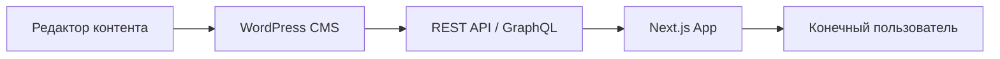

import { Playground } from '@components/Playground'

Headless CMS — это подход, при котором WordPress используется только для управления контентом (бэкенд), а за отображение отвечает отдельное приложение на современном фронтенд-фреймворке (Next.js, React, Vue).

## Как это работает

WordPress предоставляет данные через **REST API** или **GraphQL**. Фронтенд делает запросы к этим эндпоинтам и отрисовывает страницы.



## Работа с REST API

По умолчанию WordPress отдает данные в формате JSON. Основные эндпоинты:

- `https://yoursite.com/wp-json/wp/v2/posts` — список постов.
- `https://yoursite.com/wp-json/wp/v2/pages` — список страниц.
- `https://yoursite.com/wp-json/wp/v2/users` — пользователи.

### Пример запроса на JavaScript (Next.js)

```javascript
// fetch posts from WP
async function getPosts() {
  const res = await fetch('https://demo.wp-api.org/wp-json/wp/v2/posts');
  const posts = await res.json();
  return posts;
}

// Пример использования в компоненте
const PostsList = ({ posts }) => {
  return (
    <ul>
      {posts.map(post => (
        <li key={post.id} dangerouslySetInnerHTML={{ __html: post.title.rendered }} />
      ))}
    </ul>
  );
};
```

## Преимущества Headless подхода

1. **Производительность:** Статическая генерация (SSG) в Next.js делает сайт невероятно быстрым.
2. **Безопасность:** Админка WordPress может быть скрыта от публичного доступа.
3. **Developer Experience:** Фронтенд-разработчики могут использовать любимые инструменты (React, Tailwind), не изучая PHP.
4. **Омниканальность:** Один бэкенд может питать сайт, мобильное приложение и умные часы.

## Когда НЕ стоит использовать Headless

- Если вам нужны плагины, которые сильно завязаны на фронтенд (многие формы, конструкторы страниц типа Elementor).
- Если бюджет ограничен (разработка Headless обходится дороже).
- Если клиенту важен предварительный просмотр (Preview) "из коробки" без сложной настройки.

В 2026 году WordPress прочно закрепился в роли мощного контент-движка, который отлично работает в паре с любыми современными технологиями.

## Интерактивный пример

WordPress REST API — headless подход:

<Playground client:visible
  template="static"
  files={{
    "/index.html": {
      code: `<!DOCTYPE html>
<html lang="ru">
<head>
<meta charset="UTF-8">
<style>
* { box-sizing: border-box; margin: 0; padding: 0; }
body { font-family: monospace; background: #0f172a; color: #e2e8f0; padding: 20px; }
h3 { color: #818cf8; margin-bottom: 12px; }
.diagram { display: flex; align-items: center; gap: 12px; margin-bottom: 16px; justify-content: center; }
.box { background: #1e293b; border: 1px solid #334155; border-radius: 10px; padding: 12px; text-align: center; min-width: 100px; }
.box .icon { font-size: 22px; }
.box .label { font-size: 11px; color: #94a3b8; margin-top: 4px; }
.arrow { color: #818cf8; font-size: 16px; }
.endpoints { display: flex; flex-direction: column; gap: 4px; margin-bottom: 14px; }
.endpoint { display: flex; align-items: center; gap: 8px; background: #1e293b; border: 1px solid #334155; border-radius: 6px; padding: 8px 12px; font-size: 12px; cursor: pointer; transition: all .2s; }
.endpoint:hover { border-color: #818cf8; }
.endpoint .method { background: #22c55e; color: #0f172a; padding: 2px 6px; border-radius: 3px; font-weight: 700; font-size: 10px; }
.endpoint .url { color: #22d3ee; }
.response { background: #1e293b; border: 1px solid #334155; border-radius: 8px; padding: 12px; font-size: 11px; color: #94a3b8; white-space: pre; overflow-x: auto; max-height: 120px; }
</style>
</head>
<body>
<h3>Headless WordPress</h3>
<div class="diagram">
  <div class="box"><div class="icon">🗄️</div><div class="label">WordPress<br>(Backend)</div></div>
  <div class="arrow">→ REST API →</div>
  <div class="box"><div class="icon">⚛️</div><div class="label">React / Next.js<br>(Frontend)</div></div>
</div>
<div class="endpoints" id="endpoints"></div>
<div class="response" id="response">// Click an endpoint to see the response</div>
<script>
const endpoints = [
  { method: "GET", url: "/wp-json/wp/v2/posts", response: JSON.stringify([{ id: 1, title: { rendered: "Hello World" }, status: "publish", date: "2024-01-15T10:00:00" }, { id: 2, title: { rendered: "Getting Started" }, status: "publish", date: "2024-01-12T09:00:00" }], null, 2) },
  { method: "GET", url: "/wp-json/wp/v2/pages", response: JSON.stringify([{ id: 10, title: { rendered: "About Us" }, slug: "about", status: "publish" }], null, 2) },
  { method: "GET", url: "/wp-json/wp/v2/categories", response: JSON.stringify([{ id: 1, name: "Tutorials", slug: "tutorials", count: 15 }, { id: 2, name: "News", slug: "news", count: 8 }], null, 2) },
  { method: "GET", url: "/wp-json/wp/v2/media", response: JSON.stringify([{ id: 20, title: { rendered: "hero.jpg" }, source_url: "https://site.com/wp-content/uploads/hero.jpg", mime_type: "image/jpeg" }], null, 2) },
  { method: "POST", url: "/wp-json/wp/v2/posts", response: JSON.stringify({ id: 3, title: { rendered: "New Post" }, status: "draft", message: "Created successfully" }, null, 2) },
];
const el = document.getElementById("endpoints");
const resp = document.getElementById("response");
endpoints.forEach(e => {
  const div = document.createElement("div");
  div.className = "endpoint";
  div.innerHTML = "<span class=\\"method\\" style=\\"background:" + (e.method === "POST" ? "#f59e0b" : "#22c55e") + "\\">" + e.method + "</span><span class=\\"url\\">" + e.url + "</span>";
  div.onclick = () => { resp.textContent = e.response; };
  el.appendChild(div);
});
<\/script>
</body>
</html>`,
      active: true,
    },
  }}
/>
