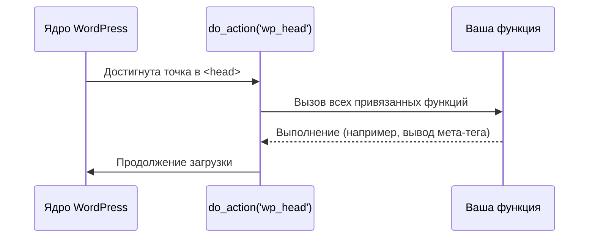

import { Playground } from '@components/Playground'

Хуки — это основа расширяемости WordPress. Они позволяют разработчикам изменять поведение системы или выводить контент в определенных местах, не затрагивая файлы ядра или других плагинов.

Существует два типа хуков: **Actions** (События) и **Filters** (Фильтры).

## Actions (Экшены)

Экшены позволяют выполнять код в определенный момент загрузки страницы или выполнения процесса (например, при сохранении поста).

**Принцип работы:** "Когда происходит событие X, выполни функцию Y".



### Пример использования:

Добавим скрипт в подвал сайта.

```php
function my_custom_footer_text() {
    echo '<p>Сделано на курсе Яши</p>';
}

add_action('wp_footer', 'my_custom_footer_text');
```

## Filters (Фильтры)

Фильтры используются для модификации данных перед тем, как они будут сохранены в базу или выведены на экран.

**Принцип работы:** "Возьми переменную, измени её и верни обратно".

### Пример использования:

Изменим длину текста в анонсе поста (excerpt).

```php
function my_custom_excerpt_length($length) {
    return 20; // Ограничить до 20 слов
}

add_filter('excerpt_length', 'my_custom_excerpt_length');
```

## Как найти нужный хук?

1. **Документация:** Официальный WordPress Code Reference.
2. **Поиск по коду:** Если вы используете IDE, ищите вызовы `do_action()` и `apply_filters()` в файлах ядра или плагинов.
3. **Плагины для отладки:** Query Monitor показывает все хуки, запущенные на текущей странице.

## Приоритет выполнения

Вы можете указать, в какой очереди выполнится ваша функция, добавив числовой приоритет (по умолчанию 10).

```php
add_action('init', 'my_first_function', 5);  // Выполнится раньше
add_action('init', 'my_second_function', 15); // Выполнится позже
```

Использование хуков делает ваш код чистым, модульным и совместимым с обновлениями системы.

## Интерактивный пример

Система хуков WordPress — actions и filters в действии:

<Playground client:visible
  template="static"
  files={{
    "/index.html": {
      code: `<!DOCTYPE html>
<html lang="ru">
<head>
<meta charset="UTF-8">
<style>
* { box-sizing: border-box; margin: 0; padding: 0; }
body { font-family: monospace; background: #0f172a; color: #e2e8f0; padding: 20px; }
h3 { color: #818cf8; margin-bottom: 12px; }
.tabs { display: flex; gap: 6px; margin-bottom: 12px; }
.tab { padding: 6px 14px; border-radius: 6px; background: #1e293b; border: 1px solid #334155; cursor: pointer; font-size: 12px; }
.tab.active { background: #1e1b4b; border-color: #6366f1; color: #818cf8; }
.panel { background: #1e293b; border: 1px solid #334155; border-radius: 10px; padding: 14px; }
.hook-list { display: flex; flex-direction: column; gap: 4px; }
.hook { padding: 6px 10px; background: #0f172a; border-radius: 6px; font-size: 12px; cursor: pointer; border-left: 3px solid #334155; transition: all .3s; }
.hook:hover { border-left-color: #818cf8; }
.hook.fired { border-left-color: #22c55e; background: #052e16; }
.log { margin-top: 10px; background: #0f172a; border-radius: 6px; padding: 10px; font-size: 11px; color: #94a3b8; max-height: 80px; overflow-y: auto; }
button { background: #6366f1; color: #fff; border: none; padding: 6px 14px; border-radius: 6px; cursor: pointer; font-size: 12px; margin-top: 8px; }
</style>
</head>
<body>
<h3>WordPress Hooks System</h3>
<div class="tabs">
  <div class="tab active" onclick="showTab(0)">Actions</div>
  <div class="tab" onclick="showTab(1)">Filters</div>
</div>
<div class="panel" id="panel0">
  <p style="font-size:11px;color:#64748b;margin-bottom:8px">Actions выполняют код в определённый момент:</p>
  <div class="hook-list" id="actions"></div>
  <button onclick="fireActions()">▶ Simulate Page Load</button>
  <div class="log" id="actionLog"></div>
</div>
<div class="panel" id="panel1" style="display:none">
  <p style="font-size:11px;color:#64748b;margin-bottom:8px">Filters модифицируют данные на лету:</p>
  <div id="filterDemo"></div>
  <div class="log" id="filterLog"></div>
</div>
<script>
const actions = [
  { name: "init", desc: "WordPress загружен" },
  { name: "wp_enqueue_scripts", desc: "Подключение CSS/JS" },
  { name: "wp_head", desc: "Вывод в <head>" },
  { name: "the_content", desc: "Отображение контента" },
  { name: "wp_footer", desc: "Вывод перед </body>" },
  { name: "shutdown", desc: "Завершение работы" },
];
const actionsEl = document.getElementById("actions");
const actionLog = document.getElementById("actionLog");
actions.forEach(a => {
  const div = document.createElement("div");
  div.className = "hook";
  div.id = "action-" + a.name;
  div.innerHTML = "<strong style=\\"color:#22d3ee\\">" + a.name + "</strong> — " + a.desc;
  actionsEl.appendChild(div);
});
function fireActions() {
  actionsEl.querySelectorAll(".hook").forEach(h => h.className = "hook");
  actionLog.innerHTML = "";
  actions.forEach((a, i) => {
    setTimeout(() => {
      document.getElementById("action-" + a.name).className = "hook fired";
      const d = document.createElement("div");
      d.textContent = "do_action( + a.name + ) → " + a.desc;
      actionLog.prepend(d);
    }, i * 500);
  });
}
const filterDemo = document.getElementById("filterDemo");
const filterLog = document.getElementById("filterLog");
const originalTitle = "My Blog Post";
let title = originalTitle;
const filters = [
  { name: "the_title", fn: (t) => t.toUpperCase(), desc: "strtoupper" },
  { name: "the_title", fn: (t) => "📌 " + t, desc: "add emoji prefix" },
  { name: "the_title", fn: (t) => t + " | My Site", desc: "append site name" },
];
function renderFilters() {
  title = originalTitle;
  let html = "<div style=\\"margin-bottom:8px;font-size:12px\\">Original: <strong>" + originalTitle + "</strong></div>";
  filters.forEach((f, i) => {
    title = f.fn(title);
    html += "<div class=\\"hook fired\\" style=\\"margin:4px 0\\"><strong style=\\"color:#f59e0b\\">apply_filters( + f.name + )</strong> → " + f.desc + "</div>";
  });
  html += "<div style=\\"margin-top:8px;font-size:12px\\">Result: <strong style=\\"color:#4ade80\\">" + title + "</strong></div>";
  filterDemo.innerHTML = html;
}
renderFilters();
function showTab(n) {
  document.querySelectorAll(".tab").forEach((t, i) => t.className = i === n ? "tab active" : "tab");
  document.getElementById("panel0").style.display = n === 0 ? "block" : "none";
  document.getElementById("panel1").style.display = n === 1 ? "block" : "none";
}
<\/script>
</body>
</html>`,
      active: true,
    },
  }}
/>
