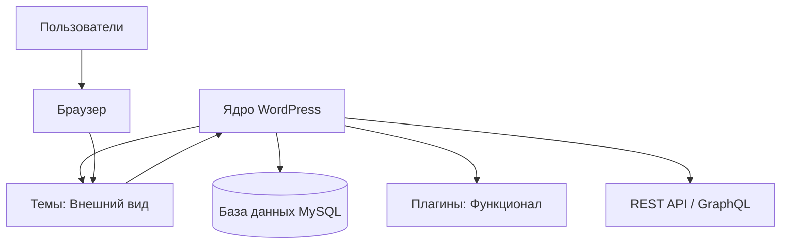

import { Playground } from '@components/Playground'

WordPress — это самая популярная система управления контентом (CMS) в мире. В 2026 году она продолжает удерживать лидерство, эволюционировав из простой платформы для блогов в мощный фреймворк для создания сложных веб-приложений, интернет-магазинов и Headless-решений.

## Почему WordPress?

Несмотря на появление множества новых инструментов, WordPress остается актуальным по нескольким причинам:

1. **Доступность:** Огромное сообщество и база знаний.
2. **Гибкость:** Возможность создать что угодно — от лендинга до социальной сети.
3. **Экосистема:** Тысячи плагинов (WooCommerce, ACF, Yoast) и тем.
4. **Gutenberg:** Современный блочный редактор на базе React, который изменил подход к редактированию контента.

## Архитектура системы

Архитектура WordPress строится на принципе обратной совместимости и событийной модели.

### Основные компоненты:

- **Core (Ядро):** Файлы системы, которые обеспечивают базовую логику. Их никогда нельзя редактировать напрямую.
- **Темы:** Отвечают за отображение данных.
- **Плагины:** Расширяют возможности системы без изменения ядра.
- **База данных:** Хранит посты, настройки, данные пользователей и мета-информацию.

## Возможности в 2026 году

Современный WordPress — это не только PHP. Сегодня активно используются:

- **Full Site Editing (FSE):** Управление всем сайтом через блоки.
- **Interactivity API:** Создание быстрых фронтенд-интерфейсов без перезагрузки страниц.
- **Headless Mode:** Использование WP как бэкенда для Next.js или Vue приложений.

В следующих уроках мы разберем, как настроить среду разработки и начать создавать профессиональные решения на этой платформе.

## Интерактивный пример

Архитектура WordPress — из чего состоит CMS:

<Playground client:visible
  template="static"
  files={{
    "/index.html": {
      code: `<!DOCTYPE html>
<html lang="ru">
<head>
<meta charset="UTF-8">

</head>
<body>
<h3>WordPress Architecture</h3>

Нажми на компонент, чтобы узнать подробнее

<script>
const items = [
  { icon: "🎨", name: "Themes", info: "Темы определяют внешний вид сайта: шаблоны, стили, layout. Файлы: style.css, functions.php, template files." },
  { icon: "🔌", name: "Plugins", info: "Плагины расширяют функционал: SEO, формы, кэширование, eCommerce. Более 60 000 в каталоге." },
  { icon: "🗄️", name: "Database", info: "MySQL база хранит посты, страницы, настройки, пользователей. Таблицы: wp_posts, wp_options, wp_users." },
  { icon: "📝", name: "Content", info: "Посты, страницы, медиафайлы. Gutenberg — блочный редактор для создания контента." },
  { icon: "👤", name: "Users", info: "Роли: Admin, Editor, Author, Contributor, Subscriber. Каждая с разными правами." },
  { icon: "⚙️", name: "Core", info: "Ядро WordPress: PHP-файлы, REST API, WP-CLI, система хуков (actions & filters)." },
];
const grid = document.getElementById("grid");
const info = document.getElementById("info");
items.forEach(item => {
  const div = document.createElement("div");
  div.className = "item";
  div.innerHTML = "
" + item.icon + "

" + item.name + "
";
  div.onclick = () => {
    grid.querySelectorAll(".item").forEach(i => i.classList.remove("active"));
    div.classList.add("active");
    info.innerHTML = "<strong>" + item.name + ":</strong> " + item.info;
  };
  grid.appendChild(div);
});
<\/script>
</body>
</html>`,
      active: true,
    },
  }}
/>
