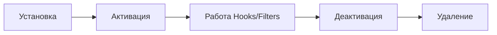

import { Playground } from '@components/Playground'

Плагины позволяют расширять функциональность WordPress без изменения файлов ядра или темы.

## Структура плагина

Минимальный плагин — это PHP-файл в директории `wp-content/plugins/` с заголовком в комментариях. Однако профессиональные плагины имеют четкую структуру.

```text
my-awesome-plugin/
├── assets/             # JS, CSS, Images
├── includes/           # PHP логика, классы
├── templates/          # Файлы шаблонов
├── languages/          # i18n файлы
└── my-awesome-plugin.php # Главный файл
```

## Главный файл плагина

```php
<?php
/**
 * Plugin Name: Yasha Custom Functionality
 * Description: Обучающий плагин для демонстрации разработки.
 * Version: 1.0.0
 * Author: Yasha Learn Code
 * License: GPL2
 */

// Защита от прямого доступа
if ( ! defined( 'ABSPATH' ) ) {
    exit;
}

// Константы
define( 'YASHA_PLUGIN_DIR', plugin_dir_path( __FILE__ ) );
define( 'YASHA_PLUGIN_URL', plugin_dir_url( __FILE__ ) );

// Подключение файлов
require_once YASHA_PLUGIN_DIR . 'includes/class-yasha-init.php';
```

## Жизненный цикл плагина



### Активация и Деактивация

Используются для создания таблиц в БД или настройки дефолтных опций.

```php
function yasha_plugin_activate() {
    // Логика при активации (например, flush_rewrite_rules)
}
register_activation_hook( __FILE__, 'yasha_plugin_activate' );

function yasha_plugin_deactivate() {
    // Очистка при отключении
}
register_deactivation_hook( __FILE__, 'yasha_plugin_deactivate' );
```

## Использование хуков в плагине

Лучшая практика — использовать объектно-ориентированный подход для организации хуков.

```php
class Yasha_Core {
    public function __construct() {
        add_action( 'wp_enqueue_scripts', [ $this, 'enqueue_assets' ] );
    }

    public function enqueue_assets() {
        wp_enqueue_style( 'yasha-styles', YASHA_PLUGIN_URL . 'assets/css/main.css' );
    }
}
new Yasha_Core();
```

## Резюме
- Всегда используйте префиксы в именах функций и классов, чтобы избежать конфликтов.
- Не забывайте про `register_uninstall_hook` для полной очистки данных после удаления плагина.
- Организуйте код по логическим папкам.

## Интерактивный пример

Структура WordPress-плагина:

<Playground client:visible
  template="static"
  files={{
    "/index.html": {
      code: `<!DOCTYPE html>
<html lang="ru">
<head>
<meta charset="UTF-8">
<style>
* { box-sizing: border-box; margin: 0; padding: 0; }
body { font-family: monospace; background: #0f172a; color: #e2e8f0; padding: 20px; }
h3 { color: #818cf8; margin-bottom: 12px; }
.plugin { background: #1e293b; border: 1px solid #334155; border-radius: 10px; padding: 14px; margin-bottom: 12px; }
.header { display: flex; align-items: center; gap: 10px; margin-bottom: 12px; padding-bottom: 10px; border-bottom: 1px solid #334155; }
.header .icon { font-size: 28px; }
.header .meta { flex: 1; }
.header .name { font-weight: 700; font-size: 14px; }
.header .ver { color: #64748b; font-size: 11px; }
.toggle { background: #22c55e; color: #0f172a; border: none; padding: 5px 12px; border-radius: 5px; cursor: pointer; font-size: 11px; font-weight: 700; }
.toggle.inactive { background: #475569; color: #e2e8f0; }
.files { display: flex; flex-direction: column; gap: 3px; }
.file { display: flex; align-items: center; gap: 6px; padding: 4px 8px; font-size: 12px; cursor: pointer; border-radius: 4px; }
.file:hover { background: #0f172a; }
.file.active { background: #0f172a; color: #818cf8; }
.code { background: #0f172a; border: 1px solid #334155; border-radius: 8px; padding: 12px; font-size: 11px; color: #94a3b8; white-space: pre; overflow-x: auto; margin-top: 10px; }
</style>
</head>
<body>
<h3>Plugin Architecture</h3>
<div class="plugin">
  <div class="header">
    <span class="icon">🔌</span>
    <div class="meta"><div class="name">My Awesome Plugin</div><div class="ver">v1.0.0 | Author: Developer</div></div>
    <button class="toggle" id="toggle" onclick="togglePlugin()">Active</button>
  </div>
  <div class="files" id="files"></div>
</div>
<div class="code" id="code"></div>
<script>
let active = true;
const files = [
  { name: "my-plugin.php", icon: "📄", code: "/*\\n * Plugin Name: My Awesome Plugin\\n * Description: Does something cool\\n * Version: 1.0.0\\n * Author: Developer\\n */\\n\\nif (!defined('ABSPATH')) exit;\\n\\nrequire_once plugin_dir_path(__FILE__) . 'includes/class-main.php';\\n\\nfunction my_plugin_init() {\\n  new My_Plugin_Main();\\n}\\nadd_action('plugins_loaded', 'my_plugin_init');" },
  { name: "includes/class-main.php", icon: "📄", code: "class My_Plugin_Main {\\n  public function __construct() {\\n    add_action('admin_menu', [$this, 'add_menu']);\\n    add_shortcode('my_shortcode', [$this, 'render']);\\n  }\\n\\n  public function add_menu() {\\n    add_menu_page('My Plugin', 'My Plugin',\\n      'manage_options', 'my-plugin', [$this, 'page']);\\n  }\\n}" },
  { name: "includes/class-api.php", icon: "📄", code: "class My_Plugin_API {\\n  public function __construct() {\\n    add_action('rest_api_init', [$this, 'routes']);\\n  }\\n\\n  public function routes() {\\n    register_rest_route('my-plugin/v1', '/items', [\\n      'methods' => 'GET',\\n      'callback' => [$this, 'get_items'],\\n    ]);\\n  }\\n}" },
  { name: "assets/style.css", icon: "🎨", code: ".my-plugin-widget {\\n  padding: 20px;\\n  border-radius: 8px;\\n  background: #f9fafb;\\n}" },
  { name: "uninstall.php", icon: "🗑️", code: "if (!defined('WP_UNINSTALL_PLUGIN')) exit;\\n\\n// Clean up plugin data\\ndelete_option('my_plugin_settings');\\n\\n// Remove custom tables\\nglobal $wpdb;\\n$wpdb->query(\\"DROP TABLE IF EXISTS {$wpdb->prefix}my_plugin\\");" },
];
const filesEl = document.getElementById("files");
const codeEl = document.getElementById("code");
files.forEach(f => {
  const div = document.createElement("div");
  div.className = "file";
  div.innerHTML = f.icon + " " + f.name;
  div.onclick = () => {
    filesEl.querySelectorAll(".file").forEach(el => el.classList.remove("active"));
    div.classList.add("active");
    codeEl.textContent = f.code;
  };
  filesEl.appendChild(div);
});
codeEl.textContent = files[0].code;
filesEl.querySelector(".file").classList.add("active");
function togglePlugin() {
  active = !active;
  const btn = document.getElementById("toggle");
  btn.textContent = active ? "Active" : "Inactive";
  btn.className = "toggle" + (active ? "" : " inactive");
}
<\/script>
</body>
</html>`,
      active: true,
    },
  }}
/>
