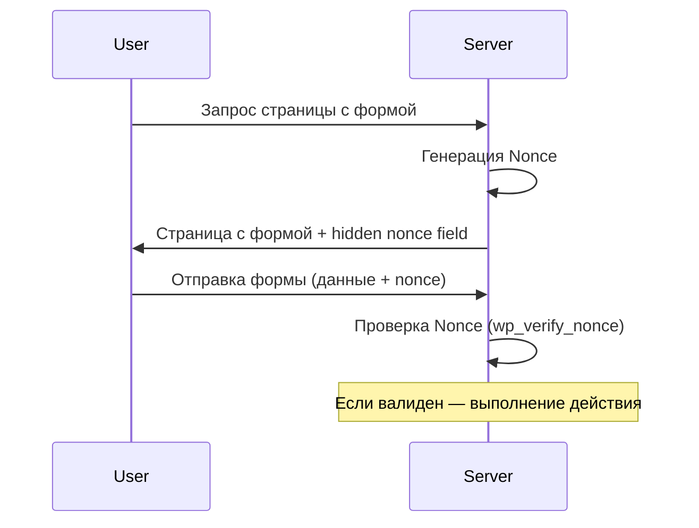

import { Playground } from '@components/Playground'

Безопасность в WordPress строится на принципе: никогда не доверять входящим данным и всегда экранировать исходящие.

## Validation, Sanitization, Escaping

Существует три уровня обработки данных:
1. **Validation (Валидация):** Проверка, соответствуют ли данные формату (например, является ли строка email-адресом).
2. **Sanitization (Очистка):** Удаление потенциально опасных символов из входящих данных перед сохранением в БД.
3. **Escaping (Экранирование):** Подготовка данных перед выводом в браузер для предотвращения XSS-атак.

### Примеры кода

```php
// 1. Validation
if ( ! is_email( $_POST['user_email'] ) ) {
    wp_die('Неверный формат email');
}

// 2. Sanitization (перед сохранением)
$user_name = sanitize_text_field( $_POST['user_name'] );
$user_bio  = wp_kses_post( $_POST['user_bio'] ); // Разрешает только безопасный HTML

// 3. Escaping (при выводе)
echo esc_html( $title );
echo esc_url( $link );
?>
<input type="text" value="<?php echo esc_attr( $value ); ?>">
```

## Nonces (Numbers used once)

Nonces защищают от CSRF-атак (Cross-Site Request Forgery). Они проверяют, что запрос был отправлен намеренно и из доверенного места.

### Жизненный цикл Nonce



### Использование Nonce

**В форме:**
```php
<form method="post">
    <?php wp_nonce_field( 'yasha_save_settings', 'yasha_settings_nonce' ); ?>
    <input type="text" name="setting_field">
    <input type="submit" value="Сохранить">
</form>
```

**В обработчике:**
```php
if ( isset( $_POST['yasha_settings_nonce'] ) && wp_verify_nonce( $_POST['yasha_settings_nonce'], 'yasha_save_settings' ) ) {
    // Безопасно сохраняем данные
} else {
    wp_die('Ошибка безопасности');
}
```

## SQL Инъекции и $wpdb

При выполнении прямых запросов к БД всегда используйте метод `prepare()`.

```php
global $wpdb;
$user_id = 5;
$results = $wpdb->get_results( $wpdb->prepare(
    "SELECT * FROM {$wpdb->prefix}posts WHERE post_author = %d AND post_status = %s",
    $user_id,
    'publish'
) );
```

## Резюме
- Используйте `sanitize_*` функции для входящих данных.
- Используйте `esc_*` функции для вывода данных.
- Всегда добавляйте `nonce` в формы и AJAX-запросы.
- Никогда не конкатенируйте переменные в SQL-запросах.

## Интерактивный пример

Очистка и валидация данных — sanitize vs escape:

<Playground client:visible
  template="static"
  files={{
    "/index.html": {
      code: `<!DOCTYPE html>
<html lang="ru">
<head>
<meta charset="UTF-8">
<style>
* { box-sizing: border-box; margin: 0; padding: 0; }
body { font-family: monospace; background: #0f172a; color: #e2e8f0; padding: 20px; }
h3 { color: #818cf8; margin-bottom: 12px; }
.input-area { margin-bottom: 12px; }
.input-area label { font-size: 12px; color: #94a3b8; display: block; margin-bottom: 4px; }
.input-area input { width: 100%; background: #1e293b; border: 1px solid #334155; border-radius: 6px; padding: 8px; color: #e2e8f0; font-family: monospace; font-size: 12px; }
.results { display: flex; flex-direction: column; gap: 6px; }
.result { background: #1e293b; border: 1px solid #334155; border-radius: 6px; padding: 8px 12px; font-size: 12px; }
.result .func { color: #22d3ee; font-weight: 700; margin-bottom: 4px; }
.result .output { padding: 4px 8px; background: #0f172a; border-radius: 4px; margin-top: 4px; }
.safe { color: #4ade80; }
.danger { color: #f87171; }
</style>
</head>
<body>
<h3>WordPress Data Sanitization</h3>
<div class="input-area">
  <label>Введите потенциально опасный ввод:</label>
  <input id="input" value="<script>alert(xss)<\/script>" oninput="process()">
</div>
<div class="results" id="results"></div>
<script>
function escapeHtml(str) { return str.replace(/&/g,"&amp;").replace(/</g,"&lt;").replace(/>/g,"&gt;").replace(/"/g,"&quot;"); }
function sanitizeText(str) { return str.replace(/<[^>]*>/g, "").trim(); }
function sanitizeEmail(str) { return str.replace(/[^a-zA-Z0-9@._+-]/g, ""); }
function sanitizeUrl(str) { try { const u = new URL(str); return ["http:", "https:"].includes(u.protocol) ? str : ""; } catch { return ""; } }
const funcs = [
  { name: "esc_html()", fn: escapeHtml, desc: "Экранирует HTML-теги для безопасного вывода" },
  { name: "sanitize_text_field()", fn: sanitizeText, desc: "Удаляет HTML-теги и лишние пробелы" },
  { name: "sanitize_email()", fn: sanitizeEmail, desc: "Оставляет только допустимые символы email" },
  { name: "esc_url()", fn: sanitizeUrl, desc: "Проверяет и очищает URL" },
];
function process() {
  const val = document.getElementById("input").value;
  const el = document.getElementById("results");
  el.innerHTML = funcs.map(f => {
    const result = f.fn(val);
    const safe = result !== val;
    return "<div class=\\"result\\"><div class=\\"func\\">" + f.name + " <span style=\\"font-weight:400;color:#64748b\\">— " + f.desc + "</span></div><div class=\\"output " + (safe ? "safe" : "danger") + "\\">" + escapeHtml(result || "(empty)") + "</div></div>";
  }).join("");
}
process();
<\/script>
</body>
</html>`,
      active: true,
    },
  }}
/>
