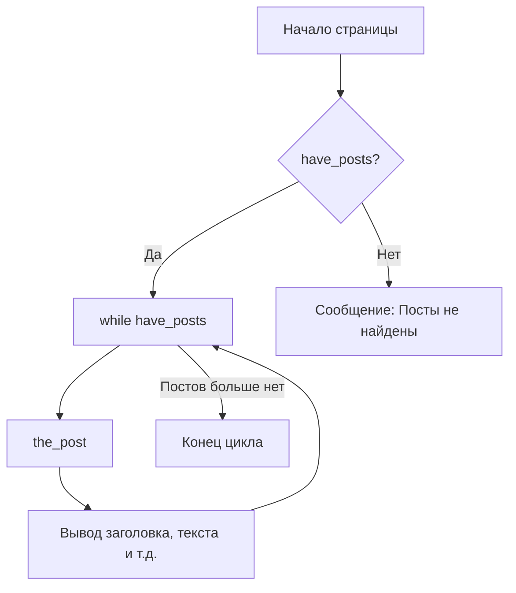

import { Playground } from '@components/Playground'

Цикл (The Loop) — это основной механизм WordPress для вывода постов. Он проходит по каждому посту, доступному для текущей страницы, и отображает его согласно вашему шаблону.

## Как это работает

Когда WordPress загружает страницу, он делает запрос к базе данных и собирает массив постов. Цикл проверяет, есть ли посты, и если да — начинает их перебор.



## Стандартный код цикла

Этот код обычно находится в файлах `index.php`, `single.php` или `archive.php`.

```php
<?php
if ( have_posts() ) : 
    while ( have_posts() ) : the_post(); ?>
        
        <article id="post-<?php the_ID(); ?>">
            <h2><a href="<?php the_permalink(); ?>"><?php the_title(); ?></a></h2>
            <div><?php the_excerpt(); ?></div>
        </article>

    <?php endwhile; 
else :
    echo '<p>Контент не найден.</p>';
endif;
?>
```

## Важные функции внутри цикла

- `the_title()` — выводит заголовок поста.
- `the_content()` — выводит основной текст.
- `the_permalink()` — ссылка на полную версию поста.
- `the_post_thumbnail()` — выводит миниатюру (featured image).
- `the_category()` — список категорий.

## Пользовательские запросы: WP_Query

Иногда стандартного цикла недостаточно (например, нужно вывести 3 последних новости в подвале). Для этого используется класс `WP_Query`.

```php
$args = array(
    'post_type' => 'post',
    'posts_per_page' => 3
);

$query = new WP_Query( $args );

if ( $query->have_posts() ) {
    while ( $query->have_posts() ) {
        $query->the_post();
        the_title('<li>', '</li>');
    }
    wp_reset_postdata(); // Обязательно сбросить глобальные данные после кастомного цикла
}
```

Всегда помните о вызовe `wp_reset_postdata()`, чтобы не нарушить работу основного цикла на странице.

## Интерактивный пример

WordPress Loop — итерация по постам:

<Playground client:visible
  template="static"
  files={{
    "/index.html": {
      code: `<!DOCTYPE html>
<html lang="ru">
<head>
<meta charset="UTF-8">
<style>
* { box-sizing: border-box; margin: 0; padding: 0; }
body { font-family: monospace; background: #0f172a; color: #e2e8f0; padding: 20px; }
h3 { color: #818cf8; margin-bottom: 12px; }
.code { background: #1e293b; border: 1px solid #334155; border-radius: 8px; padding: 12px; font-size: 11px; margin-bottom: 12px; }
.code .line { padding: 2px 0; }
.code .keyword { color: #c084fc; }
.code .func { color: #22d3ee; }
.code .string { color: #fbbf24; }
.posts { display: flex; flex-direction: column; gap: 6px; }
.post { background: #1e293b; border: 1px solid #334155; border-radius: 8px; padding: 10px 14px; opacity: 0.3; transition: all .4s; }
.post.active { opacity: 1; border-color: #818cf8; }
.post .title { font-weight: 700; font-size: 13px; }
.post .meta { color: #64748b; font-size: 11px; margin-top: 2px; }
.post .excerpt { color: #94a3b8; font-size: 12px; margin-top: 4px; }
button { background: #6366f1; color: #fff; border: none; padding: 7px 16px; border-radius: 6px; cursor: pointer; font-weight: 700; font-size: 12px; margin-bottom: 10px; }
.counter { font-size: 12px; color: #64748b; margin-bottom: 8px; }
</style>
</head>
<body>
<h3>The WordPress Loop</h3>
<button onclick="runLoop()">▶ Run The Loop</button>
<div class="counter" id="counter"></div>
<div class="posts" id="posts"></div>
<script>
const posts = [
  { title: "Getting Started with WordPress", date: "2024-01-15", category: "Tutorial", excerpt: "Learn the basics of WordPress development..." },
  { title: "Custom Theme Development", date: "2024-01-12", category: "Themes", excerpt: "Build your own WordPress theme from scratch..." },
  { title: "Plugin Architecture Guide", date: "2024-01-10", category: "Plugins", excerpt: "Understanding WordPress plugin structure..." },
  { title: "REST API Deep Dive", date: "2024-01-08", category: "API", excerpt: "Working with WordPress REST API endpoints..." },
  { title: "Performance Optimization Tips", date: "2024-01-05", category: "Performance", excerpt: "Speed up your WordPress site..." },
];
const el = document.getElementById("posts");
const counter = document.getElementById("counter");
posts.forEach(p => {
  const div = document.createElement("div");
  div.className = "post";
  div.innerHTML = "<div class=\\"title\\">" + p.title + "</div><div class=\\"meta\\">" + p.date + " · " + p.category + "</div><div class=\\"excerpt\\">" + p.excerpt + "</div>";
  el.appendChild(div);
});
function runLoop() {
  const els = el.querySelectorAll(".post");
  els.forEach(e => e.className = "post");
  let i = 0;
  counter.textContent = "have_posts() → true | the_post() → iteration " + (i+1);
  const interval = setInterval(() => {
    if (i > 0) els[i-1].className = "post active";
    if (i < els.length) {
      els[i].className = "post active";
      els[i].style.borderColor = "#818cf8";
      counter.textContent = "have_posts() → true | the_post() → post #" + (i+1);
      i++;
    } else {
      clearInterval(interval);
      counter.textContent = "have_posts() → false | Loop ended. " + posts.length + " posts displayed.";
    }
  }, 700);
}
<\/script>
</body>
</html>`,
      active: true,
    },
  }}
/>
