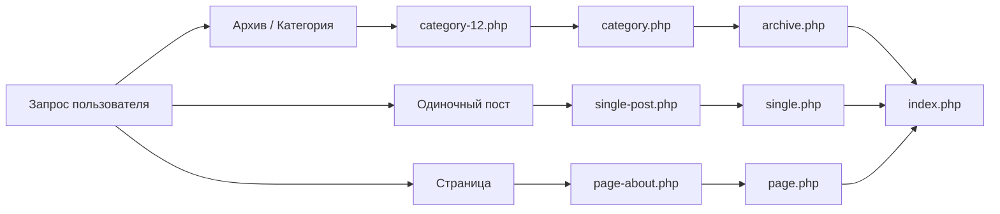

import { Playground } from '@components/Playground'

Тема WordPress определяет, как контент будет отображаться пользователю. Понимание иерархии шаблонов — ключ к созданию гибких и производительных сайтов.

## Минимальный набор файлов

Для того чтобы WordPress распознал папку как тему, в ней должны быть как минимум два файла:

1. `style.css` — мета-информация о теме и стили.
2. `index.php` — основной шаблон вывода.

### style.css

В начале этого файла обязательно должен быть заголовок в комментариях:

```css
/*
Theme Name: My Custom Theme
Author: Yasha
Version: 1.0
Description: Обучающая тема для курса WordPress.
*/
```

## Иерархия шаблонов (Template Hierarchy)

WordPress ищет нужный файл шаблона в зависимости от того, какую страницу запросил пользователь. Если специфичный файл не найден, система переходит к более общему.



## Основные файлы темы

- `functions.php` — "мозг" темы. Здесь подключаются скрипты, стили и регистрируются возможности темы.
- `header.php` — верхняя часть сайта (теги `head`, навигация).
- `footer.php` — нижняя часть сайта (подвал, скрипты).
- `sidebar.php` — боковая панель.

## Подключение стилей и скриптов

Правильный способ подключения ресурсов в WordPress — использование хука `wp_enqueue_scripts` в файле `functions.php`.

```php
<?php
// functions.php

function my_theme_scripts() {
    // Подключение стилей
    wp_enqueue_style('main-styles', get_stylesheet_uri());
    
    // Подключение кастомного JS
    wp_enqueue_script('custom-js', get_template_directory_uri() . '/js/main.js', array(), '1.0', true);
}

add_action('wp_enqueue_scripts', 'my_theme_scripts');
```

Использование функций `get_header()` и `get_footer()` позволяет собирать страницу из этих фрагментов.

## Интерактивный пример

Файловая структура WordPress-темы:

<Playground client:visible
  template="static"
  files={{
    "/index.html": {
      code: `<!DOCTYPE html>
<html lang="ru">
<head>
<meta charset="UTF-8">
<style>
* { box-sizing: border-box; margin: 0; padding: 0; }
body { font-family: monospace; background: #0f172a; color: #e2e8f0; padding: 20px; }
h3 { color: #818cf8; margin-bottom: 12px; }
.tree { background: #1e293b; border: 1px solid #334155; border-radius: 10px; padding: 14px; }
.node { padding: 3px 0; cursor: pointer; font-size: 12px; display: flex; align-items: center; gap: 6px; }
.node:hover { color: #60a5fa; }
.node.active { color: #818cf8; font-weight: 700; }
.indent { padding-left: 16px; }
.icon { width: 16px; text-align: center; }
.info { margin-top: 14px; background: #1e293b; border: 1px solid #334155; border-radius: 8px; padding: 12px 16px; font-size: 12px; color: #94a3b8; min-height: 50px; }
</style>
</head>
<body>
<h3>WordPress Theme Structure</h3>
<div class="tree" id="tree"></div>
<div class="info" id="info">Нажми на файл, чтобы узнать его назначение</div>
<script>
const files = [
  { name: "my-theme/", icon: "📁", indent: 0, info: "Корневая папка темы в wp-content/themes/" },
  { name: "style.css", icon: "🎨", indent: 1, info: "Главный файл стилей. Содержит метаданные темы (Theme Name, Version, Author)." },
  { name: "functions.php", icon: "⚙️", indent: 1, info: "Функции темы: регистрация меню, сайдбаров, подключение скриптов, поддержка фич." },
  { name: "index.php", icon: "📄", indent: 1, info: "Главный шаблон-фоллбэк. Обязательный файл для любой темы." },
  { name: "header.php", icon: "📄", indent: 1, info: "Шапка сайта: <head>, навигация, логотип. Подключается через get_header()." },
  { name: "footer.php", icon: "📄", indent: 1, info: "Подвал сайта: копирайт, ссылки, скрипты. Подключается через get_footer()." },
  { name: "sidebar.php", icon: "📄", indent: 1, info: "Боковая панель с виджетами. Подключается через get_sidebar()." },
  { name: "single.php", icon: "📄", indent: 1, info: "Шаблон для отдельного поста. Показывает один пост целиком." },
  { name: "page.php", icon: "📄", indent: 1, info: "Шаблон для страниц (Pages). Отличается от постов." },
  { name: "archive.php", icon: "📄", indent: 1, info: "Шаблон архивов: категории, теги, авторы, даты." },
  { name: "search.php", icon: "🔍", indent: 1, info: "Шаблон страницы результатов поиска." },
  { name: "404.php", icon: "❌", indent: 1, info: "Шаблон для страницы 404 — страница не найдена." },
  { name: "template-parts/", icon: "📁", indent: 1, info: "Папка для переиспользуемых частей шаблонов." },
  { name: "content.php", icon: "📄", indent: 2, info: "Шаблон контента поста. Используется через get_template_part()." },
];
const tree = document.getElementById("tree");
const info = document.getElementById("info");
files.forEach(f => {
  const div = document.createElement("div");
  div.className = "node";
  div.style.paddingLeft = (f.indent * 16) + "px";
  div.innerHTML = "<span class=\\"icon\\">" + f.icon + "</span>" + f.name;
  div.onclick = () => {
    tree.querySelectorAll(".node").forEach(n => n.classList.remove("active"));
    div.classList.add("active");
    info.innerHTML = "<strong>" + f.name + "</strong><br><br>" + f.info;
  };
  tree.appendChild(div);
});
<\/script>
</body>
</html>`,
      active: true,
    },
  }}
/>
