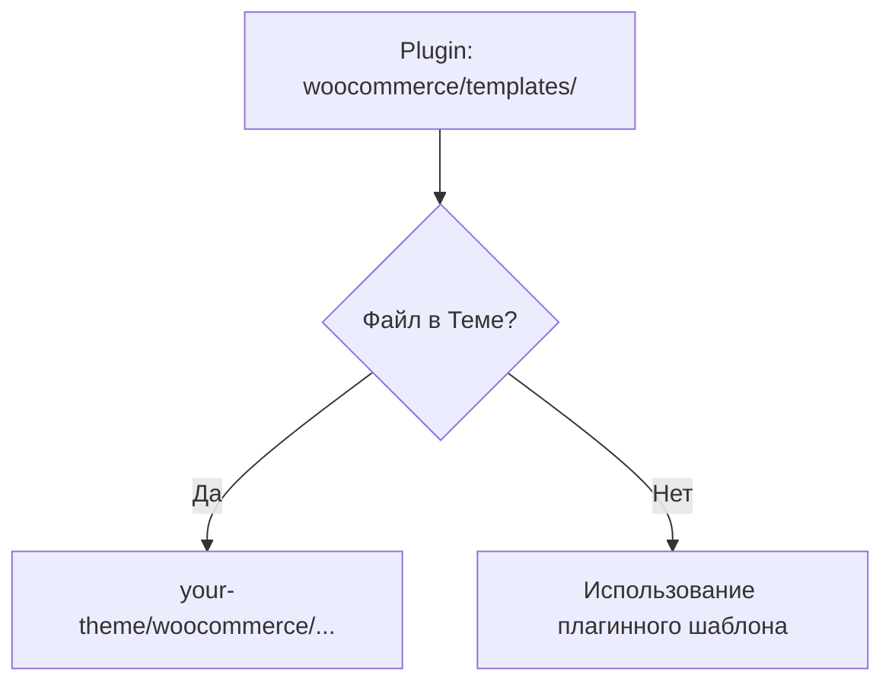

import { Playground } from '@components/Playground'

WooCommerce — самый популярный плагин для создания интернет-магазинов на WordPress. Он превращает WP в мощную e-commerce платформу.

## Поддержка темы (Theme Support)

Чтобы тема корректно работала с WooCommerce, её нужно объявить.

```php
function yasha_add_woocommerce_support() {
    add_theme_support( 'woocommerce' );
    add_theme_support( 'wc-product-gallery-zoom' );
    add_theme_support( 'wc-product-gallery-lightbox' );
    add_theme_support( 'wc-product-gallery-slider' );
}
add_action( 'after_setup_theme', 'yasha_add_woocommerce_support' );
```

## Иерархия шаблонов WooCommerce

WooCommerce использует свою систему шаблонов. Чтобы переопределить их, создайте папку `woocommerce` в корне вашей темы.



Например, для изменения страницы товара: скопируйте `single-product.php` из плагина в `your-theme/woocommerce/single-product.php`.

## Хуки WooCommerce

WooCommerce практически полностью построен на хуках. Это позволяет менять контент, не затрагивая файлы шаблонов.

### Пример: Добавление текста под кнопкой "Купить"

```php
add_action( 'woocommerce_after_add_to_cart_button', 'yasha_after_cart_button_text' );

function yasha_after_cart_button_text() {
    echo '<p class="shipping-info">Бесплатная доставка от 5000 руб.</p>';
}
```

### Удаление стандартных элементов

```php
// Удаление вывода цены на странице списка товаров
remove_action( 'woocommerce_after_shop_loop_item_title', 'woocommerce_template_loop_price', 10 );
```

## Работа с данными заказа

```php
$order = wc_get_order( $order_id );

foreach ( $order->get_items() as $item_id => $item ) {
    $product_name = $item->get_name();
    $quantity = $item->get_quantity();
}

$total = $order->get_total();
```

## Резюме
- Используйте `add_theme_support( 'woocommerce' )`.
- Переопределяйте шаблоны только в крайнем случае, отдавайте приоритет хукам (`add_action`, `remove_action`).
- Используйте `wc_get_product` и `wc_get_order` для получения объектов данных.

## Интерактивный пример

Карточки товаров — как в WooCommerce:

<Playground client:visible
  template="static"
  files={{
    "/index.html": {
      code: `<!DOCTYPE html>
<html lang="ru">
<head>
<meta charset="UTF-8">
<style>
* { box-sizing: border-box; margin: 0; padding: 0; }
body { font-family: system-ui, sans-serif; background: #0f172a; color: #e2e8f0; padding: 20px; }
h3 { color: #818cf8; margin-bottom: 12px; font-family: monospace; }
.products { display: grid; grid-template-columns: repeat(3, 1fr); gap: 10px; margin-bottom: 14px; }
.product { background: #1e293b; border: 1px solid #334155; border-radius: 10px; overflow: hidden; transition: transform .2s; }
.product:hover { transform: translateY(-3px); }
.product .img { height: 80px; display: flex; align-items: center; justify-content: center; font-size: 32px; background: #0f172a; }
.product .body { padding: 10px; }
.product .name { font-weight: 700; font-size: 12px; margin-bottom: 4px; }
.product .price { color: #22c55e; font-weight: 700; font-size: 14px; }
.product .price .old { color: #64748b; font-size: 11px; text-decoration: line-through; margin-left: 6px; }
.product .add-btn { width: 100%; background: #6366f1; color: #fff; border: none; padding: 6px; border-radius: 6px; cursor: pointer; font-size: 11px; font-weight: 700; margin-top: 6px; }
.cart { background: #1e293b; border: 1px solid #334155; border-radius: 10px; padding: 14px; }
.cart h4 { font-size: 13px; font-family: monospace; margin-bottom: 8px; }
.cart-item { display: flex; justify-content: space-between; padding: 4px 0; font-size: 12px; border-bottom: 1px solid #0f172a; }
.total { margin-top: 8px; text-align: right; font-weight: 700; color: #22c55e; }
</style>
</head>
<body>
<h3>WooCommerce Product Listing</h3>
<div class="products" id="products"></div>
<div class="cart"><h4>🛒 Cart</h4><div id="cartItems"></div><div class="total" id="total"></div></div>
<script>
const products = [
  { name: "WordPress Theme", emoji: "🎨", price: 59, old: 79 },
  { name: "SEO Plugin", emoji: "🔍", price: 29, old: null },
  { name: "Security Suite", emoji: "🔒", price: 49, old: 69 },
  { name: "Backup Pro", emoji: "💾", price: 39, old: null },
  { name: "Forms Builder", emoji: "📝", price: 19, old: 29 },
  { name: "Speed Optimizer", emoji: "⚡", price: 35, old: 45 },
];
const cart = [];
const el = document.getElementById("products");
products.forEach((p, i) => {
  const div = document.createElement("div");
  div.className = "product";
  div.innerHTML = "<div class=\\"img\\">" + p.emoji + "</div><div class=\\"body\\"><div class=\\"name\\">" + p.name + "</div><div class=\\"price\\">$" + p.price + (p.old ? "<span class=\\"old\\">$" + p.old + "</span>" : "") + "</div><button class=\\"add-btn\\" onclick=\\"addToCart(" + i + ")\\">Add to Cart</button></div>";
  el.appendChild(div);
});
function addToCart(i) {
  const p = products[i];
  const existing = cart.find(c => c.name === p.name);
  if (existing) existing.qty++;
  else cart.push({ name: p.name, price: p.price, qty: 1 });
  renderCart();
}
function renderCart() {
  const items = document.getElementById("cartItems");
  items.innerHTML = cart.map(c => "<div class=\\"cart-item\\"><span>" + c.name + " ×" + c.qty + "</span><span>$" + (c.price * c.qty) + "</span></div>").join("") || "<div style=\\"color:#64748b;font-size:12px\\">Cart is empty</div>";
  const total = cart.reduce((s, c) => s + c.price * c.qty, 0);
  document.getElementById("total").textContent = total > 0 ? "Total: $" + total : "";
}
renderCart();
<\/script>
</body>
</html>`,
      active: true,
    },
  }}
/>
